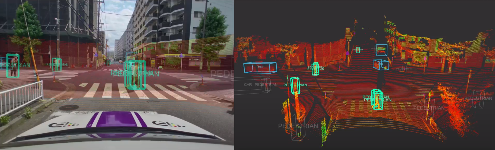

# edge-auto

This repository provides a sample ROS2 environment working on a x86-based ECU and Ethernet-based LiDARs.

As a sample application, the following images show object detection results using the 
contents of this repository. Various perception applications will be added in the future and you can develop them in this provided environment.

[Edge.Auto](https://sensor.tier4.jp/) sensor fusion system can be realized by using this with [edge-auto-jetson](https://github.com/tier4/edge-auto-jetson) repository.

## Prerequisites

### System Overview

This repository is based on a natively built ROS2 environment. The sample system overview is shown below.

### System Requirement

- LiDAR: Ethernet-based LiDARs, please see [tier4/nebula](https://github.com/tier4/nebula) about a list of currently supported LiDARs.
- ECU: x86-based ECU, including [AVA-3510](https://www.adlinktech.com/Products/Connected-Autonomous-Vehicle-Solutions/AVA/AVA-3510) from ADLINK Technology Inc.
- OS: Ubuntu 22.04 LTS
- ROS: ROS2 Humble

## Getting Started

Please see [Tutorials](docs/tutorials.md).

## Related repositories

- [tier4/edge-auto](https://github.com/tier4/edge-auto)
  - Meta-repository containing `autoware.repos` to construct ROS-based workspace on x86-based ECU.
- [tier4/edge-auto-jetson](https://github.com/tier4/edge-auto-jetson)
  - Meta-repository containing `autoware.repos` file to construct ROS-based workspace on Jetson-based ECU.
- [tier4/edge_auto_launch](https://github.com/tier4/edge_auto_launch)
  - Launch configuration repository containing node configurations and their parameters for x86-based ECU.
- [tier4/edge_auto_jetson_launch](https://github.com/tier4/edge_auto_jetson_launch)
  - Launch configuration repository containing node configurations and their parameters for Jetson-based ECU.
- [tier4/edge_auto_individual_params](https://github.com/tier4/edge_auto_individual_params)
  - Repository for managing system parameters including camera parameters, driver parameters, etc.
- [tier4/nebula](https://github.com/tier4/nebula)
  - ROS2 package for unified ethernet-based LiDAR driver.
- [tier4/tier4_automotive_hdr_camera](https://github.com/tier4/tier4_automotive_hdr_camera)
  - Kernel driver for using TIER IV cameras with Video4Linux2 interface.
- [tier4/ros2_v4l2_camera](https://github.com/tier4/ros2_v4l2_camera)
  - ROS2 package for camera driver using Video4Linux2.
- [tier4/sensor_trigger](https://github.com/tier4/sensor_trigger)
  - ROS2 package for generating sensor trigger signals.
- [tier4/calibration_tools](https://github.com/tier4/CalibrationTools)
  - Repository for calibration tools to estimate parameters on autonomous driving systems.
- [autowarefoundation/autoware.universe](https://github.com/autowarefoundation/autoware.universe)
  - Repository for experimental, cutting-edge ROS packages for autonomous driving.
