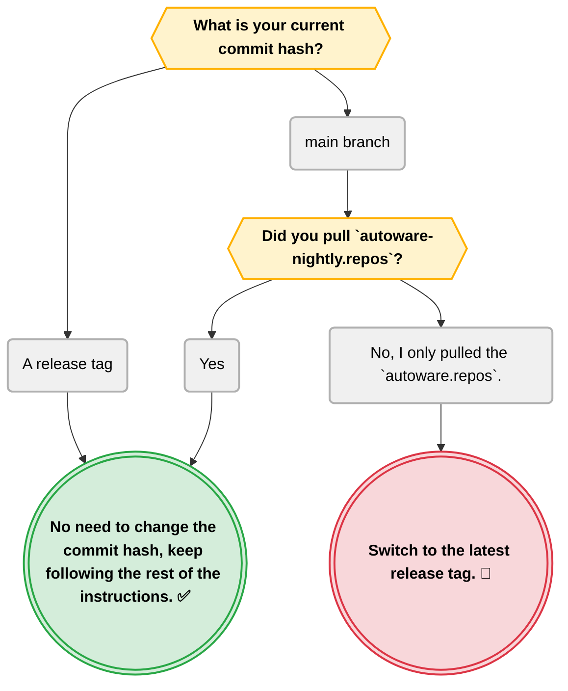

# Autoware artifacts

The Autoware perception stack uses models for inference. These models are automatically downloaded as part of the `setup-dev-env.sh` script.

The models are hosted by Web.Auto.

Default `data_dir` location is `~/autoware_data`.

## Download instructions

### Check out to the correct commit hash if necessary

First check this chart if you need to change your current commit hash.



If you need to switch to the latest tag, run the following commands:

```bash
cd ~/autoware
git fetch --tags && git checkout $(git describe --tags $(git rev-list --tags --max-count=1))
```

Once you've downloaded the artifacts, you can switch back to your desired branch or commit hash.

### Requirements

Install ansible following the instructions in the [ansible installation guide](../../README.md#ansible-installation).

### Download artifacts

#### Install ansible collections

```bash
cd ~/autoware # The root directory of the cloned repository
ansible-galaxy collection install -f -r "ansible-galaxy-requirements.yaml"
```

This step should be repeated when a new playbook is added.

#### Run the playbook

```bash
ansible-playbook autoware.dev_env.download_artifacts -e "data_dir=$HOME/autoware_data" --ask-become-pass
```

This will download and extract the artifacts to the specified directory and validate the checksums.
