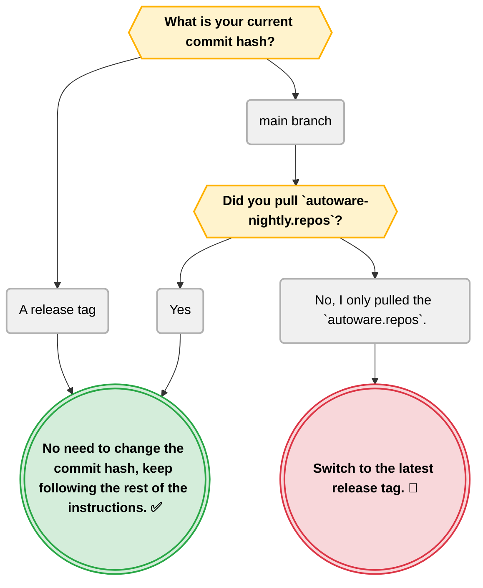

# Autoware artifacts

The Autoware perception stack uses models for inference. These models are downloaded by running `ansible-playbook autoware.dev_env.install_dev_env --tags artifacts`.

The models are hosted by Web.Auto.

Default `data_dir` location is `~/autoware_data/ml_models` (part of the asset-typed `~/autoware_data/` layout: `assets/`, `maps/`, `ml_models/`, `recordings/`, `scenarios/`).

## Download instructions

### Check out to the correct commit hash if necessary

First check this chart if you need to change your current commit hash.


```mermaid
graph TD
    cond1{{What is your current commit hash?}}
    --> option_release_branch(A release tag)
    cond1 --> opt2(main branch)
    opt2 --> cond2{{Did you pull `autoware-nightly.repos`?}}
    --> option_nightly(Yes)
    cond2 --> option_autoware_main(No, I only pulled the `autoware.repos`.)

    option_release_branch --> final_normal(((No need to change the commit hash, keep following the rest of the instructions. ✅)))
    option_nightly --> final_normal
    option_autoware_main --> final_change(((Switch to the latest release tag. 🔄)))

    %% Define styles
    classDef conditional fill:#FFF3CD,stroke:#FFB100,stroke-width:2px,color:#000,font-weight:bold;
    classDef final_normal fill:#D4EDDA,stroke:#28A745,stroke-width:2px,color:#000,font-weight:bold;
    classDef final_change fill:#F8D7DA,stroke:#DC3545,stroke-width:2px,color:#000,font-weight:bold;
    classDef neutral fill:#F0F0F0,stroke:#B0B0B0,stroke-width:2px,color:#000,font-weight:normal;

    %% Apply classes
    class cond1,cond2 conditional;
    class final_normal final_normal;
    class final_change final_change;
    class option_release_branch,opt2,option_nightly,option_autoware_main neutral;
```

If you need to switch to the latest tag, run the following commands:

```bash
cd ~/autoware
git fetch --tags && git checkout $(git describe --tags $(git rev-list --tags --max-count=1))
```

Once you've downloaded the artifacts, you can switch back to your desired branch or commit hash.

### Requirements

Install ansible following the instructions in the [ansible installation guide](../../README.md#ansible-installation).

### Download artifacts

#### Install ansible collections

```bash
cd ~/autoware # The root directory of the cloned repository
ansible-galaxy collection install -f -r "ansible-galaxy-requirements.yaml"
```

This step should be repeated when a new playbook is added.

#### Run the playbook

```bash
ansible-playbook autoware.dev_env.install_dev_env --tags artifacts -e "data_dir=$HOME/autoware_data/ml_models" --ask-become-pass
```

This will download and extract the artifacts to the specified directory and validate the checksums.

### Migrating from the legacy layout

Earlier versions of this role downloaded directly into `~/autoware_data/`. To match the new
layout, move the existing model directories under `~/autoware_data/ml_models/` (and, if you
were using `~/autoware_map/`, into `~/autoware_data/maps/`):

```bash
mkdir -p ~/autoware_data/ml_models
shopt -s extglob
mv ~/autoware_data/!(ml_models|maps|recordings|scenarios|assets) ~/autoware_data/ml_models/

# only if you also have ~/autoware_map/
[ -d ~/autoware_map ] && mv ~/autoware_map ~/autoware_data/maps
```

Re-running the playbook is also safe: it will populate the new `ml_models/` directory and you
can delete the old top-level model folders afterwards.
