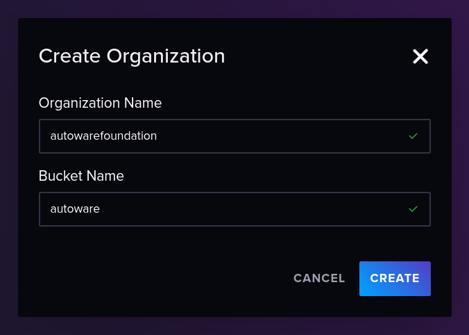
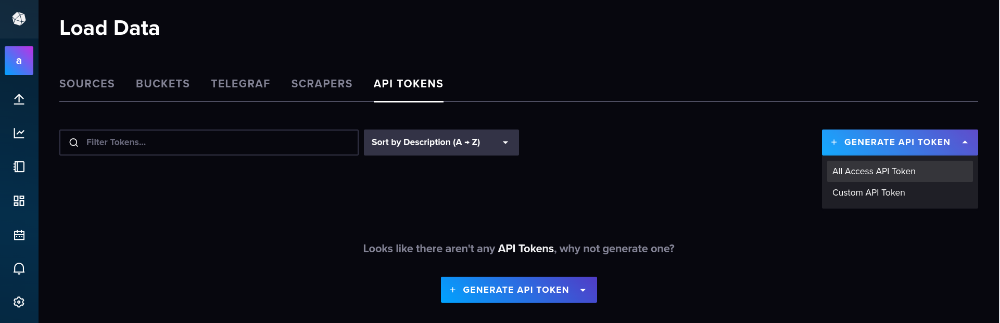
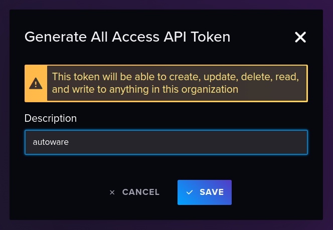

# telegraf

This role install [InfluxDB v2](https://docs.influxdata.com/influxdb/v2/get-started/) and [Telegraf](https://docs.influxdata.com/telegraf/v1/) to collect system metrics.

After installing telegraf and influxdb2, we need to manually make an API token and copy it to the `/etc/telegraf/telegraf.conf`.

## Create Organization

When accessing the InfluxDB UI <http://localhost:8086/> for the first time, you need to create an organization and a backet. Enter as follows.

## Generate API token

Next, move to the `Load Data` tab, click the `GENERATE API TOKEN button`, and generate the API token.

<https://docs.influxdata.com/influxdb/v2/admin/tokens/create-token/#manage-tokens-in-the-influxdb-ui>

## Copy API token and restart Telegraf

Paste the obtained API token into the empty string part of `token = ""` in `/etc/telegraf/telegraf.conf`.

<https://github.com/youtalk/autoware/blob/telegraf/ansible/roles/telegraf/files/telegraf.conf#L18>
