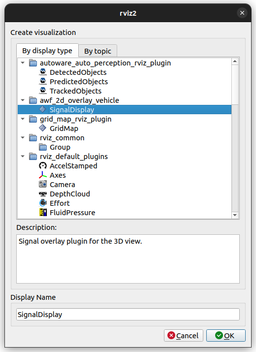

# awf_2d_overlay_vehicle

Plugin for displaying 2D overlays over the RViz2 3D scene.

Based on the [jsk_visualization](https://github.com/jsk-ros-pkg/jsk_visualization)
package, under the 3-Clause BSD license.

## Purpose

This plugin provides a visual and easy-to-understand display of vehicle speed, turn signal, steering status and gears.

## Inputs / Outputs

### Input

| Name                                     | Type                                                    | Description                        |
| ---------------------------------------- | ------------------------------------------------------- | ---------------------------------- |
| `/vehicle/status/velocity_status`        | `autoware_auto_vehicle_msgs::msg::VelocityReport`       | The topic is vehicle twist         |
| `/vehicle/status/turn_indicators_status` | `autoware_auto_vehicle_msgs::msg::TurnIndicatorsReport` | The topic is status of turn signal |
| `/vehicle/status/hazard_status`          | `autoware_auto_vehicle_msgs::msg::HazardReport`         | The topic is status of hazard      |
| `/vehicle/status/steering_status`        | `autoware_auto_vehicle_msgs::msg::SteeringReport`       | The topic is status of steering    |
| `/vehicle/status/gear_status`            | `autoware_auto_vehicle_msgs::msg::GearReport`           | The topic is status of gear        |

## Parameter

### Core Parameters

#### SignalDisplay

| Name                     | Type   | Default Value        | Description                       |
| ------------------------ | ------ | -------------------- | --------------------------------- |
| `property_width_`        | int    | 128                  | Width of the plotter window [px]  |
| `property_height_`       | int    | 128                  | Height of the plotter window [px] |
| `property_left_`         | int    | 128                  | Left of the plotter window [px]   |
| `property_top_`          | int    | 128                  | Top of the plotter window [px]    |
| `property_signal_color_` | QColor | QColor(25, 255, 240) | Turn Signal color                 |

## Assumptions / Known limits

TBD.

## Usage

1. Start rviz and select Add under the Displays panel.

   

2. Select any one of the tier4_vehicle_rviz_plugin and press OK.

   

3. Enter the name of the topic where you want to view the status.

   
