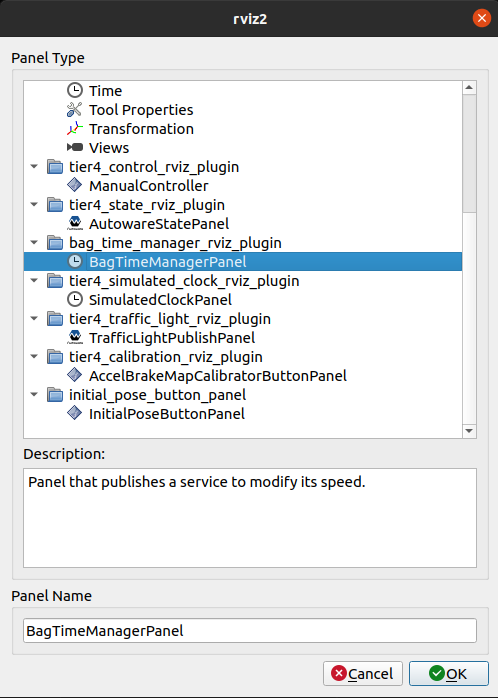
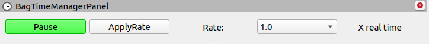

# bag_time_manager_rviz_plugin

## Purpose

This plugin allows publishing and controlling the ros bag time.

## Output

tbd.

## HowToUse

1. Start rviz and select panels/Add new panel.

   

2. Select BagTimeManagerPanel and press OK.

   

3. See bag_time_manager_rviz_plugin/BagTimeManagerPanel is added.

   

- Pause/Resume: pause/resume the clock.
- ApplyRate: apply rate of the clock.
