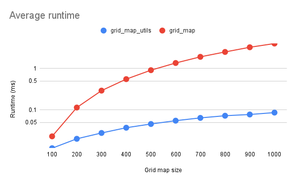

# Grid Map Utils

## Overview

This packages contains a re-implementation of the `grid_map::PolygonIterator` used to iterate over
all cells of a grid map contained inside some polygon.

## Algorithm

This implementation uses the [scan line algorithm](https://en.wikipedia.org/wiki/Scanline_rendering),
a common algorithm used to draw polygons on a rasterized image.
The main idea of the algorithm adapted to a grid map is as follow:

- calculate intersections between rows of the grid map and the edges of the polygon edges;
- calculate for each row the column between each pair of intersections;
- the resulting `(row, column)` indexes are inside of the polygon.

More details on the scan line algorithm can be found in the References.

## API

The `grid_map_utils::PolygonIterator` follows the same API as the original [`grid_map::PolygonIterator`](https://docs.ros.org/en/kinetic/api/grid_map_core/html/classgrid__map_1_1PolygonIterator.html).

## Assumptions

The behavior of the `grid_map_utils::PolygonIterator` is only guaranteed to match the `grid_map::PolygonIterator` if edges of the polygon do not _exactly_ cross any cell center.
In such a case, whether the crossed cell is considered inside or outside of the polygon can vary due to floating precision error.

## Performances

Benchmarking code is implemented in `test/benchmarking.cpp` and is also used to validate that the `grid_map_utils::PolygonIterator` behaves exactly like the `grid_map::PolygonIterator`.

The following figure shows a comparison of the runtime between the implementation of this package (`grid_map_utils`) and the original implementation (`grid_map`).
The time measured includes the construction of the iterator and the iteration over all indexes and is shown using a logarithmic scale.
Results were obtained varying the side size of a square grid map with `100 <= n <= 1000` (size=`n` means a grid of `n x n` cells),
random polygons with a number of vertices `3 <= m <= 100` and with each parameter `(n,m)` repeated 10 times.

## Future improvements

There exists variations of the scan line algorithm for multiple polygons.
These can be implemented if we want to iterate over the cells contained in at least one of multiple polygons.

The current implementation imitate the behavior of the original `grid_map::PolygonIterator` where a cell is selected if its center position is inside the polygon.
This behavior could be changed for example to only return all cells overlapped by the polygon.

## References

- <https://en.wikipedia.org/wiki/Scanline_rendering>
- <https://web.cs.ucdavis.edu/~ma/ECS175_S00/Notes/0411_b.pdf>
- <https://www.techfak.uni-bielefeld.de/ags/wbski/lehre/digiSA/WS0607/3DVRCG/Vorlesung/13.RT3DCGVR-vertex-2-fragment.pdf>
