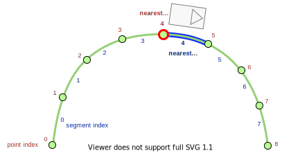
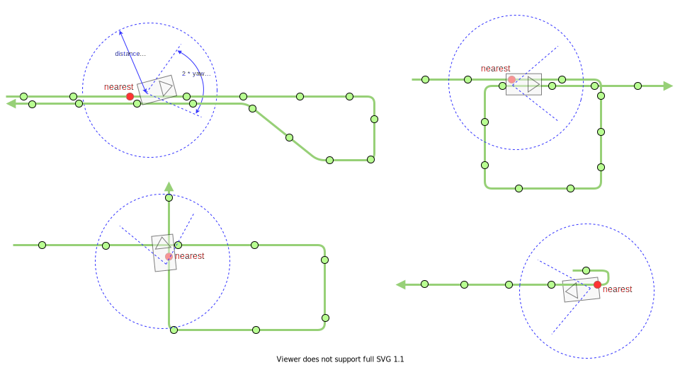

# Motion Utils package

## Definition of terms

### Segment

`Segment` in Autoware is the line segment between two successive points as follows.

{: style="width:600px"}

The nearest segment index and nearest point index to a certain position is not always th same.
Therefore, we prepare two different utility functions to calculate a nearest index for points and segments.

## Nearest index search

In this section, the nearest index and nearest segment index search is explained.

We have the same functions for the nearest index search and nearest segment index search.
Taking for the example the nearest index search, we have two types of functions.

The first function finds the nearest index with distance and yaw thresholds.

```cpp
template <class T>
size_t findFirstNearestIndexWithSoftConstraints(
  const T & points, const geometry_msgs::msg::Pose & pose,
  const double dist_threshold = std::numeric_limits<double>::max(),
  const double yaw_threshold = std::numeric_limits<double>::max());
```

This function finds the first local solution within thresholds.
The reason to find the first local one is to deal with some edge cases explained in the next subsection.

There are default parameters for thresholds arguments so that you can decide which thresholds to pass to the function.

1. When both the distance and yaw thresholds are given.
   - First, try to find the nearest index with both the distance and yaw thresholds.
   - If not found, try to find again with only the distance threshold.
   - If not found, find without any thresholds.
2. When only distance are given.
   - First, try to find the nearest index the distance threshold.
   - If not found, find without any thresholds.
3. When no thresholds are given.
   - Find the nearest index.

The second function finds the nearest index in the lane whose id is `lane_id`.

```cpp
size_t findNearestIndexFromLaneId(
  const autoware_auto_planning_msgs::msg::PathWithLaneId & path,
  const geometry_msgs::msg::Point & pos, const int64_t lane_id);
```

### Application to various object

Many node packages often calculate the nearest index of objects.
We will explain the recommended method to calculate it.

#### Nearest index for the ego

Assuming that the path length before the ego is short enough, we expect to find the correct nearest index in the following edge cases by `findFirstNearestIndexWithSoftConstraints` with both distance and yaw thresholds.
Blue circles describes the distance threshold from the base link position and two blue lines describe the yaw threshold against the base link orientation.
Among points in these cases, the correct nearest point which is red can be found.



Therefore, the implementation is as follows.

```cpp
const size_t ego_nearest_idx = findFirstNearestIndexWithSoftConstraints(points, ego_pose, ego_nearest_dist_threshold, ego_nearest_yaw_threshold);
const size_t ego_nearest_seg_idx = findFirstNearestIndexWithSoftConstraints(points, ego_pose, ego_nearest_dist_threshold, ego_nearest_yaw_threshold);
```

#### Nearest index for dynamic objects

For the ego nearest index, the orientation is considered in addition to the position since the ego is supposed to follow the points.
However, for the dynamic objects (e.g., predicted object), sometimes its orientation may be different from the points order, e.g. the dynamic object driving backward although the ego is driving forward.

Therefore, the yaw threshold should not be considered for the dynamic object.
The implementation is as follows.

```cpp
const size_t dynamic_obj_nearest_idx = findFirstNearestIndexWithSoftConstraints(points, dynamic_obj_pose, dynamic_obj_nearest_dist_threshold);
const size_t dynamic_obj_nearest_seg_idx = findFirstNearestIndexWithSoftConstraints(points, dynamic_obj_pose, dynamic_obj_nearest_dist_threshold);
```

#### Nearest index for traffic objects

In lanelet maps, traffic objects belong to the specific lane.
With this specific lane's id, the correct nearest index can be found.

The implementation is as follows.

```cpp
// first extract `lane_id` which the traffic object belong to.
const size_t traffic_obj_nearest_idx = findNearestIndexFromLaneId(path_with_lane_id, traffic_obj_pos, lane_id);
const size_t traffic_obj_nearest_seg_idx = findNearestSegmentIndexFromLaneId(path_with_lane_id, traffic_obj_pos, lane_id);
```

## Path/Trajectory length calculation between designated points

Based on the discussion so far, the nearest index search algorithm is different depending on the object type.
Therefore, we recommended using the wrapper utility functions which require the nearest index search (e.g., calculating the path length) with each nearest index search.

For example, when we want to calculate the path length between the ego and the dynamic object, the implementation is as follows.

```cpp
const size_t ego_nearest_seg_idx = findFirstNearestSegmentIndex(points, ego_pose, ego_nearest_dist_threshold, ego_nearest_yaw_threshold);
const size_t dyn_obj_nearest_seg_idx = findFirstNearestSegmentIndex(points, dyn_obj_pose, dyn_obj_nearest_dist_threshold);
const double length_from_ego_to_obj = calcSignedArcLength(points, ego_pose, ego_nearest_seg_idx, dyn_obj_pose, dyn_obj_nearest_seg_idx);
```
