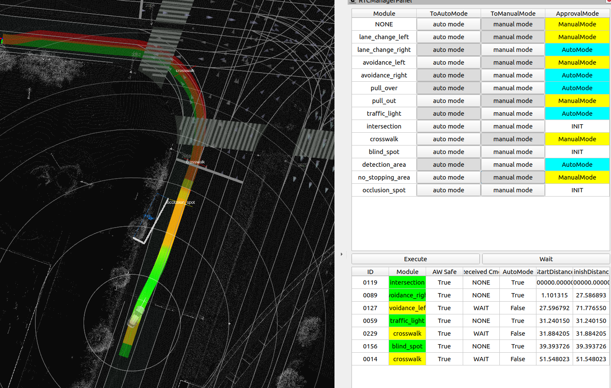
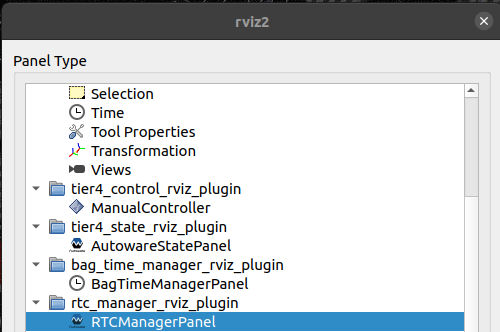

# rtc_manager_rviz_plugin

## Purpose

The purpose of this Rviz plugin is

1. To display each content of RTC status.

2. To switch each module of RTC auto mode.

3. To change RTC cooperate commands by button.

## Inputs / Outputs

### Input

| Name                           | Type                                        | Description                             |
| ------------------------------ | ------------------------------------------- | --------------------------------------- |
| `/api/external/get/rtc_status` | `tier4_rtc_msgs::msg::CooperateStatusArray` | The statuses of each Cooperate Commands |

### Output

| Name                             | Type                                     | Description                                          |
| -------------------------------- | ---------------------------------------- | ---------------------------------------------------- |
| `/api/external/set/rtc_commands` | `tier4_rtc_msgs::src::CooperateCommands` | The Cooperate Commands for each planning             |
| `/planning/enable_auto_mode/*`   | `tier4_rtc_msgs::src::AutoMode`          | The Cooperate Commands mode for each planning module |

## HowToUse

1. Start rviz and select panels/Add new panel.
   

2. tier4_state_rviz_plugin/RTCManagerPanel and press OK.
   
