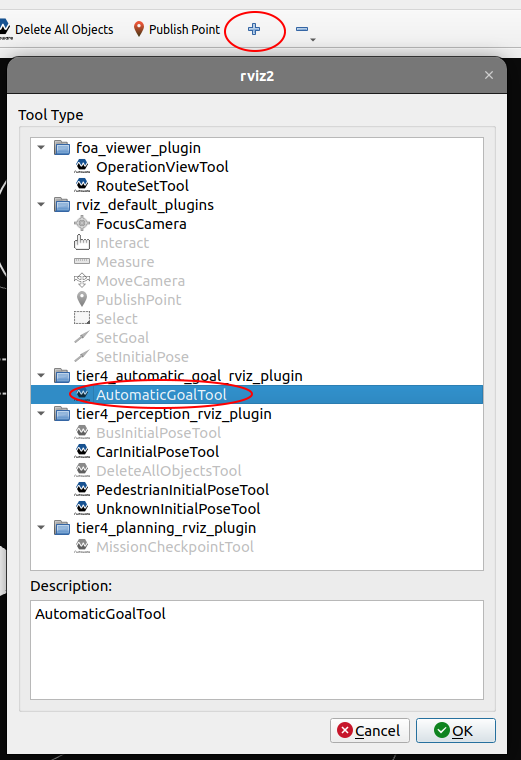
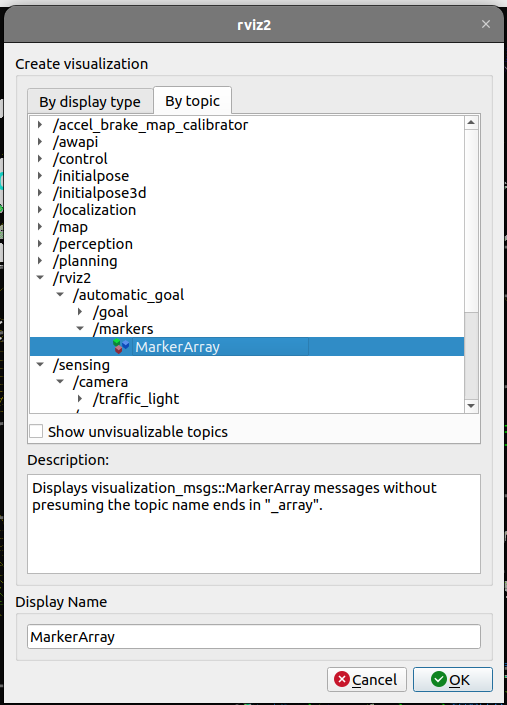
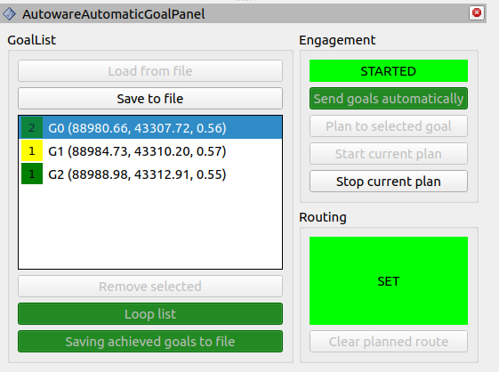

# tier4_automatic_goal_rviz_plugin

## Purpose

1. Defining a `GoalsList` by adding goals using `RvizTool` (Pose on the map).

2. Automatic execution of the created `GoalsList` from the selected goal - it can be stopped and restarted.

3. Looping the current `GoalsList`.

4. Saving achieved goals to a file.

5. Plan the route to one (single) selected goal and starting that route - it can be stopped and restarted.

6. Remove any goal from the list or clear the current route.

7. Save the current `GoalsList` to a file and load the list from the file.

8. The application enables/disables access to options depending on the current state.

9. The saved `GoalsList` can be executed without using a plugin - using a node `automatic_goal_sender`.

## Inputs / Outputs

### Input

| Name                         | Type                                              | Description                                      |
| ---------------------------- | ------------------------------------------------- | ------------------------------------------------ |
| `/api/operation_mode/state`  | `autoware_adapi_v1_msgs::msg::OperationModeState` | The topic represents the state of operation mode |
| `/api/routing/state`         | `autoware_adapi_v1_msgs::msg::RouteState`         | The topic represents the state of route          |
| `/rviz2/automatic_goal/goal` | `geometry_msgs::msgs::PoseStamped`                | The topic for adding goals to GoalsList          |

### Output

| Name                                       | Type                                               | Description                                        |
| ------------------------------------------ | -------------------------------------------------- | -------------------------------------------------- |
| `/api/operation_mode/change_to_autonomous` | `autoware_adapi_v1_msgs::srv::ChangeOperationMode` | The service to change operation mode to autonomous |
| `/api/operation_mode/change_to_stop`       | `autoware_adapi_v1_msgs::srv::ChangeOperationMode` | The service to change operation mode to stop       |
| `/api/routing/set_route_points`            | `autoware_adapi_v1_msgs::srv::SetRoutePoints`      | The service to set route                           |
| `/api/routing/clear_route`                 | `autoware_adapi_v1_msgs::srv::ClearRoute`          | The service to clear route state                   |
| `/rviz2/automatic_goal/markers`            | `visualization_msgs::msg::MarkerArray`             | The topic to visualize goals as rviz markers       |

## HowToUse

1. Start rviz and select panels/Add new panel.

   

2. Select `tier4_automatic_goal_rviz_plugin/AutowareAutomaticGoalPanel` and press OK.

3. Select Add a new tool.

   

4. Select `tier4_automatic_goal_rviz_plugin/AutowareAutomaticGoalTool` and press OK.

5. Add goals visualization as markers to `Displays`.

   

6. Append goals to the `GoalsList` to be achieved using `2D Append Goal` - in such a way that routes can be planned.

7. Start sequential planning and goal achievement by clicking `Send goals automatically`

   

8. You can save `GoalsList` by clicking `Save to file`.

9. After saving, you can run the `GoalsList` without using a plugin also:
   - example: `ros2 launch tier4_automatic_goal_rviz_plugin automatic_goal_sender.launch.xml goals_list_file_path:="/tmp/goals_list.yaml" goals_achieved_dir_path:="/tmp/"`
     - `goals_list_file_path` - is the path to the saved `GoalsList` file to be loaded
     - `goals_achieved_dir_path` - is the path to the directory where the file `goals_achieved.log` will be created and the achieved goals will be written to it

### Hints

If the application (Engagement) goes into `ERROR` mode (usually returns to `EDITING` later), it means that one of the services returned a calling error (`code!=0`).
In this situation, check the terminal output for more information.

- Often it is enough to try again.
- Sometimes a clearing of the current route is required before retrying.
