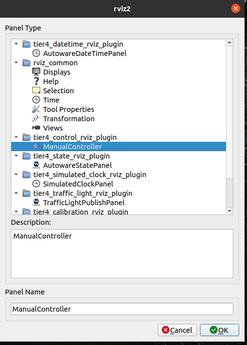
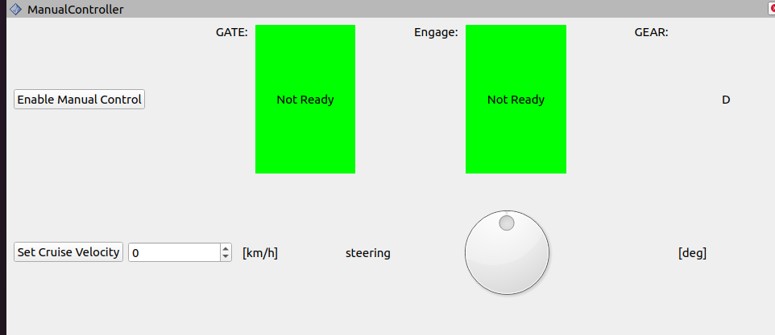
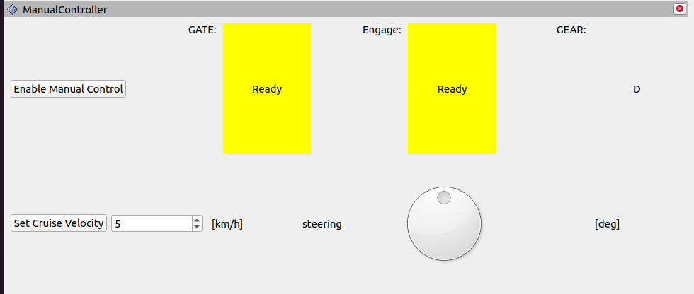

# tier4_control_rviz_plugin

This package is to mimic external control for simulation.

## Inputs / Outputs

### Input

| Name                              | Type                                              | Description             |
| --------------------------------- | ------------------------------------------------- | ----------------------- |
| `/control/current_gate_mode`      | `tier4_control_msgs::msg::GateMode`               | Current GATE mode       |
| `/vehicle/status/velocity_status` | `autoware_auto_vehicle_msgs::msg::VelocityReport` | Current velocity status |
| `/api/autoware/get/engage`        | `tier4_external_api_msgs::srv::Engage`            | Getting Engage          |
| `/vehicle/status/gear_status`     | `autoware_auto_vehicle_msgs::msg::GearReport`     | The state of GEAR       |

### Output

| Name                             | Type                                                       | Description             |
| -------------------------------- | ---------------------------------------------------------- | ----------------------- |
| `/control/gate_mode_cmd`         | `tier4_control_msgs::msg::GateMode`                        | GATE mode               |
| `/external/selected/control_cmd` | `autoware_auto_control_msgs::msg::AckermannControlCommand` | AckermannControlCommand |
| `/external/selected/gear_cmd`    | `autoware_auto_vehicle_msgs::msg::GearCommand`             | GEAR                    |

## Usage

1. Start rviz and select Panels.

   

2. Select tier4_control_rviz_plugin/ManualController and press OK.

   

3. Enter velocity in "Set Cruise Velocity" and Press the button to confirm. You can notice that GEAR shows D (DRIVE).

   

4. Press "Enable Manual Control" and you can notice that "GATE" and "Engage" turn "Ready" and the vehicle starts!

   
