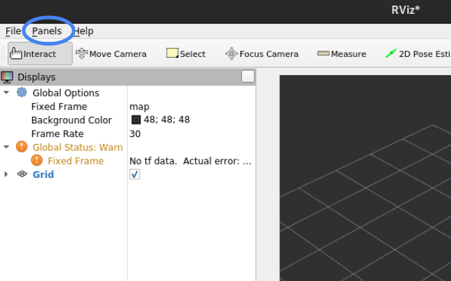

# tier4_datetime_rviz_plugin

## Purpose

This plugin displays the ROS Time and Wall Time in rviz.

## Assumptions / Known limits

TBD.

## Usage

1. Start rviz and select panels/Add new panel.
   
2. Select tier4_datetime_rviz_plugin/AutowareDateTimePanel and press OK.
   
