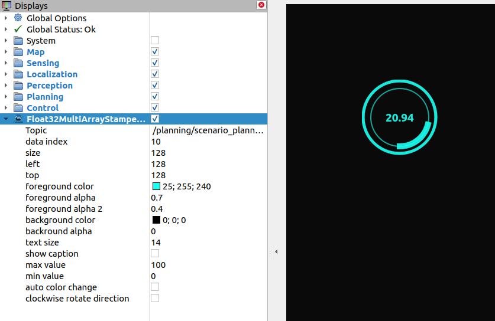

# tier4_debug_rviz_plugin

This package is including jsk code.
Note that jsk_overlay_utils.cpp and jsk_overlay_utils.hpp are BSD license.

## Plugins

### Float32MultiArrayStampedPieChart

Pie chart from `tier4_debug_msgs::msg::Float32MultiArrayStamped`.

