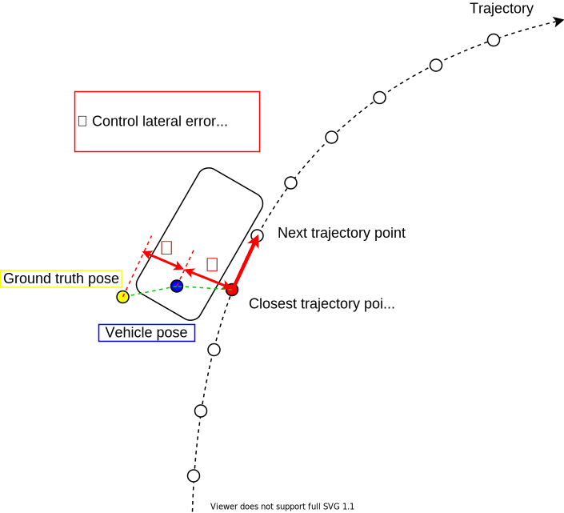

# tier4_debug_tools

This package provides useful features for debugging Autoware.

## Usage

### tf2pose

This tool converts any `tf` to `pose` topic.  
With this tool, for example, you can plot `x` values of `tf` in `rqt_multiplot`.

```sh
ros2 run tier4_debug_tools tf2pose {tf_from} {tf_to} {hz}
```

Example:

```sh
$ ros2 run tier4_debug_tools tf2pose base_link ndt_base_link 100

$ ros2 topic echo /tf2pose/pose -n1
header:
  seq: 13
  stamp:
    secs: 1605168366
    nsecs: 549174070
  frame_id: "base_link"
pose:
  position:
    x: 0.0387684271191
    y: -0.00320360406477
    z: 0.000276674520819
  orientation:
    x: 0.000335221893885
    y: 0.000122020672186
    z: -0.00539673212896
    w: 0.999985368502
---
```

### pose2tf

This tool converts any `pose` topic to `tf`.

```sh
ros2 run tier4_debug_tools pose2tf {pose_topic_name} {tf_name}
```

Example:

```sh
$ ros2 run tier4_debug_tools pose2tf /localization/pose_estimator/pose ndt_pose

$ ros2 run tf tf_echo ndt_pose ndt_base_link 100
At time 1605168365.449
- Translation: [0.000, 0.000, 0.000]
- Rotation: in Quaternion [0.000, 0.000, 0.000, 1.000]
            in RPY (radian) [0.000, -0.000, 0.000]
            in RPY (degree) [0.000, -0.000, 0.000]
```

### stop_reason2pose

This tool extracts `pose` from `stop_reasons`.  
Topics without numbers such as `/stop_reason2pose/pose/detection_area` are the nearest stop_reasons, and topics with numbers are individual stop_reasons that are roughly matched with previous ones.

```sh
ros2 run tier4_debug_tools stop_reason2pose {stop_reason_topic_name}
```

Example:

```sh
$ ros2 run tier4_debug_tools stop_reason2pose /planning/scenario_planning/status/stop_reasons

$ ros2 topic list | ag stop_reason2pose
/stop_reason2pose/pose/detection_area
/stop_reason2pose/pose/detection_area_1
/stop_reason2pose/pose/obstacle_stop
/stop_reason2pose/pose/obstacle_stop_1

$ ros2 topic echo /stop_reason2pose/pose/detection_area -n1
header:
  seq: 1
  stamp:
    secs: 1605168355
    nsecs:    821713
  frame_id: "map"
pose:
  position:
    x: 60608.8433457
    y: 43886.2410876
    z: 44.9078212441
  orientation:
    x: 0.0
    y: 0.0
    z: -0.190261378408
    w: 0.981733470901
---
```

### stop_reason2tf

This is an all-in-one script that uses `tf2pose`, `pose2tf`, and `stop_reason2pose`.  
With this tool, you can view the relative position from base_link to the nearest stop_reason.

```sh
ros2 run tier4_debug_tools stop_reason2tf {stop_reason_name}
```

Example:

```sh
$ ros2 run tier4_debug_tools stop_reason2tf obstacle_stop
At time 1605168359.501
- Translation: [0.291, -0.095, 0.266]
- Rotation: in Quaternion [0.007, 0.011, -0.005, 1.000]
            in RPY (radian) [0.014, 0.023, -0.010]
            in RPY (degree) [0.825, 1.305, -0.573]
```

### lateral_error_publisher

This node calculate the control error and localization error in the trajectory normal direction as shown in the figure below.



Set the reference trajectory, vehicle pose and ground truth pose in the launch file.

```sh
ros2 launch tier4_debug_tools lateral_error_publisher.launch.xml
```
