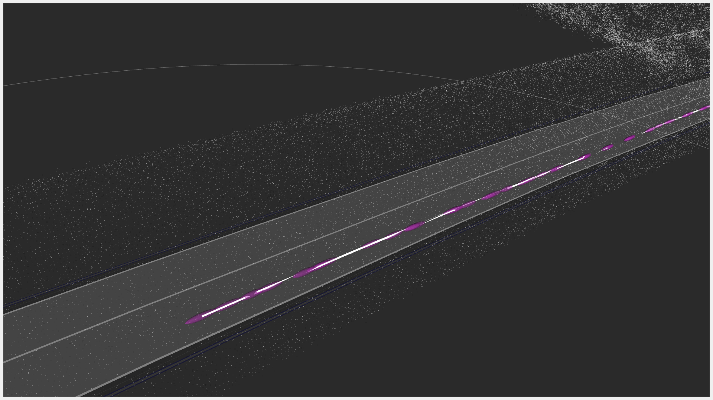

# tier4_localization_rviz_plugin

## Purpose

This plugin can display the localization history obtained by ekf_localizer, ndt_scan_matching, and GNSS.
If the uncertainty of the estimated pose is given, it can also be displayed.

## Inputs / Outputs

### Input

### Pose History

| Name         | Type                              | Description                                                                                           |
| ------------ | --------------------------------- | ----------------------------------------------------------------------------------------------------- |
| `input/pose` | `geometry_msgs::msg::PoseStamped` | In input/pose, put the result of localization calculated by ekf_localizer, ndt_scan_matching, or GNSS |

### Pose With Covariance History

| Name                         | Type                                            | Description                                                                                                           |
| ---------------------------- | ----------------------------------------------- | --------------------------------------------------------------------------------------------------------------------- |
| `input/pose_with_covariance` | `geometry_msgs::msg::PoseWithCovarianceStamped` | In input/pose_with_covariance, put the result of localization calculated by ekf_localizer, ndt_scan_matching, or GNSS |

## Parameters

### Core Parameters

### Pose History

| Name                    | Type   | Default Value | Description                |
| ----------------------- | ------ | ------------- | -------------------------- |
| `property_buffer_size_` | int    | 100           | Buffer size of topic       |
| `property_line_view_`   | bool   | true          | Use Line property or not   |
| `property_line_width_`  | float  | 0.1           | Width of Line property [m] |
| `property_line_alpha_`  | float  | 1.0           | Alpha of Line property     |
| `property_line_color_`  | QColor | Qt::white     | Color of Line property     |

### Pose With Covariance History

| Name                            | Type   | Default Value  | Description                      |
| ------------------------------- | ------ | -------------- | -------------------------------- |
| `property_buffer_size_`         | int    | 100            | Buffer size of topic             |
| `property_path_view_`           | bool   | true           | Use path property or not         |
| `property_shape_type_`          | string | Line           | Line or Arrow                    |
| `property_line_width_`          | float  | 0.1            | Width of Line property [m]       |
| `property_line_alpha_`          | float  | 1.0            | Alpha of Line property           |
| `property_line_color_`          | QColor | Qt::white      | Color of Line property           |
| `property_arrow_shaft_length`   | float  | 0.3            | Shaft length of Arrow property   |
| `property_arrow_shaft_diameter` | float  | 0.15           | Shaft diameter of Arrow property |
| `property_arrow_head_length`    | float  | 0.2            | Head length of Arrow property    |
| `property_arrow_head_diameter`  | float  | 0.3            | Head diameter of Arrow property  |
| `property_arrow_alpha_`         | float  | 1.0            | Alpha of Arrow property          |
| `property_arrow_color_`         | QColor | Qt::white      | Color of Arrow property          |
| `property_sphere_scale_`        | float  | 1.0            | Scale of Sphere property         |
| `property_sphere_alpha_`        | float  | 0.5            | Alpha of Sphere property         |
| `property_sphere_color_`        | QColor | (204, 51, 204) | Color of Sphere property         |

## Assumptions / Known limits

TBD.

## Usage

1. Start rviz and select Add under the Displays panel.
   
2. Select tier4_localization_rviz_plugin/PoseHistory or PoseWithCovarianceHistory. Next, press OK.
   
3. Enter the name of the topic where you want to view the trajectory and the covariance.
   
4. You can view the trajectory and the covariance.
   
