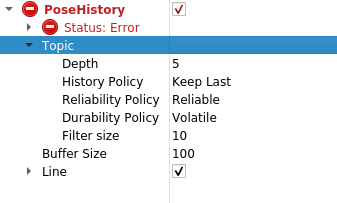

# tier4_localization_rviz_plugin

## Purpose

This plugin can display the history of the localization obtained by ekf_localizer or ndt_scan_matching.

## Inputs / Outputs

### Input

| Name         | Type                              | Description                                                                                    |
| ------------ | --------------------------------- | ---------------------------------------------------------------------------------------------- |
| `input/pose` | `geometry_msgs::msg::PoseStamped` | In input/pose, put the result of localization calculated by ekf_localizer or ndt_scan_matching |

## Parameters

### Core Parameters

| Name                    | Type   | Default Value | Description                |
| ----------------------- | ------ | ------------- | -------------------------- |
| `property_buffer_size_` | int    | 100           | Buffer size of topic       |
| `property_line_view_`   | bool   | true          | Use Line property or not   |
| `property_line_width_`  | float  | 0.1           | Width of Line property [m] |
| `property_line_alpha_`  | float  | 1.0           | Alpha of Line property     |
| `property_line_color_`  | QColor | Qt::white     | Color of Line property     |

## Assumptions / Known limits

TBD.

## Usage

1. Start rviz and select Add under the Displays panel.
   
2. Select tier4_localization_rviz_plugin/PoseHistory and press OK.
   
3. Enter the name of the topic where you want to view the trajectory.
   
