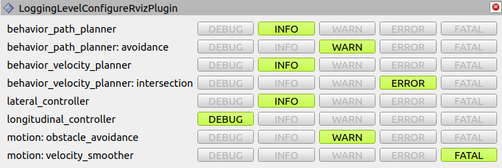

# tier4_logging_level_configure_rviz_plugin

This package provides an rviz_plugin that can easily change the logger level of each node

This plugin dispatches services to the "logger name" associated with "nodes" specified in YAML, adjusting the logger level.

As of November 2023, in ROS 2 Humble, users are required to initiate a service server in the node to use this feature. (This might be integrated into ROS standards in the future.) For easy service server generation, you can use the [LoggerLevelConfigure](https://github.com/autowarefoundation/autoware.universe/blob/main/common/tier4_autoware_utils/include/tier4_autoware_utils/ros/logger_level_configure.hpp) utility.
