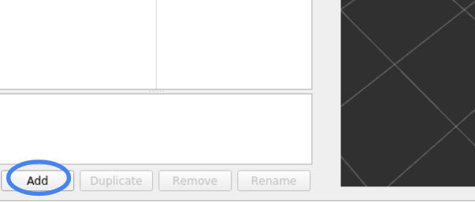

# tier4_planning_rviz_plugin

This package is including jsk code.
Note that jsk_overlay_utils.cpp and jsk_overlay_utils.hpp are BSD license.

## Purpose

This plugin displays the path, trajectory, and maximum speed.

## Inputs / Outputs

### Input

| Name                                               | Type                                           | Description                                |
| -------------------------------------------------- | ---------------------------------------------- | ------------------------------------------ |
| `/input/path`                                      | `autoware_auto_planning_msgs::msg::Path`       | The topic on which to subscribe path       |
| `/input/trajectory`                                | `autoware_auto_planning_msgs::msg::Trajectory` | The topic on which to subscribe trajectory |
| `/planning/scenario_planning/current_max_velocity` | `tier4_planning_msgs/msg/VelocityLimit`        | The topic on which to publish max velocity |

### Output

| Name                                    | Type                            | Description                              |
| --------------------------------------- | ------------------------------- | ---------------------------------------- |
| `/planning/mission_planning/checkpoint` | `geometry_msgs/msg/PoseStamped` | The topic on which to publish checkpoint |

## Parameter

### Core Parameters

#### MissionCheckpoint

| Name                   | Type   | Default Value        | Description                                        |
| ---------------------- | ------ | -------------------- | -------------------------------------------------- |
| `pose_topic_property_` | string | `mission_checkpoint` | The topic on which to publish checkpoint           |
| `std_dev_x_`           | float  | 0.5                  | X standard deviation for checkpoint pose [m]       |
| `std_dev_y_`           | float  | 0.5                  | Y standard deviation for checkpoint pose [m]       |
| `std_dev_theta_`       | float  | M_PI / 12.0          | Theta standard deviation for checkpoint pose [rad] |
| `position_z_`          | float  | 0.0                  | Z position for checkpoint pose [m]                 |

#### Path

| Name                            | Type   | Default Value | Description                  |
| ------------------------------- | ------ | ------------- | ---------------------------- |
| `property_path_view_`           | bool   | true          | Use Path property or not     |
| `property_path_width_view_`     | bool   | false         | Use Constant Width or not    |
| `property_path_width_`          | float  | 2.0           | Width of Path property [m]   |
| `property_path_alpha_`          | float  | 1.0           | Alpha of Path property       |
| `property_path_color_view_`     | bool   | false         | Use Constant Color or not    |
| `property_path_color_`          | QColor | Qt::black     | Color of Path property       |
| `property_velocity_view_`       | bool   | true          | Use Velocity property or not |
| `property_velocity_alpha_`      | float  | 1.0           | Alpha of Velocity property   |
| `property_velocity_scale_`      | float  | 0.3           | Scale of Velocity property   |
| `property_velocity_color_view_` | bool   | false         | Use Constant Color or not    |
| `property_velocity_color_`      | QColor | Qt::black     | Color of Velocity property   |
| `property_vel_max_`             | float  | 3.0           | Max velocity [m/s]           |

#### DrivableArea

| Name                     | Type  | Default Value | Description                           |
| ------------------------ | ----- | ------------- | ------------------------------------- |
| `color_scheme_property_` | int   | 0             | Color scheme of DrivableArea property |
| `alpha_property_`        | float | 0.2           | Alpha of DrivableArea property        |
| `draw_under_property_`   | bool  | false         | Draw as background or not             |

#### PathFootprint

| Name                             | Type   | Default Value | Description                        |
| -------------------------------- | ------ | ------------- | ---------------------------------- |
| `property_path_footprint_view_`  | bool   | true          | Use Path Footprint property or not |
| `property_path_footprint_alpha_` | float  | 1.0           | Alpha of Path Footprint property   |
| `property_path_footprint_color_` | QColor | Qt::black     | Color of Path Footprint property   |
| `property_vehicle_length_`       | float  | 4.77          | Vehicle length [m]                 |
| `property_vehicle_width_`        | float  | 1.83          | Vehicle width [m]                  |
| `property_rear_overhang_`        | float  | 1.03          | Rear overhang [m]                  |

#### Trajectory

| Name                            | Type   | Default Value | Description                  |
| ------------------------------- | ------ | ------------- | ---------------------------- |
| `property_path_view_`           | bool   | true          | Use Path property or not     |
| `property_path_width_`          | float  | 2.0           | Width of Path property [m]   |
| `property_path_alpha_`          | float  | 1.0           | Alpha of Path property       |
| `property_path_color_view_`     | bool   | false         | Use Constant Color or not    |
| `property_path_color_`          | QColor | Qt::black     | Color of Path property       |
| `property_velocity_view_`       | bool   | true          | Use Velocity property or not |
| `property_velocity_alpha_`      | float  | 1.0           | Alpha of Velocity property   |
| `property_velocity_scale_`      | float  | 0.3           | Scale of Velocity property   |
| `property_velocity_color_view_` | bool   | false         | Use Constant Color or not    |
| `property_velocity_color_`      | QColor | Qt::black     | Color of Velocity property   |
| `property_velocity_text_view_`  | bool   | false         | View text Velocity           |
| `property_velocity_text_scale_` | float  | 0.3           | Scale of Velocity property   |
| `property_vel_max_`             | float  | 3.0           | Max velocity [m/s]           |

#### TrajectoryFootprint

| Name                                   | Type   | Default Value        | Description                              |
| -------------------------------------- | ------ | -------------------- | ---------------------------------------- |
| `property_trajectory_footprint_view_`  | bool   | true                 | Use Trajectory Footprint property or not |
| `property_trajectory_footprint_alpha_` | float  | 1.0                  | Alpha of Trajectory Footprint property   |
| `property_trajectory_footprint_color_` | QColor | QColor(230, 230, 50) | Color of Trajectory Footprint property   |
| `property_vehicle_length_`             | float  | 4.77                 | Vehicle length [m]                       |
| `property_vehicle_width_`              | float  | 1.83                 | Vehicle width [m]                        |
| `property_rear_overhang_`              | float  | 1.03                 | Rear overhang [m]                        |
| `property_trajectory_point_view_`      | bool   | false                | Use Trajectory Point property or not     |
| `property_trajectory_point_alpha_`     | float  | 1.0                  | Alpha of Trajectory Point property       |
| `property_trajectory_point_color_`     | QColor | QColor(0, 60, 255)   | Color of Trajectory Point property       |
| `property_trajectory_point_radius_`    | float  | 0.1                  | Radius of Trajectory Point property      |

#### MaxVelocity

| Name                    | Type   | Default Value                                      | Description                                  |
| ----------------------- | ------ | -------------------------------------------------- | -------------------------------------------- |
| `property_topic_name_`  | string | `/planning/scenario_planning/current_max_velocity` | The topic on which to subscribe max velocity |
| `property_text_color_`  | QColor | QColor(255, 255, 255)                              | Text color                                   |
| `property_left_`        | int    | 128                                                | Left of the plotter window [px]              |
| `property_top_`         | int    | 128                                                | Top of the plotter window [px]               |
| `property_length_`      | int    | 96                                                 | Length of the plotter window [px]            |
| `property_value_scale_` | float  | 1.0 / 4.0                                          | Value scale                                  |

## Usage

1. Start rviz and select Add under the Displays panel.
   
2. Select any one of the tier4_planning_rviz_plugin and press OK.
   
3. Enter the name of the topic where you want to view the path or trajectory.
   
