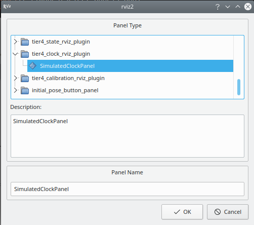
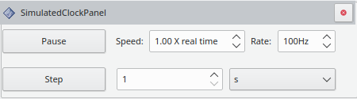

# tier4_simulated_clock_rviz_plugin

## Purpose

This plugin allows publishing and controlling the simulated ROS time.

## Output

| Name     | Type                        | Description                |
| -------- | --------------------------- | -------------------------- |
| `/clock` | `rosgraph_msgs::msg::Clock` | the current simulated time |

## How to use the plugin

1. Launch [planning simulator](https://autowarefoundation.github.io/autoware-documentation/main/tutorials/ad-hoc-simulation/planning-simulation/#1-launch-autoware) with `use_sim_time:=true`.

   ```shell
   ros2 launch autoware_launch planning_simulator.launch.xml map_path:=$HOME/autoware_map/sample-map-planning vehicle_model:=sample_vehicle sensor_model:=sample_sensor_kit use_sim_time:=true
   ```

   > <span style="color: orange; font-weight: bold;">Warning</span>
   > If you launch the planning simulator without adding the `tier4_simulated_clock_rviz_plugin`, your simulation will not be running. You'll not even be able to place the initial and the goal poses.

2. Start rviz and select panels/Add new panel.

   

3. Select tier4_clock_rviz_plugin/SimulatedClock and press OK.

   

4. Use the added panel to control how the simulated clock is published.

   

   <ol type="a">
     <li>Pause button: pause/resume the clock.</li>
     <li>Speed: speed of the clock relative to the system clock.</li>
     <li>Rate: publishing rate of the clock.</li>
     <li>Step button: advance the clock by the specified time step.</li>
     <li>Time step: value used to advance the clock when pressing the step button d).</li>
     <li>Time unit: time unit associated with the value from e).</li>
   </ol>

   > <span style="color: orange; font-weight: bold;">Warning</span>
   > If you set the time step too large, your simulation will go haywire.
