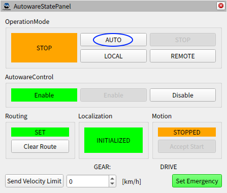

# tier4_state_rviz_plugin

## Purpose

This plugin displays the current status of autoware.
This plugin also can engage from the panel.

## Inputs / Outputs

### Input

| Name                                     | Type                                                           | Description                                                   |
| ---------------------------------------- | -------------------------------------------------------------- | ------------------------------------------------------------- |
| `/api/operation_mode/state`              | `autoware_adapi_v1_msgs::msg::OperationModeState`              | The topic represents the state of operation mode              |
| `/api/routing/state`                     | `autoware_adapi_v1_msgs::msg::RouteState`                      | The topic represents the state of route                       |
| `/api/localization/initialization_state` | `autoware_adapi_v1_msgs::msg::LocalizationInitializationState` | The topic represents the state of localization initialization |
| `/api/motion/state`                      | `autoware_adapi_v1_msgs::msg::MotionState`                     | The topic represents the state of motion                      |
| `/api/autoware/get/emergency`            | `tier4_external_api_msgs::msg::Emergency`                      | The topic represents the state of external emergency          |
| `/vehicle/status/gear_status`            | `autoware_auto_vehicle_msgs::msg::GearReport`                  | The topic represents the state of gear                        |

### Output

| Name                                               | Type                                               | Description                                        |
| -------------------------------------------------- | -------------------------------------------------- | -------------------------------------------------- |
| `/api/operation_mode/change_to_autonomous`         | `autoware_adapi_v1_msgs::srv::ChangeOperationMode` | The service to change operation mode to autonomous |
| `/api/operation_mode/change_to_stop`               | `autoware_adapi_v1_msgs::srv::ChangeOperationMode` | The service to change operation mode to stop       |
| `/api/operation_mode/change_to_local`              | `autoware_adapi_v1_msgs::srv::ChangeOperationMode` | The service to change operation mode to local      |
| `/api/operation_mode/change_to_remote`             | `autoware_adapi_v1_msgs::srv::ChangeOperationMode` | The service to change operation mode to remote     |
| `/api/operation_mode/enable_autoware_control`      | `autoware_adapi_v1_msgs::srv::ChangeOperationMode` | The service to enable vehicle control by Autoware  |
| `/api/operation_mode/disable_autoware_control`     | `autoware_adapi_v1_msgs::srv::ChangeOperationMode` | The service to disable vehicle control by Autoware |
| `/api/routing/clear_route`                         | `autoware_adapi_v1_msgs::srv::ClearRoute`          | The service to clear route state                   |
| `/api/motion/accept_start`                         | `autoware_adapi_v1_msgs::srv::AcceptStart`         | The service to accept the vehicle to start         |
| `/api/autoware/set/emergency`                      | `tier4_external_api_msgs::srv::SetEmergency`       | The service to set external emergency              |
| `/planning/scenario_planning/max_velocity_default` | `tier4_planning_msgs::msg::VelocityLimit`          | The topic to set maximum speed of the vehicle      |

## HowToUse

1. Start rviz and select panels/Add new panel.

   

2. Select tier4_state_rviz_plugin/AutowareStatePanel and press OK.

   

3. If the auto button is activated, can engage by clicking it.

   
