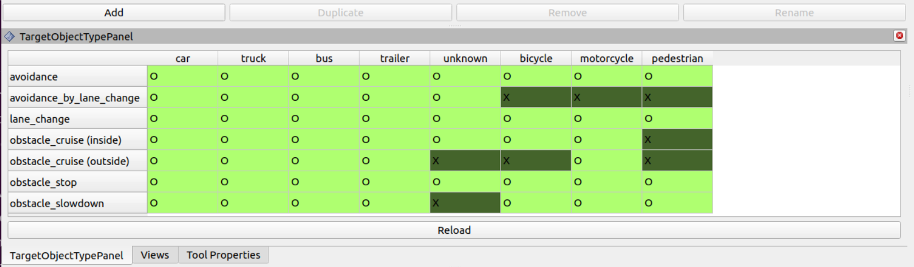

# tier4_target_object_type_rviz_plugin

This plugin allows you to check which types of the dynamic object is being used by each planner.

## Limitations

Currently, which parameters of which module to check are hardcoded. In the future, this will be parameterized using YAML.
