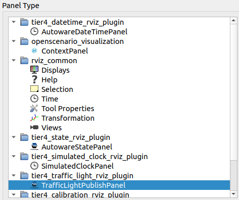
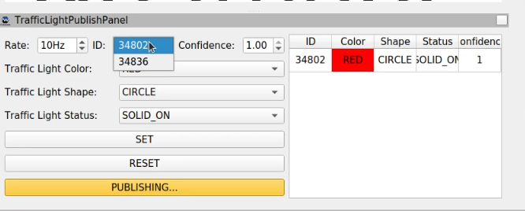
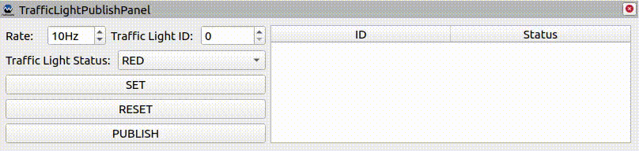

# tier4_traffic_light_rviz_plugin

## Purpose

This plugin panel publishes dummy traffic light signals.

## Inputs / Outputs

### Output

| Name                                                    | Type                                                | Description                   |
| ------------------------------------------------------- | --------------------------------------------------- | ----------------------------- |
| `/perception/traffic_light_recognition/traffic_signals` | `autoware_perception_msgs::msg::TrafficSignalArray` | Publish traffic light signals |

## HowToUse

  

  

  

1. Start rviz and select panels/Add new panel.
2. Select TrafficLightPublishPanel and press OK.
3. Set `Traffic Light ID` & `Traffic Light Status` and press `SET` button.
4. Traffic light signals are published, while `PUBLISH` button is pushed.

  

