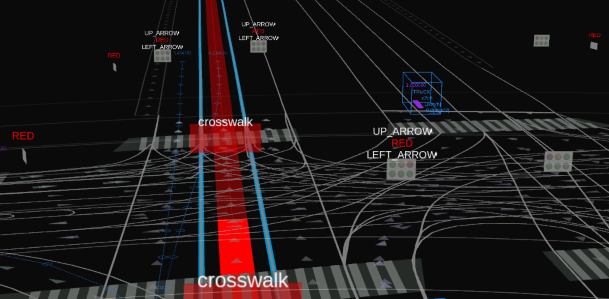

# path_distance_calculator

## Purpose

This node publishes a marker array for visualizing traffic signal recognition results on Rviz.

## Inner-workings / Algorithms

## Inputs / Outputs

### Input

| Name                                                    | Type                                                     | Description                                       |
| ------------------------------------------------------- | -------------------------------------------------------- | ------------------------------------------------- |
| `/map/vector_map`                                       | `autoware_auto_mapping_msgs::msg::HADMapBin`             | Vector map for getting traffic signal information |
| `/perception/traffic_light_recognition/traffic_signals` | `autoware_auto_perception_msgs::msg::TrafficSignalArray` | The result of traffic signal recognition          |

### Output

| Name                                                           | Type                                   | Description                                                                    |
| -------------------------------------------------------------- | -------------------------------------- | ------------------------------------------------------------------------------ |
| `/perception/traffic_light_recognition/traffic_signals_marker` | `visualization_msgs::msg::MarkerArray` | Publish a marker array for visualization of traffic signal recognition results |

## Parameters

None.

### Node Parameters

None.

### Core Parameters

None.

## Assumptions / Known limits

TBD.
