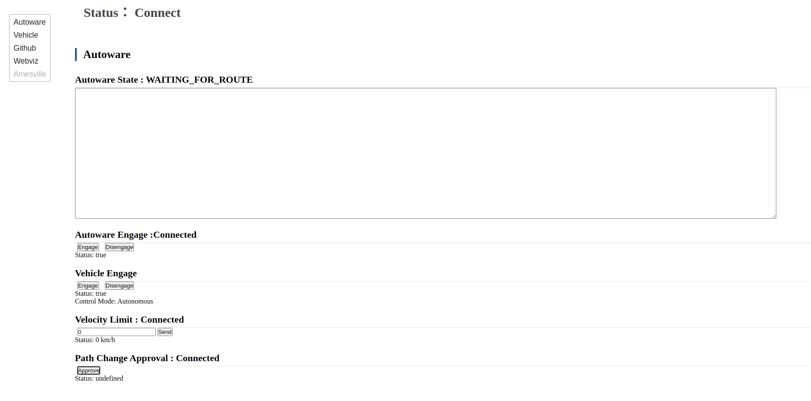

# web_controller

## Purpose

This packages is for visualizing the status of Autoware and sending topics for Autoware from a web page.

## Inputs / Outputs

### Input

| Name                                               | Type                                            | Description                  |
| -------------------------------------------------- | ----------------------------------------------- | ---------------------------- |
| `/control/current_gate_mode`                       | `tier4_control_msgs::msg::GateMode`             | Gate mode (AUTO or EXTERNAL) |
| `/autoware/state`                                  | `autoware_auto_system_msgs::msg::AutowareState` | State of Autoware            |
| `/autoware/engage`                                 | `autoware_auto_system_msgs::msg::Engage`        | Engage signal for Autoware   |
| `/vehicle/engage`                                  | `autoware_auto_system_msgs::msg::Engage`        | Engage signal for a vehicle  |
| `/planning/scenario_planning/max_velocity_default` | `tier4_planning_msgs::msg::VelocityLimit`       | Max velocity of Autoware     |

### Output

| Name                                                                                                    | Type                                      | Description                                                                               |
| ------------------------------------------------------------------------------------------------------- | ----------------------------------------- | ----------------------------------------------------------------------------------------- |
| `/planning/scenario_planning/lane_driving/behavior_planning/behavior_path_planner/path_change_approval` | `tier4_planning_msgs::msg::Approval`      | Send an approval signal for path change request such as lane change or obstacle avoidance |
| `/autoware/engage`                                                                                      | `autoware_auto_system_msgs::msg::Engage`  | Send an engage signal for Autoware                                                        |
| `/vehicle/engage`                                                                                       | `autoware_auto_system_msgs::msg::Engage`  | Send an engage signal for a vehicle                                                       |
| `/planning/scenario_planning/max_velocity_default`                                                      | `tier4_planning_msgs::msg::VelocityLimit` | Set a max velocity of Autoware                                                            |

## Parameter

### Core Parameters

None

## Assumptions / Known limits

`web_controller` needs `rosbridge` which is automatically launched in [tier4_autoware_api_launch](https://github.com/autowarefoundation/autoware.universe/pull/779) along with launching Autoware.

## Usage

1. Access to <http://localhost:8085/web_controller> after launching Autoware.
   
2. Check the status of Autoware or send topics by the buttons.
