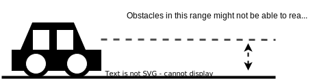

# Autonomous Emergency Braking (AEB)

## Purpose / Role

`autonomous_emergency_braking` is a module that prevents collisions with obstacles on the predicted path created by a control module or sensor values estimated from the control module.

### Assumptions

This module has following assumptions.

- It is used when driving at low speeds (about 15 km/h).

- The predicted path of the ego vehicle can be made from either the path created from sensors or the path created from a control module, or both.

- The current speed and angular velocity can be obtained from the sensors of the ego vehicle, and it uses point cloud as obstacles.

### IMU path generation: steering angle vs IMU's angular velocity

Currently, the IMU-based path is generated using the angular velocity obtained by the IMU itself. It has been suggested that the steering angle could be used instead onf the angular velocity.

The pros and cons of both approaches are:

IMU angular velocity:

- (+) Usually, it has high accuracy
- (-)Vehicle vibration might introduce noise.

Steering angle:

- (+) Not so noisy
- (-) May have a steering offset or a wrong gear ratio, and the steering angle of Autoware and the real steering may not be the same.

For the moment, there are no plans to implement the steering angle on the path creation process of the AEB module.

## Inner-workings / Algorithms

AEB has the following steps before it outputs the emergency stop signal.

1. Activate AEB if necessary.

2. Generate a predicted path of the ego vehicle.

3. Get target obstacles from the input point cloud.

4. Collision check with target obstacles.

5. Send emergency stop signals to `/diagnostics`.

We give more details of each section below.

### 1. Activate AEB if necessary

We do not activate AEB module if it satisfies the following conditions.

- Ego vehicle is not in autonomous driving state

- When the ego vehicle is not moving (Current Velocity is very low)

### 2. Generate a predicted path of the ego vehicle

AEB generates a predicted path based on current velocity and current angular velocity obtained from attached sensors. Note that if `use_imu_path` is `false`, it skips this step. This predicted path is generated as:

$$
x_{k+1} = x_k + v cos(\theta_k) dt \\
y_{k+1} = y_k + v sin(\theta_k) dt \\
\theta_{k+1} = \theta_k + \omega dt
$$

where $v$ and $\omega$ are current longitudinal velocity and angular velocity respectively. $dt$ is time interval that users can define in advance.

### 3. Get target obstacles from the input point cloud

After generating the ego predicted path, we select target obstacles from the input point cloud. This obstacle filtering has three major steps, which are rough filtering, noise filtering with clustering and rigorous filtering.

#### Rough filtering

In rough filtering step, we select target obstacle with simple filter. Create a search area up to a certain distance (default is half of the ego vehicle width plus the `path_footprint_extra_margin` parameter) away from the predicted path of the ego vehicle and ignore the point cloud that are not within it. The image of the rough filtering is illustrated below.

#### Noise filtering with clustering and convex hulls

To prevent the AEB from considering noisy points, euclidean clustering is performed on the filtered point cloud. The points in the point cloud that are not close enough to other points to form a cluster are discarded. The parameters `cluster_tolerance`, `minimum_cluster_size` and `maximum_cluster_size` can be used to tune the clustering and the size of objects to be ignored, for more information about the clustering method used by the AEB module, please check the official documentation on euclidean clustering of the PCL library: <https://pcl.readthedocs.io/projects/tutorials/en/master/cluster_extraction.html>.

Furthermore, a 2D convex hull is created around each detected cluster, the vertices of each hull represent the most extreme/outside points of the cluster. These vertices are then checked in the next step.

#### Rigorous filtering

After Noise filtering, the module performs a geometric collision check to determine whether the filtered obstacles/hull vertices actually have possibility to collide with the ego vehicle. In this check, the ego vehicle is represented as a rectangle, and the point cloud obstacles are represented as points. Only the vertices with a possibility of collision are kept. Finally, the vertex that is closest to the ego vehicle is chosen as the candidate for collision checking: Since rss distance is used to judge if a collision will happen or not, if the closest vertex to the ego is deemed to be safe, the rest of the vertices (and the points in the clusters) will also be safe.

#### Obstacle velocity estimation

Once the position of the closest obstacle/point is determined, the AEB modules uses the history of previously detected objects to estimate the closest object relative speed using the following equations:

$$
d_{t} = t_{1} - t_{0}
$$

$$
d_{x} = norm(o_{x} - prev_{x})
$$

$$
v_{norm} = d_{x} / d_{t}
$$

Where $t_{1}$ and $t_{0}$ are the timestamps of the point clouds used to detect the current closest object and the closest object of the previous point cloud frame, and $o_{x}$ and $prev_{x}$ are the positions of those objects, respectively.

Finally, the velocity vector is compared against the ego's predicted path to get the longitudinal velocity $v_{obj}$:

$$
v_{obj} = v_{norm} * Cos(yaw_{diff}) + v_{ego}
$$

where $yaw_{diff}$ is the difference in yaw between the ego path and the displacement vector $$v_{pos} = o_{pos} - prev_{pos} $$ and $v_{ego}$ is the ego's current speed, which accounts for the movement of points caused by the ego moving and not the object. All these equations are performed disregarding the z axis (in 2D).

Note that, the object velocity is calculated against the ego's current movement direction. If the object moves in the opposite direction to the ego's movement, the object velocity is set to 0 m/s. That is because the RSS distance calculation assumes the ego and the object move in the same direction and it cannot deal with negative velocities.

### 4. Collision check with target obstacles using RSS distance

In the fourth step, it checks the collision with the closest obstacle point using RSS distance. RSS distance is formulated as:

$$
d = v_{ego}*t_{response} + v_{ego}^2/(2*a_{min}) - v_{obj}^2/(2*a_{obj_{min}}) + offset
$$

where $v_{ego}$ and $v_{obj}$ is current ego and obstacle velocity, $a_{min}$ and $a_{obj_{min}}$ is ego and object minimum acceleration (maximum deceleration), $t_{response}$ is response time of the ego vehicle to start deceleration. Therefore the distance from the ego vehicle to the obstacle is smaller than this RSS distance $d$, the ego vehicle send emergency stop signals. This is illustrated in the following picture.

### 5. Send emergency stop signals to `/diagnostics`

If AEB detects collision with point cloud obstacles in the previous step, it sends emergency signal to `/diagnostics` in this step. Note that in order to enable emergency stop, it has to send ERROR level emergency. Moreover, AEB user should modify the setting file to keep the emergency level, otherwise Autoware does not hold the emergency state.

## Use cases

### Front vehicle suddenly brakes

The AEB can activate when a vehicle in front suddenly brakes, and a collision is detected by the AEB module. Provided the distance between the ego vehicle and the front vehicle is large enough and the ego’s emergency acceleration value is high enough, it is possible to avoid or soften collisions with vehicles in front that suddenly brake. NOTE: the acceleration used by the AEB to calculate rss_distance is NOT necessarily the acceleration used by the ego while doing an emergency brake. The acceleration used by the real vehicle can be tuned by changing the [mrm_emergency stop jerk and acceleration values](https://github.com/tier4/autoware_launch/blob/d1b2688f2788acab95bb9995d72efd7182e9006a/autoware_launch/config/system/mrm_emergency_stop_operator/mrm_emergency_stop_operator.param.yaml#L4).

### Stop for objects that appear suddenly

When an object appears suddenly, the AEB can act as a fail-safe to stop the ego vehicle when other modules fail to detect the object on time. If sudden object cut ins are expected, it might be useful for the AEB module to detect collisions of objects BEFORE they enter the real ego vehicle path by increasing the `expand_width` parameter.

### Preventing Collisions with rear objects

The AEB module can also prevent collisions when the ego vehicle is moving backwards.

### Preventing collisions in case of wrong Odometry (IMU path only)

When vehicle odometry information is faulty, it is possible that the MPC fails to predict a correct path for the ego vehicle. If the MPC predicted path is wrong, collision avoidance will not work as intended on the planning modules. However, the AEB’s IMU path does not depend on the MPC and could be able to predict a collision when the other modules cannot. As an example you can see a figure of a hypothetical case in which the MPC path is wrong and only the AEB’s IMU path detects a collision.

## Parameters

| Name                              | Unit   | Type   | Description                                                                                                                                                                                     | Default value |
| :-------------------------------- | :----- | :----- | :---------------------------------------------------------------------------------------------------------------------------------------------------------------------------------------------- | :------------ |
| publish_debug_pointcloud          | [-]    | bool   | flag to publish the point cloud used for debugging                                                                                                                                              | false         |
| use_predicted_trajectory          | [-]    | bool   | flag to use the predicted path from the control module                                                                                                                                          | true          |
| use_imu_path                      | [-]    | bool   | flag to use the predicted path generated by sensor data                                                                                                                                         | true          |
| use_object_velocity_calculation   | [-]    | bool   | flag to use the object velocity calculation. If set to false, object velocity is set to 0 [m/s]                                                                                                 | true          |
| detection_range_min_height        | [m]    | double | minimum hight of detection range used for avoiding the ghost brake by false positive point clouds                                                                                               | 0.0           |
| detection_range_max_height_margin | [m]    | double | margin for maximum hight of detection range used for avoiding the ghost brake by false positive point clouds. `detection_range_max_height = vehicle_height + detection_range_max_height_margin` | 0.0           |
| voxel_grid_x                      | [m]    | double | down sampling parameters of x-axis for voxel grid filter                                                                                                                                        | 0.05          |
| voxel_grid_y                      | [m]    | double | down sampling parameters of y-axis for voxel grid filter                                                                                                                                        | 0.05          |
| voxel_grid_z                      | [m]    | double | down sampling parameters of z-axis for voxel grid filter                                                                                                                                        | 100000.0      |
| min_generated_path_length         | [m]    | double | minimum distance for a predicted path generated by sensors                                                                                                                                      | 0.5           |
| expand_width                      | [m]    | double | expansion width of the ego vehicle for the collision check                                                                                                                                      | 0.1           |
| longitudinal_offset               | [m]    | double | longitudinal offset distance for collision check                                                                                                                                                | 2.0           |
| t_response                        | [s]    | double | response time for the ego to detect the front vehicle starting deceleration                                                                                                                     | 1.0           |
| a_ego_min                         | [m/ss] | double | maximum deceleration value of the ego vehicle                                                                                                                                                   | -3.0          |
| a_obj_min                         | [m/ss] | double | maximum deceleration value of objects                                                                                                                                                           | -3.0          |
| imu_prediction_time_horizon       | [s]    | double | time horizon of the predicted path generated by sensors                                                                                                                                         | 1.5           |
| imu_prediction_time_interval      | [s]    | double | time interval of the predicted path generated by sensors                                                                                                                                        | 0.1           |
| mpc_prediction_time_horizon       | [s]    | double | time horizon of the predicted path generated by mpc                                                                                                                                             | 1.5           |
| mpc_prediction_time_interval      | [s]    | double | time interval of the predicted path generated by mpc                                                                                                                                            | 0.1           |
| aeb_hz                            | [-]    | double | frequency at which AEB operates per second                                                                                                                                                      | 10            |

## Limitations

- AEB might not be able to react with obstacles that are close to the ground. It depends on the performance of the pre-processing methods applied to the point cloud.

- Longitudinal acceleration information obtained from sensors is not used due to the high amount of noise.

- The accuracy of the predicted path created from sensor data depends on the accuracy of sensors attached to the ego vehicle.

- Currently, the module calculates thee closest object velocity if it goes in the same direction as the ego vehicle, otherwise the velocity is set to 0 m/s since RSS distance calculation does not use negative velocities.

