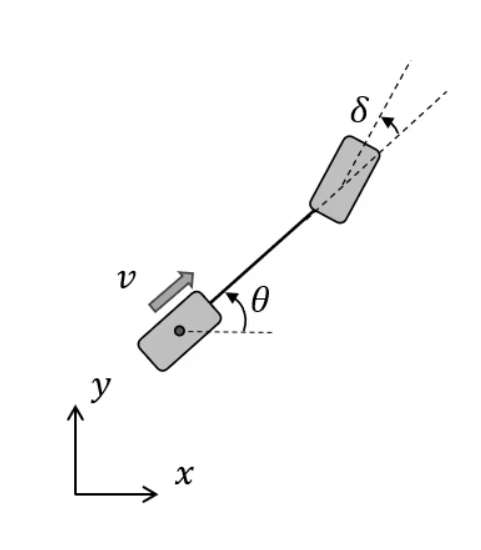
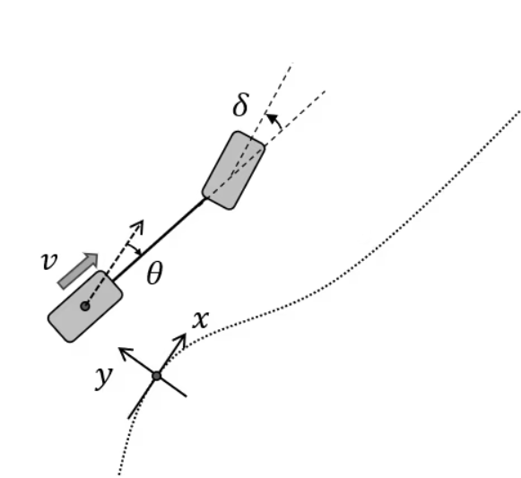

# MPC Algorithm

## Introduction

Model Predictive Control (MPC) is a control method that solves an optimization problem during each control cycle to determine an optimal control sequence based on a given vehicle model. The calculated sequence of control inputs is used to control the system.

In simpler terms, an MPC controller calculates a series of control inputs that optimize the state and output trajectories to achieve the desired behavior. The key characteristics of an MPC control system can be summarized as follows:

1. Prediction of Future Trajectories: MPC computes a control sequence by predicting the future state and output trajectories. The first control input is applied to the system, and this process repeats in a receding horizon manner at each control cycle.
2. Handling of Constraints: MPC is capable of handling constraints on the state and input variables during the optimization phase. This ensures that the system operates within specified limits.
3. Handling of Complex Dynamics: MPC algorithms can handle complex dynamics, whether they are linear or nonlinear in nature.

The choice between a linear or nonlinear model or constraint equation depends on the specific formulation of the MPC problem. If any nonlinear expressions are present in the motion equation or constraints, the optimization problem becomes nonlinear. In the following sections, we provide a step-by-step explanation of how linear and nonlinear optimization problems are solved within the MPC framework. Note that in this documentation, we utilize the linearization method to accommodate the nonlinear model.

## Linear MPC formulation

### Formulate as an optimization problem

This section provides an explanation of MPC specifically for linear systems. In the following section, it also demonstrates the formulation of a vehicle path following problem as an application.

In the linear MPC formulation, all motion and constraint expressions are linear. For the path following problem, let's assume that the system's motion can be described by a set of equations, denoted as (1). The state evolution and measurements are presented in a discrete state space format, where matrices $A$, $B$, and $C$ represent the state transition, control, and measurement matrices, respectively.

$$
\begin{gather}
x_{k+1}=Ax_{k}+Bu_{k}+w_{k}, y_{k}=Cx_{k} \tag{1} \\\
x_{k}\in R^{n},u_{k}\in R^{m},w_{k}\in R^{n}, y_{k}\in R^{l}, A\in R^{n\times n}, B\in R^{n\times m}, C\in R^{l \times n}
\end{gather}
$$

Equation (1) represents the state-space equation, where $x_k$ represents the internal states, $u_k$ denotes the input, and $w_k$ represents a known disturbance caused by linearization or problem structure. The measurements are indicated by the variable $y_k$.

It's worth noting that another advantage of MPC is its ability to effectively handle the disturbance term $w$. While it is referred to as a disturbance here, it can take various forms as long as it adheres to the equation's structure.

The state transition and measurement equations in (1) are iterative, moving from time $k$ to time $k+1$. By propagating the equation starting from an initial state and control pair $(x_0, u_0)$ along with a specified horizon of $N$ steps, one can predict the trajectories of states and measurements.

For simplicity, let's assume the initial state is $x_0$ with $k=0$.

To begin, we can compute the state $x_1$ at $k=1$ using equation (1) by substituting the initial state into the equation. Since we are seeking a solution for the input sequence, we represent the inputs as decision variables in the symbolic expressions.

$$
\begin{align}
x_{1} = Ax_{0} + Bu_{0} + w_{0} \tag{2}
\end{align}
$$

Then, when $k=2$, using also equation (2), we get

$$
\begin{align}
x_{2} & = Ax_{1} + Bu_{1} + w_{1} \\\
& = A(Ax_{0} + Bu_{0} + w_{0}) + Bu_{1} + w_{1} \\\
& = A^{2}x_{0} + ABu_{0} + Aw_{0} + Bu_{1} + w_{1} \\\
& = A^{2}x_{0} + \begin{bmatrix}AB & B \end{bmatrix}\begin{bmatrix}u_{0}\\\ u_{1} \end{bmatrix} + \begin{bmatrix}A & I \end{bmatrix}\begin{bmatrix}w_{0}\\\ w_{1} \end{bmatrix} \tag{3}
\end{align}
$$

When $k=3$ , from equation (3)

$$
\begin{align}
x_{3} & = Ax_{2} + Bu_{2} + w_{2} \\\
& = A(A^{2}x_{0} + ABu_{0} + Bu_{1} + Aw_{0} + w_{1} ) + Bu_{2} + w_{2} \\\
& = A^{3}x_{0} + A^{2}Bu_{0} + ABu_{1} + A^{2}w_{0} + Aw_{1} + Bu_{2} + w_{2} \\\
& = A^{3}x_{0} + \begin{bmatrix}A^{2}B & AB & B  \end{bmatrix}\begin{bmatrix}u_{0}\\\ u_{1} \\\ u_{2} \end{bmatrix} + \begin{bmatrix} A^{2} & A & I \end{bmatrix}\begin{bmatrix}w_{0}\\\ w_{1} \\\ w_{2} \end{bmatrix} \tag{4}
\end{align}
$$

If $k=n$ , then

$$
\begin{align}
x_{n} = A^{n}x_{0} + \begin{bmatrix}A^{n-1}B & A^{n-2}B & \dots  & B  \end{bmatrix}\begin{bmatrix}u_{0}\\\ u_{1} \\\ \vdots  \\\ u_{n-1} \end{bmatrix} + \begin{bmatrix} A^{n-1} & A^{n-2} & \dots & I \end{bmatrix}\begin{bmatrix}w_{0}\\\ w_{1} \\\ \vdots \\\ w_{n-1} \end{bmatrix}
\tag{5}
\end{align}
$$

Putting all of them together with (2) to (5) yields the following matrix equation;

$$
\begin{align}
\begin{bmatrix}x_{1}\\\ x_{2} \\\ x_{3} \\\ \vdots  \\\ x_{n} \end{bmatrix} = \begin{bmatrix}A^{1}\\\ A^{2} \\\ A^{3} \\\ \vdots  \\\ A^{n} \end{bmatrix}x_{0} + \begin{bmatrix}B & 0 & \dots  & & 0 \\\ AB & B & 0 & \dots & 0  \\\ A^{2}B & AB & B & \dots & 0 \\\ \vdots & \vdots & & & 0 \\\ A^{n-1}B & A^{n-2}B & \dots & AB & B \end{bmatrix}\begin{bmatrix}u_{0}\\\ u_{1} \\\ u_{2} \\\ \vdots  \\\ u_{n-1} \end{bmatrix} \\\ +
\begin{bmatrix}I & 0 & \dots  & & 0 \\\ A & I & 0 & \dots & 0  \\\ A^{2} & A & I & \dots & 0 \\\ \vdots & \vdots & & & 0 \\\ A^{n-1} & A^{n-2} & \dots & A & I \end{bmatrix}\begin{bmatrix}w_{0}\\\ w_{1} \\\ w_{2} \\\ \vdots  \\\ w_{n-1} \end{bmatrix}
\tag{6}
\end{align}
$$

In this case, the measurements (outputs) become; $y_{k}=Cx_{k}$, so

$$
\begin{align}
\begin{bmatrix}y_{1}\\\ y_{2} \\\ y_{3} \\\ \vdots  \\\ y_{n} \end{bmatrix} = \begin{bmatrix}C & 0 & \dots  & & 0 \\\ 0 & C & 0 & \dots & 0  \\\ 0 & 0 & C & \dots & 0 \\\ \vdots & & & \ddots & 0 \\\ 0 & \dots & 0 & 0 & C \end{bmatrix}\begin{bmatrix}x_{1}\\\ x_{2} \\\ x_{3} \\\ \vdots  \\\ x_{n} \end{bmatrix} \tag{7}
\end{align}
$$

We can combine equations (6) and (7) into the following form:

$$
\begin{align}
X = Fx_{0} + GU +SW, Y=HX \tag{8}
\end{align}
$$

This form is similar to the original state-space equations (1), but it introduces new matrices: the state transition matrix $F$, control matrix $G$, disturbance matrix $W$, and measurement matrix $H$. In these equations, $X$ represents the predicted states, given by $\begin{bmatrix}x_{1} & x_{2} & \dots & x_{n} \end{bmatrix}^{T}$.

Now that $G$, $S$, $W$, and $H$ are known, we can express the output behavior $Y$ for the next $n$ steps as a function of the input $U$. This allows us to calculate the control input $U$ so that $Y(U)$ follows the target trajectory $Y_{ref}$.

The next step is to define a cost function. The cost function generally uses the following quadratic form;

$$
\begin{align}
J = (Y - Y_{ref})^{T}Q(Y - Y_{ref}) + (U - U_{ref})^{T}R(U - U_{ref}) \tag{9}
\end{align}
$$

where $U_{ref}$ is the target or steady-state input around which the system is linearized for $U$.

This cost function is the same as that of the LQR controller. The first term of $J$ penalizes the deviation from the reference trajectory. The second term penalizes the deviation from the reference (or steady-state) control trajectory. The $Q$ and $R$ are the cost weights Positive and Positive semi-semidefinite matrices.

Note: in some cases, $U_{ref}=0$ is used, but this can mean the steering angle should be set to $0$ even if the vehicle is turning a curve. Thus $U_{ref}$ is used for the explanation here. This $U_{ref}$ can be pre-calculated from the curvature of the target trajectory or the steady-state analyses.

As the resulting trajectory output is now $Y=Y(x_{0}, U)$, the cost function depends only on U and the initial state conditions which yields the cost $J=J(x_{0}, U)$. Let’s find the $U$ that minimizes this.

Substituting equation (8) into equation (9) and tidying up the equation for $U$.

$$
\begin{align}
J(U) &= (H(Fx_{0}+GU+SW)-Y_{ref})^{T}Q(H(Fx_{0}+GU+SW)-Y_{ref})+(U-U_{ref})^{T}R(U-U_{ref}) \\\
& =U^{T}(G^{T}H^{T}QHG+R)U+2\lbrace\{(H(Fx_{0}+SW)-Y_{ref})^{T}QHG-U_{ref}^{T}R\rbrace\}U +(\rm{constant}) \tag{10}
\end{align}
$$

This equation is a quadratic form of $U$ (i.e. $U^{T}AU+B^{T}U$)

The coefficient matrix of the quadratic term of $U$, $G^{T}C^{T}QCG+R$ , is positive definite due to the positive and semi-positive definiteness requirement for $Q$ and $R$. Therefore, the cost function is a convex quadratic function in U, which can efficiently be solved by convex optimization.

### Apply to vehicle path-following problem (nonlinear problem)

Because the path-following problem with a kinematic vehicle model is nonlinear, we cannot directly use the linear MPC methods described in the preceding section. There are several ways to deal with a nonlinearity such as using the nonlinear optimization solver. Here, the linearization is applied to the nonlinear vehicle model along the reference trajectory, and consequently, the nonlinear model is converted into a linear time-varying model.

For a nonlinear kinematic vehicle model, the discrete-time update equations are as follows:

$$
\begin{align}
x_{k+1} &= x_{k} + v\cos\theta_{k} \text{d}t \\\
y_{k+1} &= y_{k} + v\sin\theta_{k} \text{d}t \\\
\theta_{k+1} &= \theta_{k} + \frac{v\tan\delta_{k}}{L} \text{d}t \tag{11} \\\
\delta_{k+1} &= \delta_{k} - \tau^{-1}\left(\delta_{k}-\delta_{des}\right)\text{d}t
\end{align}
$$

The vehicle reference is the center of the rear axle and all states are measured at this point. The states, parameters, and control variables are shown in the following table.

| Symbol         | Represent                                                     |
| -------------- | ------------------------------------------------------------- |
| $v$            | Vehicle speed measured at the center of rear axle             |
| $\theta$       | Yaw (heading angle) in global coordinate system               |
| $\delta$       | Vehicle steering angle                                        |
| $\delta_{des}$ | Vehicle target steering angle                                 |
| $L$            | Vehicle wheelbase (distance between the rear and front axles) |
| $\tau$         | Time constant for the first order steering dynamics           |

We assume in this example that the MPC only generates the steering control, and the trajectory generator gives the vehicle speed along the trajectory.

The kinematic vehicle model discrete update equations contain trigonometric functions; sin and cos, and the vehicle coordinates $x$, $y$, and yaw angles are global coordinates. In path tracking applications, it is common to reformulate the model in error dynamics to convert the control into a regulator problem in which the targets become zero (zero error).

We make small angle assumptions for the following derivations of linear equations. Given the nonlinear dynamics and omitting the longitudinal coordinate $x$, the resulting set of equations become;

$$
\begin{align}
y_{k+1} &= y_{k} + v\sin\theta_{k} \text{d}t \\\
\theta_{k+1} &= \theta_{k} + \frac{v\tan\delta_{k}}{L} \text{d}t - \kappa_{r}v\cos\theta_{k}\text{d}t
\tag{12} \\\
\delta_{k+1} &= \delta_{k} - \tau^{-1}\left(\delta_{k}-\delta_{des}\right)\text{d}t
\end{align}
$$

Where $\kappa_{r}\left(s\right)$ is the curvature along the trajectory parametrized by the arc length.

There are three expressions in the update equations that are subject to linear approximation: the lateral deviation (or lateral coordinate) $y$, the heading angle (or the heading angle error) $\theta$, and the steering $\delta$. We can make a small angle assumption on the heading angle $\theta$.

In the path tracking problem, the curvature of the trajectory $\kappa_{r}$ is known in advance. At the lower speeds, the Ackermann formula approximates the reference steering angle $\theta_{r}$(this value corresponds to the $U_{ref}$ mentioned above). The Ackermann steering expression can be written as;

$$
\begin{align}
\delta_{r} = \arctan\left(L\kappa_{r}\right)
\end{align}
$$

When the vehicle is turning a path, its steer angle $\delta$ should be close to the value $\delta_{r}$. Therefore, $\delta$ can be expressed,

$$
\begin{align}
\delta = \delta_{r} + \Delta \delta, \Delta\delta \ll 1
\end{align}
$$

Substituting this equation into equation (12), and approximate $\Delta\delta$ to be small.

$$
\begin{align}
\tan\delta &\simeq \tan\delta_{r} + \frac{\text{d}\tan\delta}{\text{d}\delta} \Biggm|_{\delta=\delta_{r}}\Delta\delta \\\
&= \tan \delta_{r} + \frac{1}{\cos^{2}\delta_{r}}\Delta\delta \\\
&= \tan \delta_{r} + \frac{1}{\cos^{2}\delta_{r}}\left(\delta-\delta_{r}\right) \\\
&= \tan \delta_{r} - \frac{\delta_{r}}{\cos^{2}\delta_{r}} + \frac{1}{\cos^{2}\delta_{r}}\delta
\end{align}
$$

Using this, $\theta_{k+1}$ can be expressed

$$
\begin{align}
\theta_{k+1} &= \theta_{k} + \frac{v\tan\delta_{k}}{L}\text{d}t - \kappa_{r}v\cos\delta_{k}\text{d}t \\\
&\simeq \theta_{k} + \frac{v}{L}\text{d}t\left(\tan\delta_{r} - \frac{\delta_{r}}{\cos^{2}\delta_{r}} + \frac{1}{\cos^{2}\delta_{r}}\delta_{k} \right) - \kappa_{r}v\text{d}t \\\
&= \theta_{k} + \frac{v}{L}\text{d}t\left(L\kappa_{r} - \frac{\delta_{r}}{\cos^{2}\delta_{r}} + \frac{1}{\cos^{2}\delta_{r}}\delta_{k} \right) - \kappa_{r}v\text{d}t \\\
&= \theta_{k} + \frac{v}{L}\frac{\text{d}t}{\cos^{2}\delta_{r}}\delta_{k} - \frac{v}{L}\frac{\delta_{r}\text{d}t}{\cos^{2}\delta_{r}}
\end{align}
$$

Finally, the linearized time-varying model equation becomes;

$$
\begin{align}
\begin{bmatrix} y_{k+1} \\\ \theta_{k+1} \\\ \delta_{k+1} \end{bmatrix} = \begin{bmatrix} 1 & v\text{d}t & 0 \\\ 0 & 1 & \frac{v}{L}\frac{\text{d}t}{\cos^{2}\delta_{r}} \\\ 0 & 0 & 1 - \tau^{-1}\text{d}t \end{bmatrix} \begin{bmatrix} y_{k} \\\ \theta_{k} \\\ \delta_{k} \end{bmatrix} + \begin{bmatrix} 0 \\\ 0 \\\ \tau^{-1}\text{d}t \end{bmatrix}\delta_{des} + \begin{bmatrix} 0 \\\ -\frac{v}{L}\frac{\delta_{r}\text{d}t}{\cos^{2}\delta_{r}} \\\ 0 \end{bmatrix}
\end{align}
$$

This equation has the same form as equation (1) of the linear MPC assumption, but the matrices $A$, $B$, and $w$ change depending on the coordinate transformation. To make this explicit, the entire equation is written as follows

$$
\begin{align}
x_{k+1} = A_{k}x_{k} + B_{k}u_{k}+w_{k}
\end{align}
$$

Comparing equation (1), $A \rightarrow A_{k}$. This means that the $A$ matrix is a linear approximation in the vicinity of the trajectory after $k$ steps (i.e., $k* \text{d}t$ seconds), and it can be obtained if the trajectory is known in advance.

Using this equation, write down the update equation likewise (2) ~ (6)

$$
\begin{align}
\begin{bmatrix}
 x_{1} \\\ x_{2} \\\ x_{3} \\\ \vdots \\\ x_{n}
\end{bmatrix}
= \begin{bmatrix}
 A_{1} \\\ A_{1}A_{0} \\\ A_{2}A_{1}A_{0} \\\ \vdots \\\ \prod_{i=0}^{n-1} A_{k}
\end{bmatrix}
x_{0} +
\begin{bmatrix}
 B_{0} & 0 & \dots & & 0 \\\ A_{1}B_{0} & B_{1} & 0 & \dots & 0 \\\ A_{2}A_{1}B_{0} & A_{2}B_{1} & B_{2} & \dots & 0 \\\ \vdots & \vdots & &\ddots & 0 \\\ \prod_{i=1}^{n-1} A_{k}B_{0} & \prod_{i=2}^{n-1} A_{k}B_{1} & \dots & A_{n-1}B_{n-1} & B_{n-1}
\end{bmatrix}
\begin{bmatrix}
 u_{0} \\\ u_{1} \\\ u_{2} \\\ \vdots \\\ u_{n-1}
\end{bmatrix} +
\begin{bmatrix}
I & 0 & \dots & & 0 \\\ A_{1} & I & 0 & \dots & 0 \\\ A_{2}A_{1} & A_{2} & I & \dots & 0 \\\ \vdots & \vdots & &\ddots & 0 \\\ \prod_{i=1}^{n-1} A_{k} & \prod_{i=2}^{n-1} A_{k} & \dots & A_{n-1} & I
\end{bmatrix}
\begin{bmatrix}
 w_{0} \\\ w_{1} \\\ w_{2} \\\ \vdots \\\ w_{n-1}
\end{bmatrix}
\end{align}
$$

As it has the same form as equation (6), convex optimization is applicable for as much as the model in the former section.

## The cost functions and constraints

In this section, we give the details on how to set up the cost function and constraint conditions.

### The cost function

#### Weight for error and input

MPC states and control weights appear in the cost function in a similar way as LQR (9). In the vehicle path following the problem described above, if C is the unit matrix, the output $y = x = \left[y, \theta, \delta\right]$. (To avoid confusion with the y-directional deviation, here $e$ is used for the lateral deviation.)

As an example, let's determine the weight matrix $Q_{1}$ of the evaluation function for the number of prediction steps $n=2$ system as follows.

$$
\begin{align}
Q_{1} = \begin{bmatrix} q_{e} & 0 & 0 & 0 & 0& 0 \\\ 0 & q_{\theta} & 0 & 0 & 0 & 0 \\\ 0 & 0 & 0 & 0 & 0 & 0 \\\ 0 & 0 & 0 & q_{e} & 0 & 0 \\\ 0 & 0 & 0 & 0 & q_{\theta} & 0 \\\ 0 & 0 & 0 & 0 & 0 & 0 \end{bmatrix}
\end{align}
$$

The first term in the cost function (9) with $n=2$, is shown as follow ($Y_{ref}$ is set to $0$)

$$
\begin{align}
q_{e}\left(e_{0}^{2} + e_{1}^{2} \right) + q_{\theta}\left(\theta_{0}^{2} + \theta_{1}^{2} \right)
\end{align}
$$

This shows that $q_{e}$ is the weight for the lateral error and $q$ is for the angular error. In this example, $q_{e}$ acts as the proportional - P gain and $q_{\theta}$ as the derivative - D gain for the lateral tracking error. The balance of these factors (including R) will be determined through actual experiments.

#### Weight for non-diagonal term

MPC can handle the non-diagonal term in its calculation (as long as the resulting matrix is positive definite).

For instance, write $Q_{2}$ as follows for the $n=2$ system.

$$
\begin{align}
Q_{2} = \begin{bmatrix} 0 & 0 & 0 & 0 & 0 & 0 \\\ 0 & 0 & 0 & 0 & 0 & 0 \\\ 0 & 0 & q_{d} & 0 & 0 & -q_{d} \\\ 0 & 0 & 0 & 0 & 0 & 0 \\\ 0 & 0 & 0 & 0 & 0 & 0 \\\ 0 & 0 & -q_{d} & 0 & 0 & q_{d} \end{bmatrix}
\end{align}
$$

Expanding the first term of the evaluation function using $Q_{2}$

$$
\begin{align}
q_{d}\left(\delta_{0}^{2} -2\delta_{0}\delta_{1} + \delta_{1}^{2} \right) = q_{d}\left( \delta_{0} - \delta_{1}\right)^{2}
\end{align}
$$

The value of $q_{d}$ is weighted by the amount of change in $\delta$, which will prevent the tire from moving quickly. By adding this section, the system can evaluate the balance between tracking accuracy and change of steering wheel angle.

Since the weight matrix can be added linearly, the final weight can be set as $Q = Q_{1} + Q_{2}$.

Furthermore, MPC optimizes over a period of time, the time-varying weight can be considered in the optimization.

### Constraints

#### Input constraint

The main advantage of MPC controllers is the capability to deal with any state or input constraints. The constraints can be expressed as box constraints, such as "the tire angle must be within ±30 degrees", and can be put in the following form;

$$
\begin{align}
u_{min} < u < u_{max}
\end{align}
$$

The constraints must be linear and convex in the linear MPC applications.

#### Constraints on the derivative of the input

We can also put constraints on the input deviations. As the derivative of steering angle is $\dot{u}$, its box constraint is

$$
\begin{align}
\dot u_{min} < \dot u < \dot u_{max}
\end{align}
$$

We discretize $\dot{u}$ as $\left(u_{k} - u_{k-1}\right)/\text{d}t$ and multiply both sides by dt, and the resulting constraint become linear and convex

$$
\begin{align}
\dot u_{min}\text{d}t < u_{k} - u_{k-1} < \dot u_{max}\text{d}t
\end{align}
$$

Along the prediction or control horizon, i.e for setting $n=3$

$$
\begin{align}
\dot u_{min}\text{d}t < u_{1} - u_{0} < \dot u_{max}\text{d}t \\\
\dot u_{min}\text{d}t < u_{2} - u_{1} < \dot u_{max}\text{d}t
\end{align}
$$

and aligning the inequality signs

$$
\begin{align}
u_{1} - u_{0} &< \dot u_{max}\text{d}t \\\ +
u_{1} + u_{0} &< -\dot u_{min}\text{d}t \\\
u_{2} - u_{1} &< \dot u_{max}\text{d}t \\\ +
u_{2} + u_{1} &< - \dot u_{min}\text{d}t
\end{align}
$$

We can obtain a matrix expression for the resulting constraint equation in the form of

$$
\begin{align}
Ax \leq b
\end{align}
$$

Thus, putting this inequality to fit the form above, the constraints against $\dot{u}$ can be included at the first-order approximation level.

$$
\begin{align}
\begin{bmatrix} -1 & 1 & 0 \\\ 1 & -1 & 0 \\\ 0 & -1 & 1 \\\ 0 & 1 & -1 \end{bmatrix}\begin{bmatrix} u_{0} \\\ u_{1} \\\ u_{2} \end{bmatrix} \leq \begin{bmatrix} \dot u_{max}\text{d}t \\\ -\dot u_{min}\text{d}t \\\ \dot u_{max}\text{d}t \\\ -\dot u_{min}\text{d}t \end{bmatrix}
\end{align}
$$
