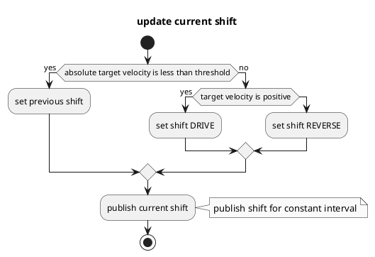

# Shift Decider

## Purpose

`autoware_shift_decider` is a module to decide shift from ackermann control command.

## Inner-workings / Algorithms

### Flow chart

### Algorithms

## Inputs / Outputs

### Input

| Name                  | Type                                  | Description                  |
| --------------------- | ------------------------------------- | ---------------------------- |
| `~/input/control_cmd` | `autoware_control_msgs::msg::Control` | Control command for vehicle. |

### Output

| Name               | Type                                      | Description                        |
| ------------------ | ----------------------------------------- | ---------------------------------- |
| `~output/gear_cmd` | `autoware_vehicle_msgs::msg::GearCommand` | Gear for drive forward / backward. |

## Parameters

none.

## Assumptions / Known limits

TBD.
