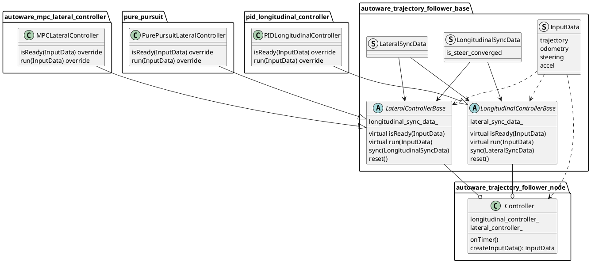

# Trajectory Follower Nodes

## Purpose

Generate control commands to follow a given Trajectory.

## Design

This is a node of the functionalities implemented in the controller class derived from [autoware_trajectory_follower_base](../autoware_trajectory_follower_base/README.md#trajectory-follower) package. It has instances of those functionalities, gives them input data to perform calculations, and publishes control commands.

By default, the controller instance with the `Controller` class as follows is used.



The process flow of `Controller` class is as follows.

```cpp
// 1. create input data
const auto input_data = createInputData(*get_clock());
if (!input_data) {
  return;
}

// 2. check if controllers are ready
const bool is_lat_ready = lateral_controller_->isReady(*input_data);
const bool is_lon_ready = longitudinal_controller_->isReady(*input_data);
if (!is_lat_ready || !is_lon_ready) {
  return;
}

// 3. run controllers
const auto lat_out = lateral_controller_->run(*input_data);
const auto lon_out = longitudinal_controller_->run(*input_data);

// 4. sync with each other controllers
longitudinal_controller_->sync(lat_out.sync_data);
lateral_controller_->sync(lon_out.sync_data);

// 5. publish control command
control_cmd_pub_->publish(out);
```

Giving the longitudinal controller information about steer convergence allows it to control steer when stopped if following parameters are `true`

- lateral controller
  - `keep_steer_control_until_converged`
- longitudinal controller
  - `enable_keep_stopped_until_steer_convergence`

### Inputs / Outputs / API

#### Inputs

- `autoware_planning_msgs/Trajectory` : reference trajectory to follow.
- `nav_msgs/Odometry`: current odometry
- `autoware_vehicle_msgs/SteeringReport` current steering

#### Outputs

- `autoware_control_msgs/Control`: message containing both lateral and longitudinal commands.

#### Parameter

- `ctrl_period`: control commands publishing period
- `timeout_thr_sec`: duration in second after which input messages are discarded.
  - Each time the node receives lateral and longitudinal commands from each controller, it publishes an `Control` if the following two conditions are met.
    1. Both commands have been received.
    2. The last received commands are not older than defined by `timeout_thr_sec`.
- `lateral_controller_mode`: `mpc` or `pure_pursuit`
  - (currently there is only `PID` for longitudinal controller)

## Debugging

Debug information are published by the lateral and longitudinal controller using `tier4_debug_msgs/Float32MultiArrayStamped` messages.

A configuration file for [PlotJuggler](https://github.com/facontidavide/PlotJuggler) is provided in the `config` folder which, when loaded, allow to automatically subscribe and visualize information useful for debugging.

In addition, the predicted MPC trajectory is published on topic `output/lateral/predicted_trajectory` and can be visualized in Rviz.
