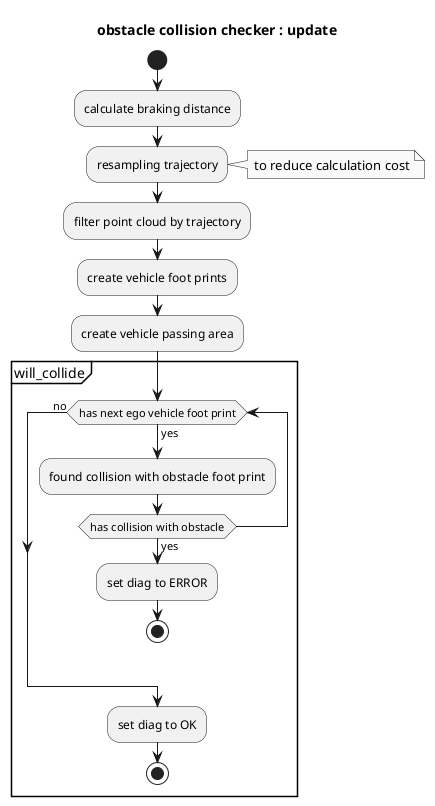

# obstacle_collision_checker

## Purpose

`obstacle_collision_checker` is a module to check obstacle collision for predicted trajectory and publish diagnostic errors if collision is found.

## Inner-workings / Algorithms

### Flow chart

### Algorithms

### Check data

Check that `obstacle_collision_checker` receives no ground pointcloud, predicted_trajectory, reference trajectory, and current velocity data.

### Diagnostic update

If any collision is found on predicted path, this module sets `ERROR` level as diagnostic status else sets `OK`.

## Inputs / Outputs

### Input

| Name                                           | Type                                      | Description                                                        |
| ---------------------------------------------- | ----------------------------------------- | ------------------------------------------------------------------ |
| `~/input/trajectory`                           | `autoware_planning_msgs::msg::Trajectory` | Reference trajectory                                               |
| `~/input/trajectory`                           | `autoware_planning_msgs::msg::Trajectory` | Predicted trajectory                                               |
| `/perception/obstacle_segmentation/pointcloud` | `sensor_msgs::msg::PointCloud2`           | Pointcloud of obstacles which the ego-vehicle should stop or avoid |
| `/tf`                                          | `tf2_msgs::msg::TFMessage`                | TF                                                                 |
| `/tf_static`                                   | `tf2_msgs::msg::TFMessage`                | TF static                                                          |

### Output

| Name             | Type                                   | Description              |
| ---------------- | -------------------------------------- | ------------------------ |
| `~/debug/marker` | `visualization_msgs::msg::MarkerArray` | Marker for visualization |

## Parameters

| Name                | Type     | Description                                        | Default value |
| :------------------ | :------- | :------------------------------------------------- | :------------ |
| `delay_time`        | `double` | Delay time of vehicle [s]                          | 0.3           |
| `footprint_margin`  | `double` | Foot print margin [m]                              | 0.0           |
| `max_deceleration`  | `double` | Max deceleration for ego vehicle to stop [m/s^2]   | 2.0           |
| `resample_interval` | `double` | Interval for resampling trajectory [m]             | 0.3           |
| `search_radius`     | `double` | Search distance from trajectory to point cloud [m] | 5.0           |

## Assumptions / Known limits

To perform proper collision check, it is necessary to get probably predicted trajectory and obstacle pointclouds without noise.
