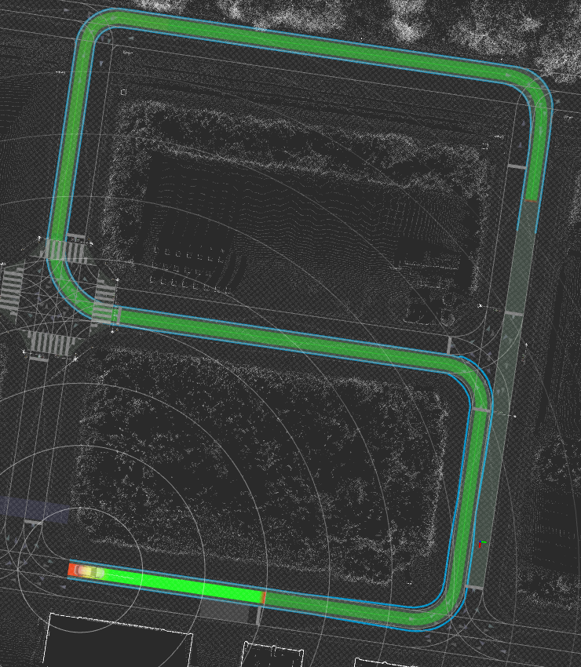
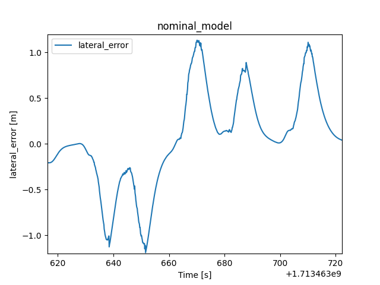
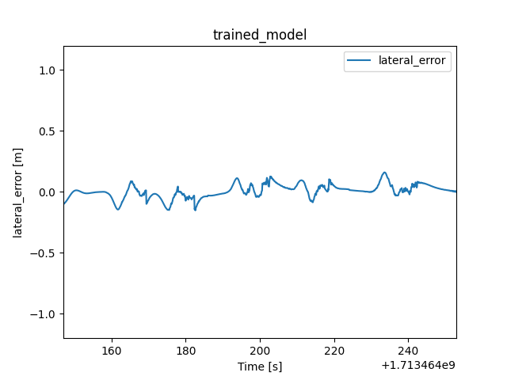

<p align="center">
  <a href="https://proxima-ai-tech.com/">
    
  </a>
</p>
<!-- cspell: ignore numba ipynb -->

# Smart MPC Trajectory Follower

Smart MPC (Model Predictive Control) is a control algorithm that combines model predictive control and machine learning. While inheriting the advantages of model predictive control, it solves its disadvantage of modeling difficulty with a data-driven method using machine learning.

This technology makes it relatively easy to operate model predictive control, which is expensive to implement, as long as an environment for collecting data can be prepared.

<p align="center">
  <a href="https://youtu.be/j7bgK8m4-zg?si=p3ipJQy_p-5AJHOP)">
    <image width="700px" src="./images/autoware_smart_mpc.png">
  </a>
</p>

## Setup

After building autoware, move to `control/smart_mpc_trajectory_follower` and run the following command:

```bash
pip3 install .
```

If you have already installed and want to update the package, run the following command instead:

```bash
pip3 install -U .
```

## Provided features

This package provides smart MPC logic for path-following control as well as mechanisms for learning and evaluation. These features are described below.

### Trajectory following control based on iLQR/MPPI

The control mode can be selected from "ilqr", "mppi", or "mppi_ilqr", and can be set as `mpc_parameter:system:mode` in [mpc_param.yaml](./smart_mpc_trajectory_follower/param/mpc_param.yaml).
In "mppi_ilqr" mode, the initial value of iLQR is given by the MPPI solution.

> [!NOTE]
> With the default settings, the performance of "mppi" mode is limited due to an insufficient number of samples. This issue is being addressed with ongoing work to introduce GPU support.

To perform a simulation, run the following command:

```bash
ros2 launch autoware_launch planning_simulator.launch.xml map_path:=$HOME/autoware_map/sample-map-planning vehicle_model:=sample_vehicle sensor_model:=sample_sensor_kit trajectory_follower_mode:=smart_mpc_trajectory_follower
```

> [!NOTE]
> When running with the nominal model set in [nominal_param.yaml](./smart_mpc_trajectory_follower/param/nominal_param.yaml), set `trained_model_parameter:control_application:use_trained_model` to `false` in [trained_model_param.yaml](./smart_mpc_trajectory_follower/param/trained_model_param.yaml). To run using the trained model, set `trained_model_parameter:control_application:use_trained_model` to `true`, but the trained model must have been generated according to the following procedure.

### Training of model and reflection in control

To obtain training data, start autoware, perform a drive, and record rosbag data with the following commands.

```bash
ros2 bag record /localization/kinematic_state /localization/acceleration /vehicle/status/steering_status /control/command/control_cmd /control/trajectory_follower/control_cmd /control/trajectory_follower/lane_departure_checker_node/debug/deviation/lateral /control/trajectory_follower/lane_departure_checker_node/debug/deviation/yaw /system/operation_mode/state /vehicle/status/control_mode /sensing/imu/imu_data /debug_mpc_x_des /debug_mpc_y_des /debug_mpc_v_des /debug_mpc_yaw_des /debug_mpc_acc_des /debug_mpc_steer_des /debug_mpc_X_des_converted /debug_mpc_x_current /debug_mpc_error_prediction /debug_mpc_max_trajectory_err /debug_mpc_emergency_stop_mode /debug_mpc_goal_stop_mode /debug_mpc_total_ctrl_time /debug_mpc_calc_u_opt_time
```

Move [rosbag2.bash](./smart_mpc_trajectory_follower/training_and_data_check/rosbag2.bash) to the rosbag directory recorded above and execute the following command on the directory

```bash
bash rosbag2.bash
```

This converts rosbag data into CSV format for training models.

> [!NOTE]
> Note that a large number of terminals are automatically opened at runtime, but they are automatically closed after rosbag data conversion is completed.
> From the time you begin this process until all terminals are closed, autoware should not be running.

Instead, the same result can be obtained by executing the following command in a python environment:

```python
from smart_mpc_trajectory_follower.training_and_data_check import train_drive_NN_model
model_trainer = train_drive_NN_model.train_drive_NN_model()
model_trainer.transform_rosbag_to_csv(rosbag_dir)
```

Here, `rosbag_dir` represents the rosbag directory.
At this time, all CSV files in `rosbag_dir` are automatically deleted first.

The paths of the rosbag directories used for training, `dir_0`, `dir_1`, `dir_2`,... and the directory `save_dir` where you save the models, the model can be saved in the python environment as follows:

```python
from smart_mpc_trajectory_follower.training_and_data_check import train_drive_NN_model
model_trainer = train_drive_NN_model.train_drive_NN_model()
model_trainer.add_data_from_csv(dir_0)
model_trainer.add_data_from_csv(dir_1)
model_trainer.add_data_from_csv(dir_2)
...
model_trainer.get_trained_model()
model_trainer.save_models(save_dir)
```

After performing the polynomial regression, the NN can be trained on the residuals as follows:

```python
model_trainer.get_trained_model(use_polynomial_reg=True)
```

> [!NOTE]
> In the default setting, regression is performed by several preselected polynomials.
> When `use_selected_polynomial=False` is set as the argument of get_trained_model, the `deg` argument allows setting the maximum degree of the polynomial to be used.

If only polynomial regression is performed and no NN model is used, run the following command:

```python
model_trainer.get_trained_model(use_polynomial_reg=True,force_NN_model_to_zero=True)
```

Move `model_for_test_drive.pth` and `polynomial_reg_info.npz` saved in `save_dir` to the home directory and set `trained_model_parameter:control_application:use_trained_model` in [trained_model_param.yaml](./smart_mpc_trajectory_follower/param/trained_model_param.yaml) to `true` to reflect the trained model in the control.

### Performance evaluation

Here, as an example, we describe the verification of the adaptive performance when the wheel base of the sample_vehicle is 2.79 m, but an incorrect value of 2.0 m is given to the controller side.
To give the controller 2.0 m as the wheel base, set the value of `nominal_parameter:vehicle_info:wheel_base` in [nominal_param.yaml](./smart_mpc_trajectory_follower/param/nominal_param.yaml) to 2.0, and run the following command:

```bash
python3 -m smart_mpc_trajectory_follower.clear_pycache
```

#### Test on autoware

To perform a control test on autoware with the nominal model before training, make sure that `trained_model_parameter:control_application:use_trained_model` in [trained_model_param.yaml](./smart_mpc_trajectory_follower/param/trained_model_param.yaml) is `false` and launch autoware in the manner described in "Trajectory following control based on iLQR/MPPI". This time, the following route will be used for the test:

<p></p>

Record rosbag and train the model in the manner described in "Training of model and reflection in control", and move the generated files `model_for_test_drive.pth` and `polynomial_reg_info.npz` to the home directory.

> [!NOTE]
> Although the data used for training is small, for the sake of simplicity, we will see how much performance can be improved with this amount of data.

To control using the trained model obtained here, set `trained_model_parameter:control_application:use_trained_model` to `true`, start autoware in the same way, and drive the same route recording rosbag.
After the driving is complete, convert the rosbag file to CSV format using the method described in "Training of model and reflection in control".
A plot of the lateral deviation is obtained by running the `lateral_error_visualize` function in `control/smart_mpc_trajectory_follower/smart_mpc_trajectory_follower/training_and_data_check/data_checker.ipynb` for the nominal and training model rosbag files `rosbag_nominal` and `rosbag_trained`, respectively, as follows:

```python
lateral_error_visualize(dir_name=rosbag_nominal,ylim=[-1.2,1.2])
lateral_error_visualize(dir_name=rosbag_trained,ylim=[-1.2,1.2])
```

The following results were obtained.

<div style="display: flex; justify-content: center; align-items: center;">
    
    
</div>

#### Test on python simulator

First, to give wheel base 2.79 m in the python simulator, create the following file and save it in `control/smart_mpc_trajectory_follower/smart_mpc_trajectory_follower/python_simulator` with the name `sim_setting.json`:

```json
{ "wheel_base": 2.79 }
```

Next, run the following commands to test the slalom driving on the python simulator with the nominal model:

```python
import python_simulator
from smart_mpc_trajectory_follower.training_and_data_check import train_drive_NN_model
initial_error = [0.0, 0.03, 0.01, -0.01, 0.0, 0.0]
save_dir = "test_python_sim"
python_simulator.slalom_drive(save_dir=save_dir,use_trained_model=False,initial_error=initial_error)
```

Here, `initial_error` is the initial error from the target trajectory, in the order of x-coordinate, y-coordinate, longitudinal velocity, yaw angle, longitudinal acceleration, and steer angle,
and `save_dir` is the directory where the driving test results are saved.

> [!NOTE]
> The value of `use_trained_model` given as the argument of `python_simulator.slalom_drive` takes precedence over the value of `trained_model_parameter:control_application:use_trained_model` in [trained_model_param.yaml](./smart_mpc_trajectory_follower/param/trained_model_param.yaml).

Run the following commands to perform training using driving data of the nominal model.

```python
model_trainer = train_drive_NN_model.train_drive_NN_model()
model_trainer.add_data_from_csv(save_dir)
model_trainer.save_train_data(save_dir)
model_trainer.get_trained_model(use_polynomial_reg=True)
model_trainer.save_models(save_dir=save_dir)
```

This way, files `model_for_test_drive.pth` and `polynomial_reg_info.npz` are saved in `save_dir`.
The following results were obtained.

<p style="text-align: center;">
    
</p>

The center of the upper row represents the lateral deviation.

Finally, to drive with the training model, run the following commands:

```python
load_dir = save_dir
save_dir = "test_python_trained_sim"
python_simulator.slalom_drive(save_dir=save_dir,load_dir=load_dir,use_trained_model=True,initial_error=initial_error)
```

The following results were obtained.

<p style="text-align: center;">
    
</p>

It can be seen that the lateral deviation has improved significantly.

Here we have described wheel base, but the parameters that can be passed to the python simulator are as follows.

| Parameter                | Type        | Description                                                                                                                                                                                                                                                                |
| ------------------------ | ----------- | -------------------------------------------------------------------------------------------------------------------------------------------------------------------------------------------------------------------------------------------------------------------------- |
| steer_bias               | float       | steer bias [rad]                                                                                                                                                                                                                                                           |
| steer_rate_lim           | float       | steer rate limit [rad/s]                                                                                                                                                                                                                                                   |
| vel_rate_lim             | float       | acceleration limit [m/s^2]                                                                                                                                                                                                                                                 |
| wheel_base               | float       | wheel base [m]                                                                                                                                                                                                                                                             |
| steer_dead_band          | float       | steer dead band [rad]                                                                                                                                                                                                                                                      |
| adaptive_gear_ratio_coef | list[float] | List of floats of length 6 specifying information on speed-dependent gear ratios from tire angle to steering wheel angle.                                                                                                                                                  |
| acc_time_delay           | float       | acceleration time delay [s]                                                                                                                                                                                                                                                |
| steer_time_delay         | float       | steer time delay [s]                                                                                                                                                                                                                                                       |
| acc_time_constant        | float       | acceleration time constant [s]                                                                                                                                                                                                                                             |
| steer_time_constant      | float       | steer time constant [s]                                                                                                                                                                                                                                                    |
| accel_map_scale          | float       | Parameter that magnifies the corresponding distortion from acceleration input values to actual acceleration realizations. <br> Correspondence information is kept in `control/smart_mpc_trajectory_follower/smart_mpc_trajectory_follower/python_simulator/accel_map.csv`. |
| acc_scaling              | float       | acceleration scaling                                                                                                                                                                                                                                                       |
| steer_scaling            | float       | steer scaling                                                                                                                                                                                                                                                              |

For example, to give the simulation side 0.01 [rad] of steer bias and 0.001 [rad] of steer dead band, edit the `sim_setting.json` as follows.

```json
{ "steer_bias": 0.01, "steer_dead_band": 0.001 }
```

#### Auto test on python simulator

Here, we describe a method for testing adaptive performance by giving the simulation side a predefined range of model parameters while the control side is given constant model parameters.

First, to restore nominal model settings to default values, set the value of `nominal_parameter:vehicle_info:wheel_base` in [nominal_param.yaml](./smart_mpc_trajectory_follower/param/nominal_param.yaml) to 2.79, and run the following command:

```bash
python3 -m smart_mpc_trajectory_follower.clear_pycache
```

To run a driving experiment within the parameter change range set in [run_sim.py](./smart_mpc_trajectory_follower/python_simulator/run_sim.py), for example, move to `control/smart_mpc_trajectory_follower/smart_mpc_trajectory_follower/python_simulator` and run the following command:

```bash
python3 run_sim.py --param_name steer_bias
```

Here we described the experimental procedure for steer bias, and the same method can be used for other parameters.

If you want to do it for all parameters at once, run the following command:

```bash
yes | python3 run_sim.py
```

In `run_sim.py`, the following parameters can be set:

| Parameter                 | Type | Description                                                                                                                                                                                                                                                                                                                                                               |
| ------------------------- | ---- | ------------------------------------------------------------------------------------------------------------------------------------------------------------------------------------------------------------------------------------------------------------------------------------------------------------------------------------------------------------------------- |
| USE_TRAINED_MODEL_DIFF    | bool | Whether the derivative of the trained model is reflected in the control                                                                                                                                                                                                                                                                                                   |
| DATA_COLLECTION_MODE      | str  | Which method will be used to collect the training data　<br> "ff": Straight line driving with feed-forward input <br> "pp": Figure eight driving with pure pursuit control <br> "mpc": Slalom driving with mpc                                                                                                                                                            |
| USE_POLYNOMIAL_REGRESSION | bool | Whether to perform polynomial regression before NN                                                                                                                                                                                                                                                                                                                        |
| USE_SELECTED_POLYNOMIAL   | bool | When USE_POLYNOMIAL_REGRESSION is True, perform polynomial regression using only some preselected polynomials. <br> The choice of polynomials is intended to be able to absorb the contribution of some parameter shifts based on the nominal model of the vehicle.                                                                                                       |
| FORCE_NN_MODEL_TO_ZERO    | bool | Whether to force the NN model to zero (i.e., erase the contribution of the NN model). <br> When USE_POLYNOMIAL_REGRESSION is True, setting FORCE_MODEL_TO_ZERO to True allows the control to reflect the results of polynomial regression only, without using NN models.                                                                                                  |
| FIT_INTERCEPT             | bool | Whether to include bias in polynomial regression. <br> If it is False, perform the regression with a polynomial of the first degree or higher.                                                                                                                                                                                                                            |
| USE_INTERCEPT             | bool | When a polynomial regression including bias is performed, whether to use or discard the resulting bias information. <br> It is meaningful only if FIT_INTERCEPT is True.<br> If it is False, discard the bias in the polynomial regression in the hope that the NN model can remove the bias term, even if the polynomial regression is performed with the bias included. |

> [!NOTE]
> When `run_sim.py` is run, the `use_trained_model_diff` set in `run_sim.py` takes precedence over the `trained_model_parameter:control_application:use_trained_model_diff` set in [trained_model_param.yaml](./smart_mpc_trajectory_follower/param/trained_model_param.yaml).

## Change of nominal parameters and their reloading

The nominal parameters of vehicle model can be changed by editing the file [nominal_param.yaml](./smart_mpc_trajectory_follower/param/nominal_param.yaml).
After changing the nominal parameters, the cache must be deleted by running the following command:

```bash
python3 -m smart_mpc_trajectory_follower.clear_pycache
```

The nominal parameters include the following:

| Parameter                                        | Type  | Description                    |
| ------------------------------------------------ | ----- | ------------------------------ |
| nominal_parameter:vehicle_info:wheel_base        | float | wheel base [m]                 |
| nominal_parameter:acceleration:acc_time_delay    | float | acceleration time delay [s]    |
| nominal_parameter:acceleration:acc_time_constant | float | acceleration time constant [s] |
| nominal_parameter:steering:steer_time_delay      | float | steer time delay [s]           |
| nominal_parameter:steering:steer_time_constant   | float | steer time constant [s]        |

## Change of control parameters and their reloading

The control parameters can be changed by editing files [mpc_param.yaml](./smart_mpc_trajectory_follower/param/mpc_param.yaml) and [trained_model_param.yaml](./smart_mpc_trajectory_follower/param/trained_model_param.yaml).
Although it is possible to reflect parameter changes by restarting autoware, the following command allows us to do so without leaving autoware running:

```bash
ros2 topic pub /pympc_reload_mpc_param_trigger std_msgs/msg/String "data: ''" --once
```

The main parameters among the control parameters are as follows.

### `mpc_param.yaml`

| Parameter                            | Type        | Description                                                                                                                                                                                                                                        |
| ------------------------------------ | ----------- | -------------------------------------------------------------------------------------------------------------------------------------------------------------------------------------------------------------------------------------------------- |
| mpc_parameter:system:mode            | str         | control mode <br>"ilqr": iLQR mode <br> "mppi": MPPI mode <br> "mppi_ilqr": the initial value of iLQR is given by the MPPI solution.                                                                                                               |
| mpc_parameter:cost_parameters:Q      | list[float] | Stage cost for states. <br> List of length 8, in order: straight deviation, lateral deviation, velocity deviation, yaw angle deviation, acceleration deviation, steer deviation, acceleration input deviation, steer input deviation cost weights. |
| mpc_parameter:cost_parameters:Q_c    | list[float] | Cost in the horizon corresponding to the following timing_Q_c for the states. <br> The correspondence of the components of the list is the same as for Q.                                                                                          |
| mpc_parameter:cost_parameters:Q_f    | list[float] | Termination cost for the states. <br> The correspondence of the components of the list is the same as for Q.                                                                                                                                       |
| mpc_parameter:cost_parameters:R      | list[float] | A list of length 2 where R[0] is weight of cost for the change rate of acceleration input value and R[1] is weight of cost for the change rate of steer input value.                                                                               |
| mpc_parameter:mpc_setting:timing_Q_c | list[int]   | Horizon numbers such that the stage cost for the states is set to Q_c.                                                                                                                                                                             |

### `trained_model_param.yaml`

| Parameter                                                          | Type | Description                                                                                                                                                                                                                                                           |
| ------------------------------------------------------------------ | ---- | --------------------------------------------------------------------------------------------------------------------------------------------------------------------------------------------------------------------------------------------------------------------- |
| trained_model_parameter:control_application:use_trained_model      | bool | Whether the trained model is reflected in the control or not.                                                                                                                                                                                                         |
| trained_model_parameter:control_application:use_trained_model_diff | bool | Whether the derivative of the trained model is reflected on the control or not. <br> It is meaningful only when use_trained_model is True, and if False, the nominal model is used for the derivative of the dynamics, and trained model is used only for prediction. |

## Request to release the slow stop mode

If the predicted trajectory deviates too far from the target trajectory, the system enters a slow stop mode and the vehicle stops moving.
To cancel the slow stop mode and make the vehicle ready to run again, run the following command:

```bash
ros2 topic pub /pympc_stop_mode_reset_request std_msgs/msg/String "data: ''" --once
```

## Limitation

- May not be able to start when initial position/posture is far from the target.

- It may take some time until the end of the planning to compile numba functions at the start of the first control.

- In the stopping action near the goal our control switches to another simple control law. As a result, the stopping action may not work except near the goal. Stopping is also difficult if the acceleration map is significantly shifted.
