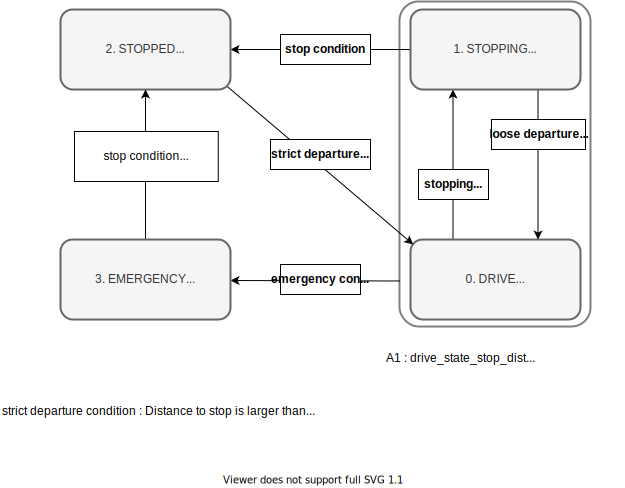

# PID Longitudinal Controller

## Purpose / Use cases

The longitudinal_controller computes the target acceleration to achieve the target velocity set at each point of the target trajectory using a feed-forward/back control.

It also contains a slope force correction that takes into account road slope information, and a delay compensation function.
It is assumed that the target acceleration calculated here will be properly realized by the vehicle interface.

Note that the use of this module is not mandatory for Autoware if the vehicle supports the "target speed" interface.

## Design / Inner-workings / Algorithms

### States

This module has four state transitions as shown below in order to handle special processing in a specific situation.

- **DRIVE**
  - Executes target velocity tracking by PID control.
  - It also applies the delay compensation and slope compensation.
- **STOPPING**
  - Controls the motion just before stopping.
  - Special sequence is performed to achieve accurate and smooth stopping.
- **STOPPED**
  - Performs operations in the stopped state (e.g. brake hold)
- **EMERGENCY**.
  - Enters an emergency state when certain conditions are met (e.g., when the vehicle has crossed a certain distance of a stop line).
  - The recovery condition (whether or not to keep emergency state until the vehicle completely stops) or the deceleration in the emergency state are defined by parameters.

The state transition diagram is shown below.

### Logics

#### Control Block Diagram

#### FeedForward (FF)

The reference acceleration set in the trajectory and slope compensation terms are output as a feedforward. Under ideal conditions with no modeling error, this FF term alone should be sufficient for velocity tracking.

Tracking errors causing modeling or discretization errors are removed by the feedback control (now using PID).

##### Brake keeping

From the viewpoint of ride comfort, stopping with 0 acceleration is important because it reduces the impact of braking. However, if the target acceleration when stopping is 0, the vehicle may cross over the stop line or accelerate a little in front of the stop line due to vehicle model error or gradient estimation error.

For reliable stopping, the target acceleration calculated by the FeedForward system is limited to a negative acceleration when stopping.

#### Slope compensation

Based on the slope information, a compensation term is added to the target acceleration.

There are two sources of the slope information, which can be switched by a parameter.

- Pitch of the estimated ego-pose (default)
  - Calculates the current slope from the pitch angle of the estimated ego-pose
  - Pros: Easily available
  - Cons: Cannot extract accurate slope information due to the influence of vehicle vibration.
- Z coordinate on the trajectory
  - Calculates the road slope from the difference of z-coordinates between the front and rear wheel positions in the target trajectory
  - Pros: More accurate than pitch information, if the z-coordinates of the route are properly maintained
  - Pros: Can be used in combination with delay compensation (not yet implemented)
  - Cons: z-coordinates of high-precision map is needed.
  - Cons: Does not support free space planning (for now)

#### PID control

For deviations that cannot be handled by FeedForward control, such as model errors, PID control is used to construct a feedback system.

This PID control calculates the target acceleration from the deviation between the current ego-velocity and the target velocity.

This PID logic has a maximum value for the output of each term. This is to prevent the following:

- Large integral terms may cause unintended behavior by users.
- Unintended noise may cause the output of the derivative term to be very large.

Also, the integral term is not accumulated when the vehicle is stopped. This is to prevent unintended accumulation of the integral term in cases such as "Autoware assumes that the vehicle is engaged, but an external system has locked the vehicle to start.
On the other hand, if the vehicle gets stuck in a depression in the road surface when starting, the vehicle will not start forever, which is currently being addressed by developers.

At present, PID control is implemented from the viewpoint of trade-off between development/maintenance cost and performance.
This may be replaced by a higher performance controller (adaptive control or robust control) in future development.

#### Time delay compensation

At high speeds, the delay of actuator systems such as gas pedals and brakes has a significant impact on driving accuracy.
Depending on the actuating principle of the vehicle, the mechanism that physically controls the gas pedal and brake typically has a delay of about a hundred millisecond.

In this controller, the predicted ego-velocity and the target velocity after the delay time are calculated and used for the feedback to address the time delay problem.

### Slope compensation

Based on the slope information, a compensation term is added to the target acceleration.

There are two sources of the slope information, which can be switched by a parameter.

- Pitch of the estimated ego-pose (default)
  - Calculates the current slope from the pitch angle of the estimated ego-pose
  - Pros: Easily available
  - Cons: Cannot extract accurate slope information due to the influence of vehicle vibration.
- Z coordinate on the trajectory
  - Calculates the road slope from the difference of z-coordinates between the front and rear wheel positions in the target trajectory
  - Pros: More accurate than pitch information, if the z-coordinates of the route are properly maintained
  - Pros: Can be used in combination with delay compensation (not yet implemented)
  - Cons: z-coordinates of high-precision map is needed.
  - Cons: Does not support free space planning (for now)

## Assumptions / Known limits

1. Smoothed target velocity and its acceleration shall be set in the trajectory
   1. The velocity command is not smoothed inside the controller (only noise may be removed).
   2. For step-like target signal, tracking is performed as fast as possible.
2. The vehicle velocity must be an appropriate value
   1. The ego-velocity must be a signed-value corresponding to the forward/backward direction
   2. The ego-velocity should be given with appropriate noise processing.
   3. If there is a large amount of noise in the ego-velocity, the tracking performance will be significantly reduced.
3. The output of this controller must be achieved by later modules (e.g. vehicle interface).
   1. If the vehicle interface does not have the target velocity or acceleration interface (e.g., the vehicle only has a gas pedal and brake interface), an appropriate conversion must be done after this controller.

## Inputs / Outputs / API

### Input

Set the following from the [controller_node](../../trajectory_follower_nodes/design/trajectory_follower-design.md)

- `autoware_auto_planning_msgs/Trajectory` : reference trajectory to follow.
- `nav_msgs/Odometry`: current odometry

### Output

Return LongitudinalOutput which contains the following to [controller_node](../../trajectory_follower_nodes/design/trajectory_follower-design.md)

- `autoware_auto_control_msgs/LongitudinalCommand`: command to control the longitudinal motion of the vehicle. It contains the target velocity and target acceleration.
- LongitudinalSyncData
  - velocity convergence(currently not used)

### PIDController class

The `PIDController` class is straightforward to use.
First, gains and limits must be set (using `setGains()` and `setLimits()`) for the proportional (P), integral (I), and derivative (D) components.
Then, the velocity can be calculated by providing the current error and time step duration to the `calculate()` function.

## Parameter description

The default parameters defined in `param/lateral_controller_defaults.param.yaml` are adjusted to the
AutonomouStuff Lexus RX 450h for under 40 km/h driving.

| Name                                        | Type   | Description                                                                                                                                                                             | Default value |
| :------------------------------------------ | :----- | :-------------------------------------------------------------------------------------------------------------------------------------------------------------------------------------- | :------------ |
| delay_compensation_time                     | double | delay for longitudinal control [s]                                                                                                                                                      | 0.17          |
| enable_smooth_stop                          | bool   | flag to enable transition to STOPPING                                                                                                                                                   | true          |
| enable_overshoot_emergency                  | bool   | flag to enable transition to EMERGENCY when the ego is over the stop line with a certain distance. See `emergency_state_overshoot_stop_dist`.                                           | true          |
| enable_large_tracking_error_emergency       | bool   | flag to enable transition to EMERGENCY when the closest trajectory point search is failed due to a large deviation between trajectory and ego pose.                                     | true          |
| enable_slope_compensation                   | bool   | flag to modify output acceleration for slope compensation. The source of the slope angle can be selected from ego-pose or trajectory angle. See `use_trajectory_for_pitch_calculation`. | true          |
| enable_brake_keeping_before_stop            | bool   | flag to keep a certain acceleration during DRIVE state before the ego stops. See [Brake keeping](#brake-keeping).                                                                       | false         |
| enable_keep_stopped_until_steer_convergence | bool   | flag to keep stopped condition until until the steer converges.                                                                                                                         | true          |
| max_acc                                     | double | max value of output acceleration [m/s^2]                                                                                                                                                | 3.0           |
| min_acc                                     | double | min value of output acceleration [m/s^2]                                                                                                                                                | -5.0          |
| max_jerk                                    | double | max value of jerk of output acceleration [m/s^3]                                                                                                                                        | 2.0           |
| min_jerk                                    | double | min value of jerk of output acceleration [m/s^3]                                                                                                                                        | -5.0          |
| use_trajectory_for_pitch_calculation        | bool   | If true, the slope is estimated from trajectory z-level. Otherwise the pitch angle of the ego pose is used.                                                                             | false         |
| lpf_pitch_gain                              | double | gain of low-pass filter for pitch estimation                                                                                                                                            | 0.95          |
| max_pitch_rad                               | double | max value of estimated pitch [rad]                                                                                                                                                      | 0.1           |
| min_pitch_rad                               | double | min value of estimated pitch [rad]                                                                                                                                                      | -0.1          |

### State transition

| Name                                | Type   | Description                                                                                                                                                          | Default value |
| :---------------------------------- | :----- | :------------------------------------------------------------------------------------------------------------------------------------------------------------------- | :------------ |
| drive_state_stop_dist               | double | The state will transit to DRIVE when the distance to the stop point is longer than `drive_state_stop_dist` + `drive_state_offset_stop_dist` [m]                      | 0.5           |
| drive_state_offset_stop_dist        | double | The state will transit to DRIVE when the distance to the stop point is longer than `drive_state_stop_dist` + `drive_state_offset_stop_dist` [m]                      | 1.0           |
| stopping_state_stop_dist            | double | The state will transit to STOPPING when the distance to the stop point is shorter than `stopping_state_stop_dist` [m]                                                | 0.5           |
| stopped_state_entry_vel             | double | threshold of the ego velocity in transition to the STOPPED state [m/s]                                                                                               | 0.01          |
| stopped_state_entry_acc             | double | threshold of the ego acceleration in transition to the STOPPED state [m/s^2]                                                                                         | 0.1           |
| emergency_state_overshoot_stop_dist | double | If `enable_overshoot_emergency` is true and the ego is `emergency_state_overshoot_stop_dist`-meter ahead of the stop point, the state will transit to EMERGENCY. [m] | 1.5           |
| emergency_state_traj_trans_dev      | double | If the ego's position is `emergency_state_traj_tran_dev` meter away from the nearest trajectory point, the state will transit to EMERGENCY. [m]                      | 3.0           |
| emergency_state_traj_rot_dev        | double | If the ego's orientation is `emergency_state_traj_rot_dev` rad away from the nearest trajectory point orientation, the state will transit to EMERGENCY. [rad]        | 0.784         |

### DRIVE Parameter

| Name                                  | Type   | Description                                                                                                                                                        | Default value |
| :------------------------------------ | :----- | :----------------------------------------------------------------------------------------------------------------------------------------------------------------- | :------------ |
| kp                                    | double | p gain for longitudinal control                                                                                                                                    | 1.0           |
| ki                                    | double | i gain for longitudinal control                                                                                                                                    | 0.1           |
| kd                                    | double | d gain for longitudinal control                                                                                                                                    | 0.0           |
| max_out                               | double | max value of PID's output acceleration during DRIVE state [m/s^2]                                                                                                  | 1.0           |
| min_out                               | double | min value of PID's output acceleration during DRIVE state [m/s^2]                                                                                                  | -1.0          |
| max_p_effort                          | double | max value of acceleration with p gain                                                                                                                              | 1.0           |
| min_p_effort                          | double | min value of acceleration with p gain                                                                                                                              | -1.0          |
| max_i_effort                          | double | max value of acceleration with i gain                                                                                                                              | 0.3           |
| min_i_effort                          | double | min value of acceleration with i gain                                                                                                                              | -0.3          |
| max_d_effort                          | double | max value of acceleration with d gain                                                                                                                              | 0.0           |
| min_d_effort                          | double | min value of acceleration with d gain                                                                                                                              | 0.0           |
| lpf_vel_error_gain                    | double | gain of low-pass filter for velocity error                                                                                                                         | 0.9           |
| current_vel_threshold_pid_integration | double | Velocity error is integrated for I-term only when the absolute value of current velocity is larger than this parameter. [m/s]                                      | 0.5           |
| brake_keeping_acc                     | double | If `enable_brake_keeping_before_stop` is true, a certain acceleration is kept during DRIVE state before the ego stops [m/s^2] See [Brake keeping](#brake-keeping). | 0.2           |

### STOPPING Parameter (smooth stop)

Smooth stop is enabled if `enable_smooth_stop` is true.
In smooth stop, strong acceleration (`strong_acc`) will be output first to decrease the ego velocity.
Then weak acceleration (`weak_acc`) will be output to stop smoothly by decreasing the ego jerk.
If the ego does not stop in a certain time or some-meter over the stop point, weak acceleration to stop right (`weak_stop_acc`) now will be output.
If the ego is still running, strong acceleration (`strong_stop_acc`) to stop right now will be output.

| Name                         | Type   | Description                                                                                                          | Default value |
| :--------------------------- | :----- | :------------------------------------------------------------------------------------------------------------------- | :------------ |
| smooth_stop_max_strong_acc   | double | max strong acceleration [m/s^2]                                                                                      | -0.5          |
| smooth_stop_min_strong_acc   | double | min strong acceleration [m/s^2]                                                                                      | -0.8          |
| smooth_stop_weak_acc         | double | weak acceleration [m/s^2]                                                                                            | -0.3          |
| smooth_stop_weak_stop_acc    | double | weak acceleration to stop right now [m/s^2]                                                                          | -0.8          |
| smooth_stop_strong_stop_acc  | double | strong acceleration to be output when the ego is `smooth_stop_strong_stop_dist`-meter over the stop point. [m/s^2]   | -3.4          |
| smooth_stop_max_fast_vel     | double | max fast vel to judge the ego is running fast [m/s]. If the ego is running fast, strong acceleration will be output. | 0.5           |
| smooth_stop_min_running_vel  | double | min ego velocity to judge if the ego is running or not [m/s]                                                         | 0.01          |
| smooth_stop_min_running_acc  | double | min ego acceleration to judge if the ego is running or not [m/s^2]                                                   | 0.01          |
| smooth_stop_weak_stop_time   | double | max time to output weak acceleration [s]. After this, strong acceleration will be output.                            | 0.8           |
| smooth_stop_weak_stop_dist   | double | Weak acceleration will be output when the ego is `smooth_stop_weak_stop_dist`-meter before the stop point. [m]       | -0.3          |
| smooth_stop_strong_stop_dist | double | Strong acceleration will be output when the ego is `smooth_stop_strong_stop_dist`-meter over the stop point. [m]     | -0.5          |

### STOPPED Parameter

| Name         | Type   | Description                                  | Default value |
| :----------- | :----- | :------------------------------------------- | :------------ |
| stopped_vel  | double | target velocity in STOPPED state [m/s]       | 0.0           |
| stopped_acc  | double | target acceleration in STOPPED state [m/s^2] | -3.4          |
| stopped_jerk | double | target jerk in STOPPED state [m/s^3]         | -5.0          |

### EMERGENCY Parameter

| Name           | Type   | Description                                       | Default value |
| :------------- | :----- | :------------------------------------------------ | :------------ |
| emergency_vel  | double | target velocity in EMERGENCY state [m/s]          | 0.0           |
| emergency_acc  | double | target acceleration in an EMERGENCY state [m/s^2] | -5.0          |
| emergency_jerk | double | target jerk in an EMERGENCY state [m/s^3]         | -3.0          |

## References / External links

## Future extensions / Unimplemented parts

## Related issues
