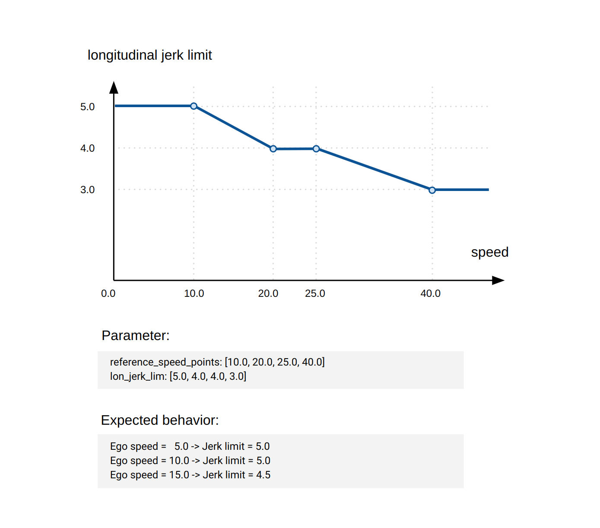

# vehicle_cmd_gate

## Purpose

`vehicle_cmd_gate` is the package to get information from emergency handler, planning module, external controller, and send a msg to vehicle.

## Inputs / Outputs

### Input

| Name                                        | Type                                                       | Description                                                          |
| ------------------------------------------- | ---------------------------------------------------------- | -------------------------------------------------------------------- |
| `~/input/steering`                          | `autoware_auto_vehicle_msgs::msg::SteeringReport`          | steering status                                                      |
| `~/input/auto/control_cmd`                  | `autoware_auto_control_msgs::msg::AckermannControlCommand` | command for lateral and longitudinal velocity from planning module   |
| `~/input/auto/turn_indicators_cmd`          | `autoware_auto_vehicle_msgs::msg::TurnIndicatorsCommand`   | turn indicators command from planning module                         |
| `~/input/auto/hazard_lights_cmd`            | `autoware_auto_vehicle_msgs::msg::HazardLightsCommand`     | hazard lights command from planning module                           |
| `~/input/auto/gear_cmd`                     | `autoware_auto_vehicle_msgs::msg::GearCommand`             | gear command from planning module                                    |
| `~/input/external/control_cmd`              | `autoware_auto_control_msgs::msg::AckermannControlCommand` | command for lateral and longitudinal velocity from external          |
| `~/input/external/turn_indicators_cmd`      | `autoware_auto_vehicle_msgs::msg::TurnIndicatorsCommand`   | turn indicators command from external                                |
| `~/input/external/hazard_lights_cmd`        | `autoware_auto_vehicle_msgs::msg::HazardLightsCommand`     | hazard lights command from external                                  |
| `~/input/external/gear_cmd`                 | `autoware_auto_vehicle_msgs::msg::GearCommand`             | gear command from external                                           |
| `~/input/external_emergency_stop_heartbeat` | `tier4_external_api_msgs::msg::Heartbeat`                  | heartbeat                                                            |
| `~/input/gate_mode`                         | `tier4_control_msgs::msg::GateMode`                        | gate mode (AUTO or EXTERNAL)                                         |
| `~/input/emergency/control_cmd`             | `autoware_auto_control_msgs::msg::AckermannControlCommand` | command for lateral and longitudinal velocity from emergency handler |
| `~/input/emergency/hazard_lights_cmd`       | `autoware_auto_vehicle_msgs::msg::HazardLightsCommand`     | hazard lights command from emergency handler                         |
| `~/input/emergency/gear_cmd`                | `autoware_auto_vehicle_msgs::msg::GearCommand`             | gear command from emergency handler                                  |
| `~/input/engage`                            | `autoware_auto_vehicle_msgs::msg::Engage`                  | engage signal                                                        |
| `~/input/operation_mode`                    | `autoware_adapi_v1_msgs::msg::OperationModeState`          | operation mode of Autoware                                           |

### Output

| Name                                   | Type                                                       | Description                                              |
| -------------------------------------- | ---------------------------------------------------------- | -------------------------------------------------------- |
| `~/output/vehicle_cmd_emergency`       | `autoware_auto_system_msgs::msg::EmergencyState`           | emergency state which was originally in vehicle command  |
| `~/output/command/control_cmd`         | `autoware_auto_control_msgs::msg::AckermannControlCommand` | command for lateral and longitudinal velocity to vehicle |
| `~/output/command/turn_indicators_cmd` | `autoware_auto_vehicle_msgs::msg::TurnIndicatorsCommand`   | turn indicators command to vehicle                       |
| `~/output/command/hazard_lights_cmd`   | `autoware_auto_vehicle_msgs::msg::HazardLightsCommand`     | hazard lights command to vehicle                         |
| `~/output/command/gear_cmd`            | `autoware_auto_vehicle_msgs::msg::GearCommand`             | gear command to vehicle                                  |
| `~/output/gate_mode`                   | `tier4_control_msgs::msg::GateMode`                        | gate mode (AUTO or EXTERNAL)                             |
| `~/output/engage`                      | `autoware_auto_vehicle_msgs::msg::Engage`                  | engage signal                                            |
| `~/output/external_emergency`          | `tier4_external_api_msgs::msg::Emergency`                  | external emergency signal                                |
| `~/output/operation_mode`              | `tier4_system_msgs::msg::OperationMode`                    | current operation mode of the vehicle_cmd_gate           |

## Parameters

| Parameter                                   | Type     | Description                                                                                                                                                                                 |
| ------------------------------------------- | -------- | ------------------------------------------------------------------------------------------------------------------------------------------------------------------------------------------- |
| `update_period`                             | double   | update period                                                                                                                                                                               |
| `use_emergency_handling`                    | bool     | true when emergency handler is used                                                                                                                                                         |
| `check_external_emergency_heartbeat`        | bool     | true when checking heartbeat for emergency stop                                                                                                                                             |
| `system_emergency_heartbeat_timeout`        | double   | timeout for system emergency                                                                                                                                                                |
| `external_emergency_stop_heartbeat_timeout` | double   | timeout for external emergency                                                                                                                                                              |
| `filter_activated_count_threshold`          | int      | threshold for filter activation                                                                                                                                                             |
| `filter_activated_velocity_threshold`       | double   | velocity threshold for filter activation                                                                                                                                                    |
| `stop_hold_acceleration`                    | double   | longitudinal acceleration cmd when vehicle should stop                                                                                                                                      |
| `emergency_acceleration`                    | double   | longitudinal acceleration cmd when vehicle stop with emergency                                                                                                                              |
| `moderate_stop_service_acceleration`        | double   | longitudinal acceleration cmd when vehicle stop with moderate stop service                                                                                                                  |
| `nominal.vel_lim`                           | double   | limit of longitudinal velocity (activated in AUTONOMOUS operation mode)                                                                                                                     |
| `nominal.reference_speed_point`             | <double> | velocity point used as a reference when calculate control command limit (activated in AUTONOMOUS operation mode). The size of this array must be equivalent to the size of the limit array. |
| `nominal.lon_acc_lim`                       | <double> | array of limits of longitudinal acceleration (activated in AUTONOMOUS operation mode)                                                                                                       |
| `nominal.lon_jerk_lim`                      | <double> | array of limits of longitudinal jerk (activated in AUTONOMOUS operation mode)                                                                                                               |
| `nominal.lat_acc_lim`                       | <double> | array of limits of lateral acceleration (activated in AUTONOMOUS operation mode)                                                                                                            |
| `nominal.lat_jerk_lim`                      | <double> | array of limits of lateral jerk (activated in AUTONOMOUS operation mode)                                                                                                                    |
| `on_transition.vel_lim`                     | double   | limit of longitudinal velocity (activated in TRANSITION operation mode)                                                                                                                     |
| `on_transition.reference_speed_point`       | <double> | velocity point used as a reference when calculate control command limit (activated in TRANSITION operation mode). The size of this array must be equivalent to the size of the limit array. |
| `on_transition.lon_acc_lim`                 | <double> | array of limits of longitudinal acceleration (activated in TRANSITION operation mode)                                                                                                       |
| `on_transition.lon_jerk_lim`                | <double> | array of limits of longitudinal jerk (activated in TRANSITION operation mode)                                                                                                               |
| `on_transition.lat_acc_lim`                 | <double> | array of limits of lateral acceleration (activated in TRANSITION operation mode)                                                                                                            |
| `on_transition.lat_jerk_lim`                | <double> | array of limits of lateral jerk (activated in TRANSITION operation mode)                                                                                                                    |

## Filter function

This module incorporates a limitation filter to the control command right before its published. Primarily for safety, this filter restricts the output range of all control commands published through Autoware.

The limitation values are calculated based on the 1D interpolation of the limitation array parameters. Here is an example for the longitudinal jerk limit.

Notation: this filter is not designed to enhance ride comfort. Its main purpose is to detect and remove abnormal values in the control outputs during the final stages of Autoware. If this filter is frequently active, it implies the control module may need tuning. If you're aiming to smoothen the signal via a low-pass filter or similar techniques, that should be handled in the control module. When the filter is activated, the topic `~/is_filter_activated` is published.

## Assumptions / Known limits

The parameter `check_external_emergency_heartbeat` (true by default) enables an emergency stop request from external modules.
This feature requires a `~/input/external_emergency_stop_heartbeat` topic for health monitoring of the external module, and the vehicle_cmd_gate module will not start without the topic.
The `check_external_emergency_heartbeat` parameter must be false when the "external emergency stop" function is not used.
