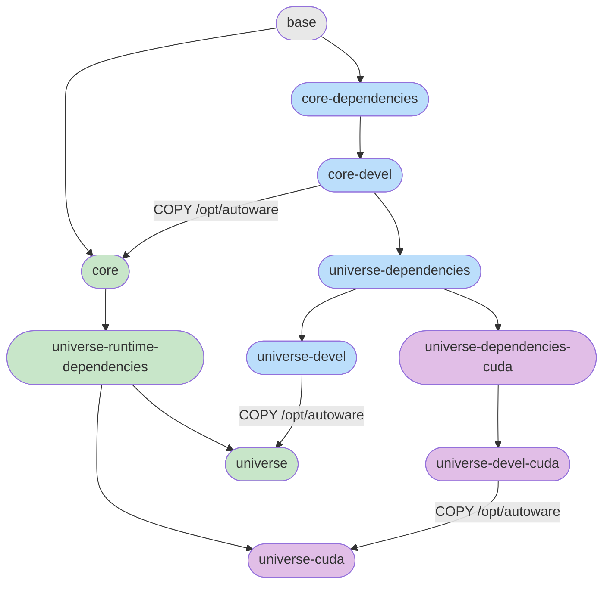

# Run Autoware in Docker

## Image Graph



## Images

| Image                           | Description                                                    | Use case                                                   |
| ------------------------------- | -------------------------------------------------------------- | ---------------------------------------------------------- |
| `base`                          | ROS base, sudo, pipx, ansible, RMW, user `aw`                  | Foundation for all other images                            |
| `core-dependencies`             | Build deps + compiled core packages (except autoware_core)     | CI for autoware_core                                       |
| `core-devel`                    | Adds autoware_core build on top of core-dependencies           | Development and CI for packages depending on autoware_core |
| `core`                          | Runtime-only: rosdep exec deps + compiled core from core-devel | Lightweight core runtime                                   |
| `universe-dependencies`         | Ansible universe roles + rosdep build deps for all of autoware | CI for autoware_universe                                   |
| `universe-dependencies-cuda`    | Adds CUDA, TensorRT, spconv dev libs                           | CI for CUDA-dependent packages                             |
| `universe-devel`                | Builds all universe sources (no CUDA)                          | Development without GPU                                    |
| `universe-devel-cuda`           | Builds all universe sources with CUDA                          | Development with GPU                                       |
| `universe-runtime-dependencies` | Runtime ansible roles + rosdep exec deps                       | Foundation for final runtime images                        |
| `universe`                      | Runtime image with compiled autoware (no CUDA)                 | Deployment without GPU                                     |
| `universe-cuda`                 | Runtime image with compiled autoware + CUDA runtime libs       | Deployment with GPU                                        |

## Pull from GHCR

Pre-built multi-arch images (amd64 + arm64) are available on GHCR:

```bash
# Pull a specific image
docker pull ghcr.io/autowarefoundation/autoware-new:base-jazzy
docker pull ghcr.io/autowarefoundation/autoware-new:base-humble

# Pull a dated version (for pinning)
docker pull ghcr.io/autowarefoundation/autoware-new:base-jazzy-20260407

# Pull a release version
docker pull ghcr.io/autowarefoundation/autoware-new:base-jazzy-1.2.3
```

Tag pattern: `<stage>-<ros_distro>[-<date>|-<version>]`

Available images (replace `jazzy` with `humble` for other distros):

| Tag | Description |
|---|---|
| `base-jazzy` | ROS base + ansible + user aw |
| `core-dependencies-jazzy` | Build deps + core packages (except autoware_core) |
| `core-devel-jazzy` | Full core development image |
| `core-jazzy` | Lightweight core runtime |
| `universe-dependencies-jazzy` | Universe build dependencies |
| `universe-dependencies-cuda-jazzy` | Universe + CUDA dev libs |
| `universe-devel-jazzy` | Full universe development (no CUDA) |
| `universe-devel-cuda-jazzy` | Full universe development with CUDA |
| `universe-runtime-dependencies-jazzy` | Universe runtime dependencies |
| `universe-jazzy` | Runtime without GPU |
| `universe-cuda-jazzy` | Runtime with GPU |

## Build locally

From the repository root:

```bash
# Build all default targets (universe + universe-cuda)
docker buildx bake -f docker-new/docker-bake.hcl

# Build a specific target (dependencies are resolved automatically)
docker buildx bake -f docker-new/docker-bake.hcl base
docker buildx bake -f docker-new/docker-bake.hcl core-devel
docker buildx bake -f docker-new/docker-bake.hcl universe
docker buildx bake -f docker-new/docker-bake.hcl universe-cuda

# Build for humble
ROS_DISTRO=humble docker buildx bake -f docker-new/docker-bake.hcl base
```

## Usage

```bash
xhost +local:docker

docker run --rm -it \
  --net host \
  --privileged \
  --gpus all \
  -e DISPLAY=$DISPLAY \
  -e NVIDIA_DRIVER_CAPABILITIES=all \
  -e NVIDIA_VISIBLE_DEVICES=all \
  -e HOST_UID=$(id -u) \
  -e HOST_GID=$(id -g) \
  -e QT_X11_NO_MITSHM=1 \
  -v /tmp/.X11-unix:/tmp/.X11-unix:rw \
  -v $HOME/autoware_map:/home/aw/autoware_map \
  -v $HOME/autoware_data:/home/aw/autoware_data \
  -v $HOME/projects/autoware:/home/aw/autoware \
  -w /home/aw/autoware \
  --runtime=nvidia \
  ghcr.io/autowarefoundation/autoware-new:universe-cuda-jazzy \
  bash -c "source /opt/autoware/setup.bash && exec bash"
```

Or run without volume mounting:

```bash
docker run --rm -it \
  --net host \
  ghcr.io/autowarefoundation/autoware-new:core-jazzy
```

For locally built images, replace the GHCR path with the local tag:

```bash
docker run --rm -it \
  --net host \
  autoware:universe-cuda-jazzy \
  bash -c "source /opt/autoware/setup.bash && exec bash"
```
