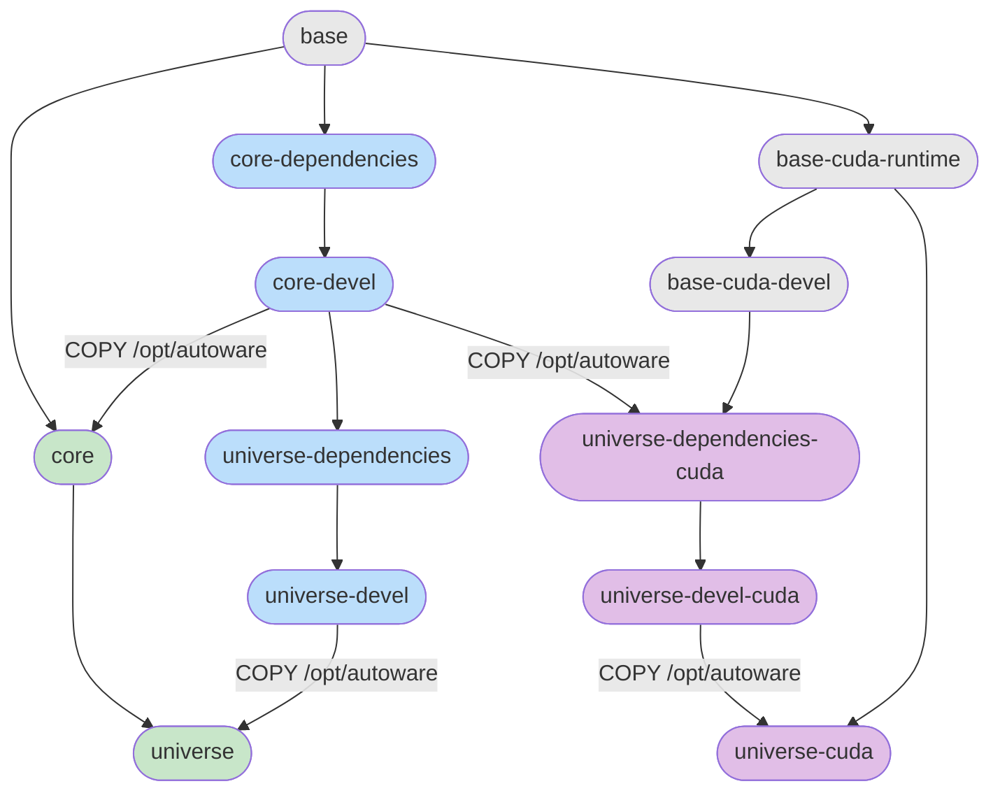

# Run Autoware in Docker

## Image Graph


```mermaid
graph TB
    base(["base"]) --> core-dependencies(["core-dependencies"]) & core(["core"]) & base-cuda-runtime(["base-cuda-runtime"])
    core-dependencies --> core-devel(["core-devel"])
    core-devel --> universe-dependencies(["universe-dependencies"])
    universe-dependencies --> universe-devel(["universe-devel"])
    universe-dependencies-cuda(["universe-dependencies-cuda"]) --> universe-devel-cuda(["universe-devel-cuda"])
    core-devel -- " COPY /opt/autoware " --> core
    core --> universe(["universe"])
    universe-devel -- " COPY /opt/autoware " --> universe
    universe-devel-cuda -- " COPY /opt/autoware " --> universe-cuda(["universe-cuda"])
    core-devel -- " COPY /opt/autoware " --> universe-dependencies-cuda
    base-cuda-devel(["base-cuda-devel"]) --> universe-dependencies-cuda
    base-cuda-runtime --> universe-cuda & base-cuda-devel
    classDef base fill: #e8e8e8, color: #333
    classDef devel fill: #bbdefb, color: #333
    classDef runtime fill: #c8e6c9, color: #333
    classDef cuda fill: #e1bee7, color: #333
    class base,base-cuda-runtime,base-cuda-devel base
    class core-dependencies,core-devel,universe-dependencies,universe-devel devel
    class core,universe runtime
    class universe-dependencies-cuda,universe-devel-cuda,universe-cuda cuda
```

## Images

| Image                        | Description                                                                           | Use case                                                   |
| ---------------------------- | ------------------------------------------------------------------------------------- | ---------------------------------------------------------- |
| `base`                       | ROS base, sudo, pipx, ansible, RMW, user `aw`                                         | Foundation for all other images                            |
| `core-dependencies`          | Build deps + compiled core packages (except autoware_core and autoware_rviz_plugins)  | CI for autoware_core                                       |
| `core-devel`                 | Adds autoware_core build on top of core-dependencies                                  | Development and CI for packages depending on autoware_core |
| `core`                       | Runtime-only: rosdep exec deps + compiled core from core-devel                        | Lightweight core runtime                                   |
| `base-cuda-runtime`          | `base` + CUDA/cuDNN/TensorRT runtime libs (no `-dev` packages)                        | Runtime foundation for `universe-cuda`                     |
| `base-cuda-devel`            | `base-cuda-runtime` + CUDA/cuDNN/TensorRT dev headers                                 | Build foundation for CUDA universe packages                |
| `universe-dependencies`      | Acados + rosdep build deps for all of autoware (non-CUDA path)                        | CI for autoware_universe                                   |
| `universe-dependencies-cuda` | Core ansible roles + acados + rosdep build deps, inherits CUDA from `base-cuda-devel` | CI for CUDA-dependent packages                             |
| `universe-devel`             | Builds all universe sources (no CUDA)                                                 | Development without GPU                                    |
| `universe-devel-cuda`        | Builds all universe sources with CUDA                                                 | Development with GPU                                       |
| `universe`                   | Runtime image with compiled autoware (no CUDA)                                        | Deployment without GPU                                     |
| `universe-cuda`              | Runtime image with compiled autoware, inherits CUDA runtime from `base-cuda-runtime`  | Deployment with GPU                                        |

## Pull from GHCR

Pre-built multi-arch images (amd64 + arm64) are available on GHCR:

```bash
# Pull a specific image
docker pull ghcr.io/autowarefoundation/autoware:base-jazzy
docker pull ghcr.io/autowarefoundation/autoware:base-humble

# Pull a dated version (for pinning)
docker pull ghcr.io/autowarefoundation/autoware:base-jazzy-20260407

# Pull a release version
docker pull ghcr.io/autowarefoundation/autoware:base-jazzy-1.2.3
```

Tag pattern: `<stage>-<ros_distro>[-<date>|-<version>]`

Available images (replace `jazzy` with `humble` for other distros):

| Tag                                | Description                                       |
| ---------------------------------- | ------------------------------------------------- |
| `base-jazzy`                       | ROS base + ansible + user aw                      |
| `core-dependencies-jazzy`          | Build deps + core packages (except autoware_core) |
| `core-devel-jazzy`                 | Full core development image                       |
| `core-jazzy`                       | Lightweight core runtime                          |
| `base-cuda-runtime-jazzy`          | base + CUDA/cuDNN/TensorRT runtime                |
| `base-cuda-devel-jazzy`            | base-cuda-runtime + CUDA/cuDNN/TensorRT dev       |
| `universe-dependencies-jazzy`      | Universe build dependencies (no CUDA)             |
| `universe-dependencies-cuda-jazzy` | Universe build deps on base-cuda-devel            |
| `universe-devel-jazzy`             | Full universe development (no CUDA)               |
| `universe-devel-cuda-jazzy`        | Full universe development with CUDA               |
| `universe-jazzy`                   | Runtime without GPU                               |
| `universe-cuda-jazzy`              | Runtime with GPU                                  |

## Build locally

From the repository root. Targets beyond `base` require source repositories under `src/`:

```bash
# Clone source repositories (needed for core and universe targets)
vcs import src < repositories/autoware.repos

# Build all default targets (universe + universe-cuda)
docker buildx bake -f docker/docker-bake.hcl

# Build a specific target (dependencies are resolved automatically)
docker buildx bake -f docker/docker-bake.hcl base
docker buildx bake -f docker/docker-bake.hcl core-devel
docker buildx bake -f docker/docker-bake.hcl universe
docker buildx bake -f docker/docker-bake.hcl universe-cuda

# Build for humble
ROS_DISTRO=humble docker buildx bake -f docker/docker-bake.hcl base
```

## Usage

```bash
xhost +local:docker

docker run --rm -it \
  --net host \
  --privileged \
  --gpus all \
  -e DISPLAY=$DISPLAY \
  -e NVIDIA_DRIVER_CAPABILITIES=all \
  -e NVIDIA_VISIBLE_DEVICES=all \
  -e HOST_UID=$(id -u) \
  -e HOST_GID=$(id -g) \
  -e QT_X11_NO_MITSHM=1 \
  -v /tmp/.X11-unix:/tmp/.X11-unix:rw \
  -v $HOME/autoware_data/maps:/home/aw/autoware_data/maps \
  -v $HOME/autoware_data/ml_models:/home/aw/autoware_data/ml_models \
  -v $HOME/autoware:/home/aw/autoware \
  -w /home/aw/autoware \
  --runtime=nvidia \
  autoware:universe-cuda-jazzy \
  bash -c "source /opt/autoware/setup.bash && exec bash"
```

| Flag                                | Why                                                                                                  |
| ----------------------------------- | ---------------------------------------------------------------------------------------------------- |
| `--rm`                              | Remove container on exit to avoid accumulating stopped containers                                    |
| `-it`                               | Interactive terminal (stdin + TTY)                                                                   |
| `--net host`                        | Share host network stack so ROS 2 nodes can discover each other                                      |
| `--privileged`                      | Access to host devices (sensors, CAN bus, etc.)                                                      |
| `--gpus all`                        | Expose all GPUs to the container                                                                     |
| `-e DISPLAY`                        | Forward X11 display for GUI applications (rviz2, rqt)                                                |
| `-e NVIDIA_DRIVER_CAPABILITIES=all` | Enable all NVIDIA driver features (compute, graphics, video)                                         |
| `-e NVIDIA_VISIBLE_DEVICES=all`     | Make all GPUs visible inside the container                                                           |
| `-e HOST_UID/HOST_GID`              | Entrypoint remaps the `aw` user to match host UID/GID, avoiding permission issues on mounted volumes |
| `-e QT_X11_NO_MITSHM`               | Disable MIT-SHM for Qt apps (shared memory doesn't work across container boundary)                   |
| `-v /tmp/.X11-unix`                 | Mount X11 socket for GUI forwarding                                                                  |
| `-v autoware_data/maps`             | Mount maps from host (lanelet2 + pointcloud)                                                         |
| `-v autoware_data/ml_models`        | Mount ML model artifacts from host                                                                   |
| `-v autoware`                       | Mount source code for development                                                                    |
| `-w /home/aw/autoware`              | Set working directory to the mounted source                                                          |
| `--runtime=nvidia`                  | Use NVIDIA container runtime for GPU support                                                         |

Or run without volume mounting:

```bash
docker run --rm -it \
  --net host \
  autoware:core-jazzy
```

The default CycloneDDS config uses the `lo` interface (localhost only). To override it, mount your own config:

```bash
docker run --rm -it \
  --net host \
  -v /path/to/your/cyclonedds.xml:/home/aw/cyclonedds.xml \
  autoware:universe-cuda-jazzy
```
