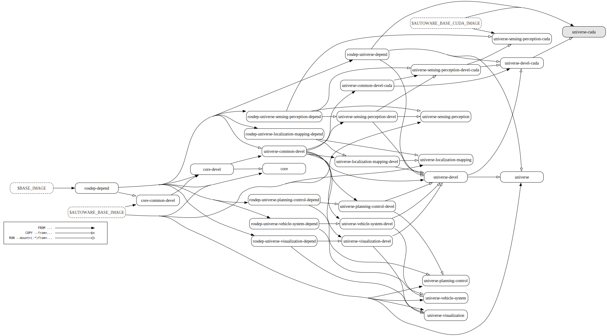

# Open AD Kit: containerized workloads for Autoware

[Open AD Kit](https://autoware.org/open-ad-kit/) offers containers for Autoware to simplify the development and deployment of Autoware and its dependencies. This directory contains scripts to build and run the containers.

Detailed instructions on how to use the containers can be found in the [Open AD Kit documentation](https://autowarefoundation.github.io/autoware-documentation/main/installation/autoware/docker-installation/).

## Development containers

When using Open AD Kit as a development container, it is easy to use Autoware's all-in-one development container image, `ghcr.io/autowarefoundation/autoware:universe-devel-cuda`.
If you do not need the CUDA drivers, you can also use the smaller image `ghcr.io/autowarefoundation/autoware:universe-devel`.

```shell
$ git clone git@github.com:autowarefoundation/autoware.git
$ cd autoware
$ vcs import src < autoware.repos
$ docker run -it --rm \
  –v $PWD/src/universe/autoware.universe/XXX/autoware_YYY:/autoware/src/autoware_YYY \
  ghcr.io/autowarefoundation/autoware:universe-devel-cuda
$ colcon build --mixin debug compile-commands
$ source install/setup.bash
$ ros2 run --prefix "gdb -ex run --args" autoware_YYY ZZZ
```

For example, if you want to make modifications to [`autoware.universe/perception/autoware_bytetrack`](https://github.com/autowarefoundation/autoware.universe/tree/main/perception/autoware_bytetrack), you can execute the following commands to perform the volume mount and debug build and execution of only the `autoware_bytetrack`.

Note that `gdb` is not currently installed in the development containers, but it would be installed in the near future.

```shell
$ docker run -it --rm \
  -v $PWD/src/universe/autoware.universe/perception/autoware_bytetrack:/autoware/src/autoware_bytetrack \
  ghcr.io/autowarefoundation/autoware:universe-devel-cuda
$ root@a566e785c4d2:/autoware# colcon build --mixin debug compile-commands
Starting >>> autoware_bytetrack
[Processing: autoware_bytetrack]
Finished <<< autoware_bytetrack [37.9s]

Summary: 1 package finished [38.1s]
$ root@a566e785c4d2:/autoware# source install/setup.bash
$ root@a566e785c4d2:/autoware# apt update && apt install gdb
$ root@a566e785c4d2:/autoware# ros2 run --prefix "gdb -ex run --args" autoware_bytetrack bytetrack_node_exe
GNU gdb (Ubuntu 12.1-0ubuntu1~22.04.2) 12.1
...
[Thread debugging using libthread_db enabled]
...
[New Thread 0x7ff6f3fff640 (LWP 1205)]
Init ByteTrack!
```

## Runtime containers

In the execution container, there is the all-in-one runtime container for Autoware, `ghcr.io/autowarefoundation/autoware:universe-cuda`, and the multi-containerized `ghcr.io/autowarefoundation/autoware:universe-***-cuda` for each component of Autoware Universe.

The all-in-one execution container also has the autoware_launch package installed, allowing it to be started in the same way as a locally built Autoware.

```shell
git clone git@github.com:autowarefoundation/autoware.git
cd autoware
docker run -it --rm ghcr.io/autowarefoundation/autoware:universe-cuda
ros2 launch autoware_launch planning_simulator.launch.xml map_path:=...
```

For example, if you want to run the runtime container that only includes the `sensing/perception` components, you can execute it as follows.

```shell
docker run -it --rm ghcr.io/autowarefoundation/autoware:universe-sensing-perception-cuda
ros2 launch autoware_pointcloud_preprocessor preprocessor.launch.xml
```

## Multi-stage Dockerfile structure



The suffix `-devel` (e.g. `universe-devel`) is intended for use as a [development container](https://containers.dev). On the other hand, those without the `-devel` suffix (e.g. `universe`) are intended to be used as a runtime container.

### `$BASE_IMAGE`

This is a base image of this Dockerfile. [`ros:humble-ros-base-jammy`](https://hub.docker.com/_/ros/tags?page=&page_size=&ordering=&name=humble-ros-base-jammy) will be given.

### `base`

This stage performs only the basic setup required for all Autoware images.

### `rosdep-depend`

The ROS dependency package list files will be generated.
These files will be used in the subsequent stages:

- `core-devel`
- `universe-common`
- `universe-COMPONENT-devel` (e.g. `universe-sensing-perception-devel`)
- `universe-COMPONENT` (e.g. `universe-sensing-perception`)
- `universe-devel`
- `universe`

By generating only the package list files and copying them to the subsequent stages, the dependency packages will not be reinstalled during the container build process unless the dependency packages change.

### `core-devel`

This stage installs the dependency packages based on `/rosdep-core-depend-packages.txt` and build the packages under the `core` directory of `autoware.repos`.

### `universe-common-devel`

This stage installs the dependency packages based on `/rosdep-universe-common-depend-packages.txt` and build the packages under the following directories of `autoware.repos`.

- `universe/external`
- `universe/autoware.universe/common`

### `universe-sensing-perception-devel`

This stage installs the dependency packages based on `/rosdep-universe-sensing-perception-depend-packages.txt` and build the packages under the following directories of `autoware.repos`.

- `universe/autoware.universe/perception`
- `universe/autoware.universe/sensing`

### `universe-sensing-perception`

This stage is a Autoware Universe Sensing/Perception runtime container. It only includes the dependencies given by `/rosdep-universe-sensing-perception-exec-depend-packages.txt` and the binaries built in the `universe-sensing-perception-devel` stage.

### `universe-localization-mapping-devel`

This stage installs the dependency packages based on `/rosdep-universe-localization-mapping-depend-packages.txt` and build the packages under the following directories of `autoware.repos`.

- `universe/autoware.universe/localization`
- `universe/autoware.universe/map`

### `universe-localization-mapping`

This stage is a Autoware Universe Localization/Mapping runtime container. It only includes the dependencies given by `/rosdep-universe-localization-mapping-exec-depend-packages.txt` and the binaries built in the `universe-localization-mapping-devel` stage.

### `universe-planning-control-devel`

This stage installs the dependency packages based on `/rosdep-universe-planning-control-depend-packages.txt` and build the packages under the following directories of `autoware.repos`.

- `universe/autoware.universe/control`
- `universe/autoware.universe/planning`

### `universe-planning-control`

This stage is a Autoware Universe Planning/Control runtime container. It only includes the dependencies given by `/rosdep-universe-planning-control-exec-depend-packages.txt` and the binaries built in the `universe-planning-control-devel` stage.

### `universe-vehicle-system-devel`

This stage installs the dependency packages based on `/rosdep-universe-vehicle-system-depend-packages.txt` and build the packages under the following directories of `autoware.repos`.

- `universe/autoware.universe/vehicle`
- `universe/autoware.universe/system`

### `universe-vehicle-system`

This stage is a Autoware Universe Vehicle/System runtime container. It only includes the dependencies given by `/rosdep-universe-vehicle-system-exec-depend-packages.txt` and the binaries built in the `universe-vehicle-system-devel` stage.

### `universe-devel`

This stage installs the dependency packages based on `/rosdep-universe-depend-packages.txt` and build the remaining packages of `autoware.repos`:

- `launcher`
- `param`
- `sensor_component`
- `sensor_kit`
- `universe/autoware.universe/evaluator`
- `universe/autoware.universe/launch`
- `universe/autoware.universe/simulator`
- `universe/autoware.universe/system`
- `universe/autoware.universe/tools`
- `universe/autoware.universe/vehicle`
- `vehicle`

This stage provides an all-in-one development container to Autoware developers. By running the host's source code with volume mounting, it allows for easy building and debugging of Autoware.

### `universe`

This stage is an Autoware Universe runtime container. It only includes the dependencies given by `/rosdep-exec-depend-packages.txt`, the binaries built in the `universe-devel` stage, and artifacts.
