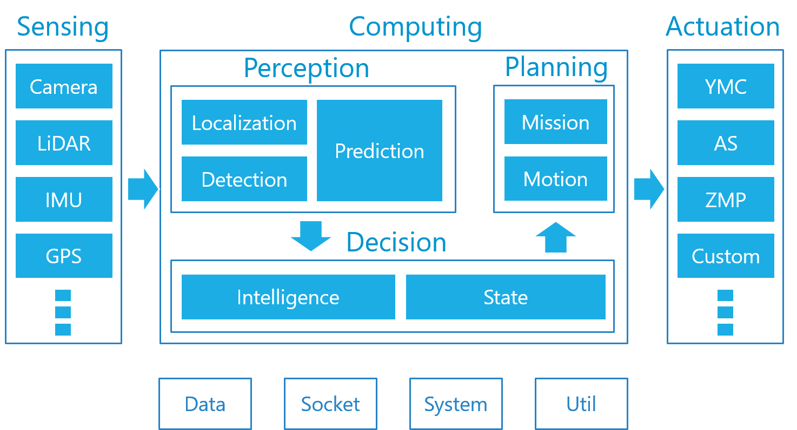
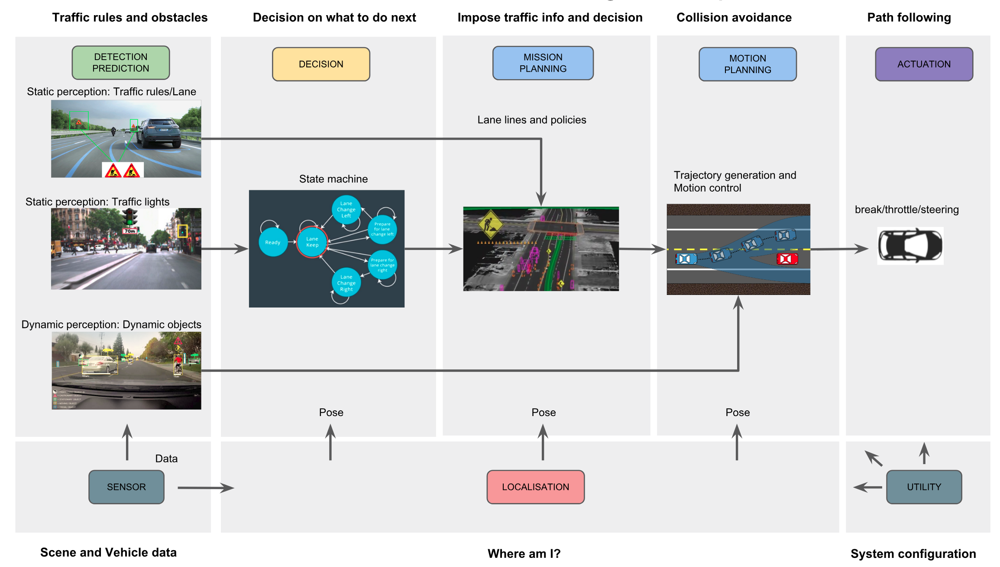
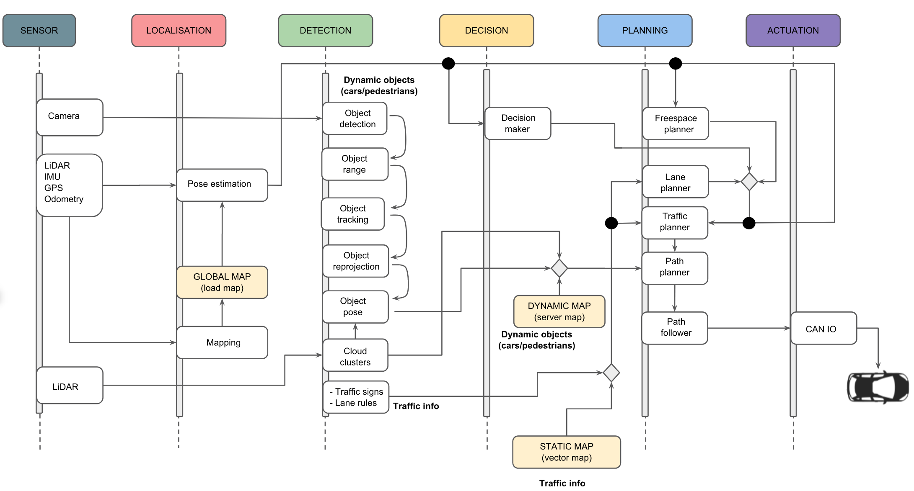
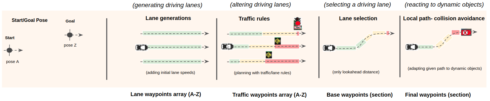
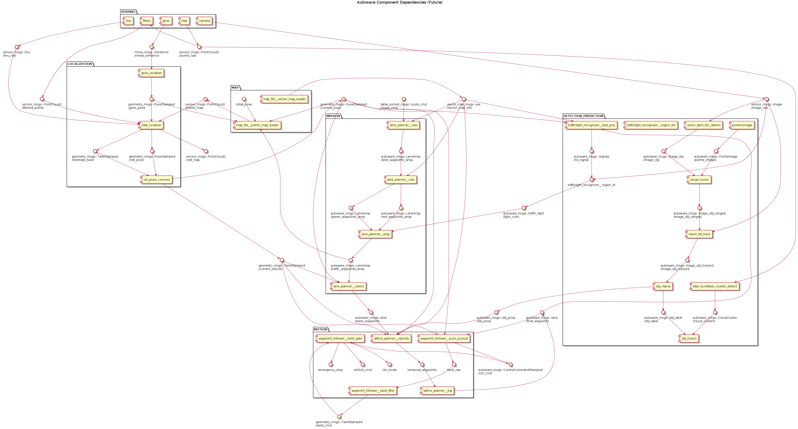

## Autonomous Driving Software Stack

The self-driving car software stack as presented in the picture above is divided into 6 categories: 
Sensing, Computing, Decision, Planning, Actuation(DBW) and Others. 

Each of these categories may contain multiple modules such as localization, detection and prediction in Computing categories. Additionally, each module has multiple software packages.

**Category > Module  > Package > Node(Element)**

## Autoware Autonomous Driving Concept
**(revise: should we use images from autoware ?)**

The software stack above shows a high-level autonomous driving concept that can be exhibited further in the following figure.

For simplicity, we organize the figure with the following a group of functionalities, namely Sensor, Localization, Detection and Prediction, Decision, Mission, Motion, Actuation, and Utility. 

**Sense**: Give images and point clouds 

**Localization**: Estimate a vehicle location and orientation

**Detection and Prediction**:  Detect and range the traffic signs, lane rules as well as moving objects from images and point clouds.

**Decision**: Make a decision of what to do next based on traffic information

**Mission planning**: Generate a path or paths (waypoints) imposed by the road traffics for the motion planning

**Motion planning**: Generate a path (waypoints) to avoid obstacles, this part also includes the motion control of the car to follow the waypoints through the control messages such as throttle, brake steering

**Actuation**: Turn the control message to the control command on the target vehicle

**Utility**: Facilitate integration and of autonomous driving such as socket, tf frame setting, simulation and etc.  

## System Integration
Expanding from the autonomous driving concept, the below figure outlines a system integration showing how the Autoware packages are put together to enable self-driving capability.

The figure outlines a sequential flow of system events from a top-down and left-right order with main tasks. This is only used as a **demonstration purpose** at the conceptual level where some elements are **excluded from explanation**. The system development is not fixed or limited to this idea. 

## Overview of Autoware Path Planning Strategy

There are a variety of modules available for the mission and motion planning in Autoware. The selection of these  packages depend on the individual requirements. The figure above summarizes the key concept of turning a goal-target point to a final driving path. The path planning strategy is using a cascade design framework where information about road traffics and obstalces incrementally added to the path(s) at each stage in producing the final waypoints for the path follower. 

- The start-goal point is planned out to the driving lane(s): **Lane waypoints array** 

- The lane waypoints array is imposed by the traffic rules: **Traffic waypoints array**
- Generating the optimal trajectory based on the traffic information: **Base waypoints** 
- Generating the final optimal trajectory with obstacle avoidance: **Final waypoints**   

Autoware has the specific messages used in the planning process, namely autoware_msgs/lane and autoware_msgs/LaneArray.

## Examples: 

For a use case scenario, we show some system integration based on a selection of motion planning methods such as Lattice and A* Planner. It is noted that not all input and output connections are displayed in order to keep the diagram readable.

**(check if this is correct- it seems we are putting things differently in Prediction/Detection modules and the generated texts are far too small- manually make the diagram?)**

1. Lattice motion planning

2. A* motion planning

**(making one)**

