# Tier IV Academy
## Building autonomous driving systems

## Chapter 1：Data Recording/Playing and Sensor Calibration
### Data Recording/Playing
* In ROS, log data of sensor and etc., can be saved into a file format called ROSBAG
* Playing ROSBAG replays recorded sensor information, it can be used for simulation
* Autoware provides ROSBAG recording/playing functions in GUI

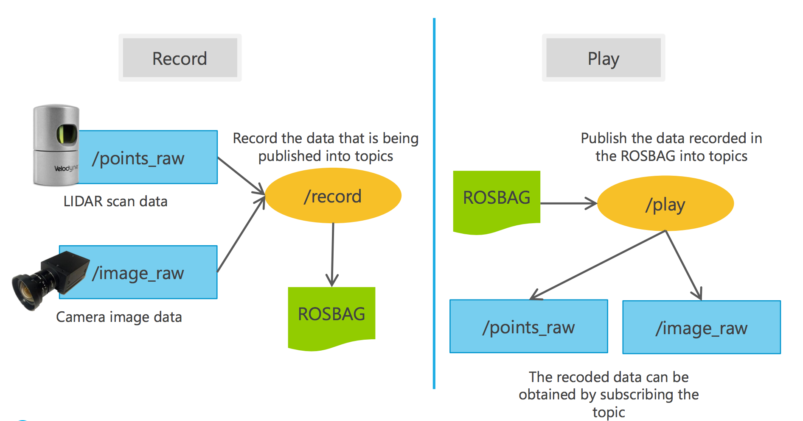

### Data Recording – Steps (1/2)
#### Publish topics to be recorded

1. Launch Autoware
Execute “run” on a terminal as follows (alternatively,
click on the “run” script on a file manager) :
``` bash
cd ~/Autoware/ros/
```
``` bash
./run
```
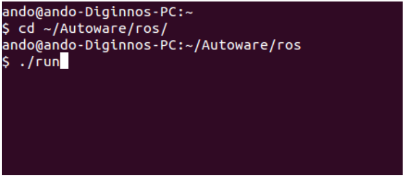

2. Launch ROS nodes by checking (☑) the boxes, this
will publish ROS topics that can be recorded
 i.e. [Velodyne HDL-32e]: this node publishes Velodyne data
to /points_raw topic
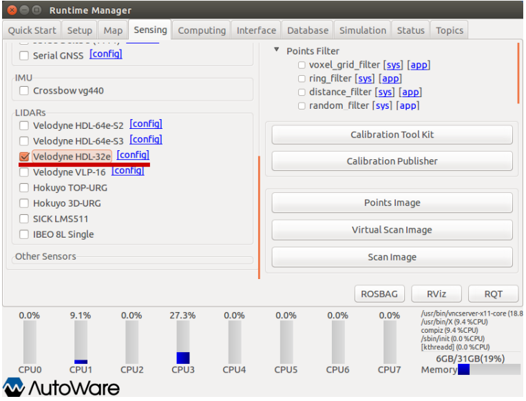

### Data Recording – Steps (2/2)
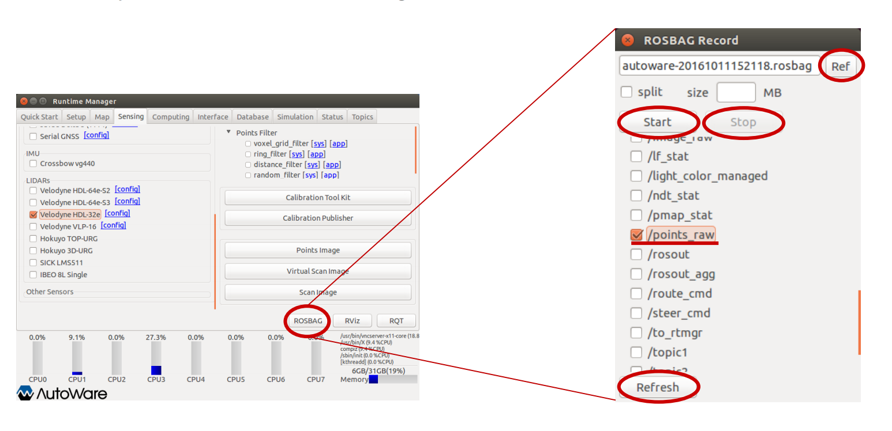

ROSBAG recording
1. Display a dialog by clicking [ROSBAG] button
1. Click [Ref] button, and then specify the filename of the ROSBAG to be saved
1. Click [Refresh] button
1. Check (☑) the boxes of ROS topics to be recorded
1. Click [Start] button to start recording the selected topic
1. Click [Stop] button to end the recording

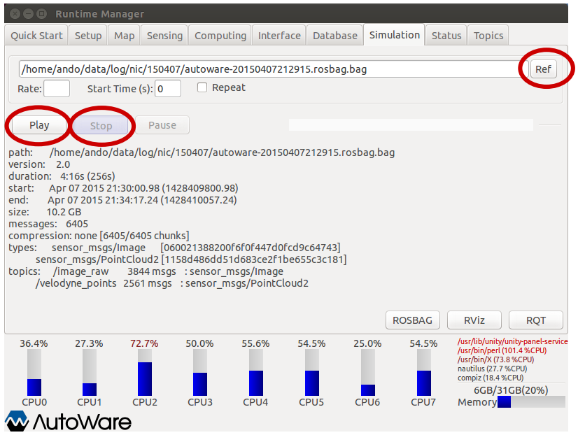

ROSBAG playing
1. Open [Simulation] tab
1. Click [Ref] button, and then specify the bag file to play
1. Click [Play] button to play back the contents of the bag file. The ROS parameter [/use_sim_time] is set to [true] automatically
1. Click [Pause] button to pause/resume the playback
1. Click [Stop] button to stop the playback. The ROS parameter [/use_sim_time] is set to [false]
automatically

### Sensor Calibration − Overview

* Calculate relative position relation (i.e., x, y ,z, roll, pitch, yaw) of the LIDAR and the camera
mounted on vehicle
* Both of the LIDAR data and the camera data can be fused by utilizing the relative position
between them
* The LIDAR scan data is projected on the camera image
* A checkerboard is used to calibrate both sensors

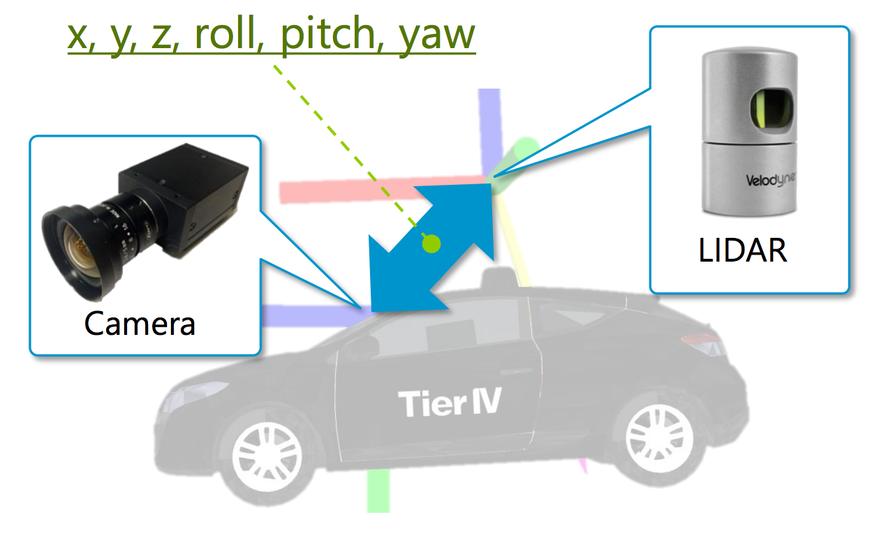

### Sensor Calibration − Structure

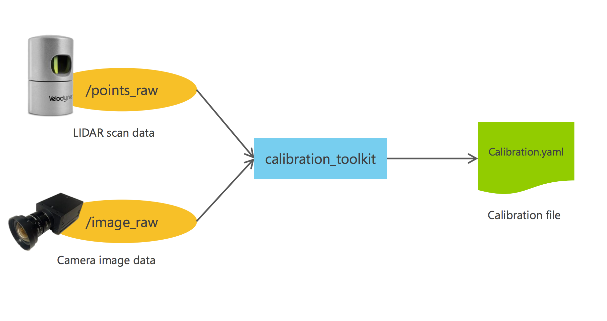

### Sensor Calibration − Steps (1/4)

Launch tools
* In this slide, a calibration file is generated by using a ROSBAG that contains “/points_raw” and
“/image_raw”

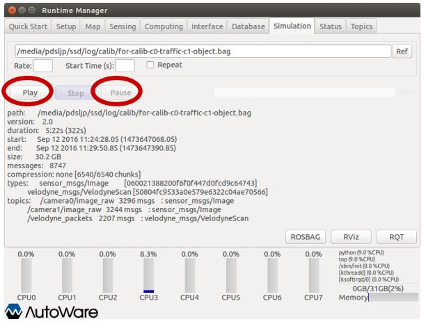
1) Play/Stop ROSBAG
* Click [Play] button in [Simulation] tab, and then click
[Pause] button
* If the ROSBAG includes “/velodyne_packets” instead of
“/points_raw”, launch Velodyne Driver

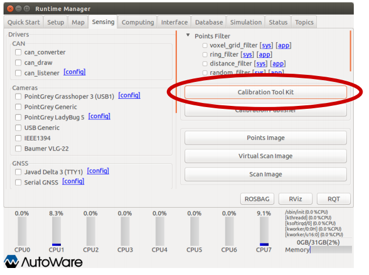
2) Launch Calibration Toolkit
*  Click [Calibration Toolkit] in [Sensing] tab

3) Select data source for calibration
* Select a camera topic for calibration
 Here, select “/camera0/image_raw”
<center></center>

* Select calibration type
 Since this example uses the relative position between the camera and the Velodyne, select [Camera->Velodyne]
<center>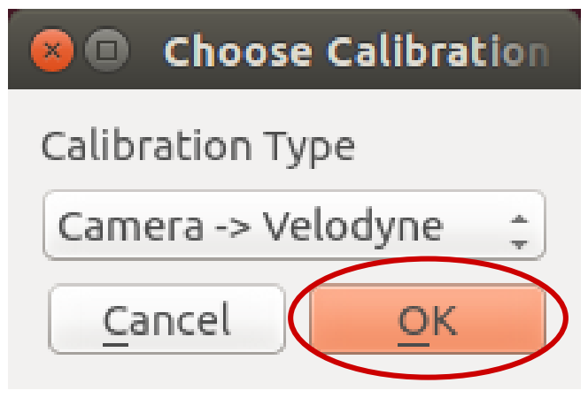</center>

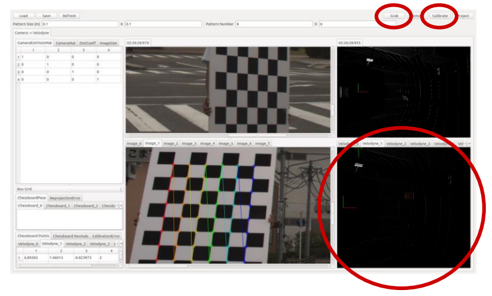
4) Press Grab to capture data from both
sensors
* Confirm that a camera image (upper-left) and
LIDAR (upper-right) data are displayed, then
click [Grab] button

5) Select grabbed data points that are
projected on the checkerboard
* Click LIDAR scan projected on the
checkerboard from the right-bottom window. Conduct this step as many times as the number of grabbed frames.

6) Calibration
* Click [Calibrate]
* Confirm that the parameters of calibration are
updated on the table shown in the left
window

7) Save file
* Click [Save] button
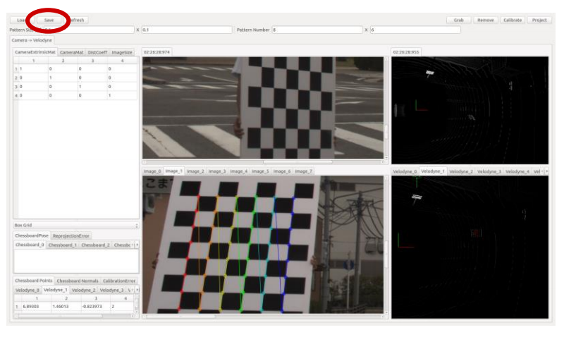
* Select the file name, the directory, and then
click the [Save] button
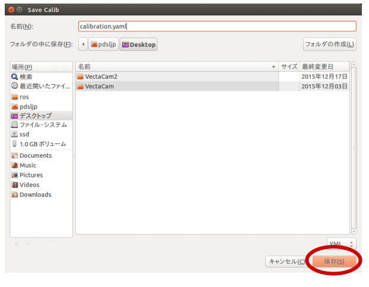
