# tier4_control_launch

## Structure



## Package Dependencies

Please see `<exec_depend>` in `package.xml`.

## Usage

You can include as follows in `*.launch.xml` to use `control.launch.py`.

```xml
<include file="$(find-pkg-share tier4_control_launch)/launch/control.launch.py">
  <!-- options for lateral_controller_mode: mpc_follower, pure_pursuit -->
  <arg name="lateral_controller_mode" value="mpc_follower" />
</include>
```

## Notes

For reducing processing load, we use the [Component](https://docs.ros.org/en/galactic/Concepts/About-Composition.html) feature in ROS2 (similar to Nodelet in ROS1 )
