# tier4_map_launch

## Structure



## Package Dependencies

Please see `<exec_depend>` in `package.xml`.

## Usage

You can include as follows in `*.launch.xml` to use `map.launch.py`.

```xml
<arg name="map_path" description="point cloud and lanelet2 map directory path"/>
<arg name="lanelet2_map_file" default="lanelet2_map.osm" description="lanelet2 map file name"/>
<arg name="pointcloud_map_file" default="pointcloud_map.pcd" description="pointcloud map file name"/>

<include file="$(find-pkg-share tier4_map_launch)/launch/map.launch.py">
  <arg name="lanelet2_map_path" value="$(var map_path)/$(var lanelet2_map_file)" />
  <arg name="pointcloud_map_path" value="$(var map_path)/$(var pointcloud_map_file)"/>
</include>
```

## Notes

For reducing processing load, we use the [Component](https://docs.ros.org/en/galactic/Concepts/About-Composition.html) feature in ROS2 (similar to Nodelet in ROS1 )
