# tier4_system_launch

## Structure



## Package Dependencies

Please see `<exec_depend>` in `package.xml`.

## Usage

Note that you should provide parameter paths as `PACKAGE_param_path`. The list of parameter paths you should provide is written at the top of `system.launch.xml`.

```xml
  <include file="$(find-pkg-share tier4_system_launch)/launch/system.launch.xml">
    <arg name="run_mode" value="online"/>
    <arg name="sensor_model" value="SENSOR_MODEL"/>

    <!-- Parameter files -->
    <arg name="FOO_param_path" value="..."/>
    <arg name="BAR_param_path" value="..."/>
    ...
  </include>
```

The sensing configuration parameters used in system_error_monitor are loaded from "config/diagnostic_aggregator/sensor_kit.param.yaml" in the "`SENSOR_MODEL`\_description" package.
