# tier4_vehicle_launch

## Structure



## Package Dependencies

Please see `<exec_depend>` in `package.xml`.

## Usage

You can include as follows in `*.launch.xml` to use `vehicle.launch.xml`.

```xml
  <arg name="vehicle_model" default="sample_vehicle" description="vehicle model name"/>
  <arg name="sensor_model" default="sample_sensor_kit" description="sensor model name"/>

  <include file="$(find-pkg-share tier4_vehicle_launch)/launch/vehicle.launch.xml">
    <arg name="vehicle_model" value="$(var vehicle_model)"/>
    <arg name="sensor_model" value="$(var sensor_model)"/>
  </include>
```

## Notes

This package finds some external packages and settings with variables and package names.

ex.)

```xml
<let name="vehicle_model_pkg" value="$(find-pkg-share $(var vehicle_model)_description)"/>
```

```xml
<arg name="config_dir" default="$(find-pkg-share individual_params)/config/$(var vehicle_id)/$(var sensor_model)"/>
```

## vehicle.xacro

### Arguments

| Name          | Type   | Description        | Default |
| ------------- | ------ | ------------------ | ------- |
| sensor_model  | String | sensor model name  | ""      |
| vehicle_model | String | vehicle model name | ""      |

### Usage

You can write as follows in `*.launch.xml`.

```xml
  <arg name="vehicle_model" default="sample_vehicle" description="vehicle model name"/>
  <arg name="sensor_model" default="sample_sensor_kit" description="sensor model name"/>
  <arg name="model" default="$(find-pkg-share tier4_vehicle_launch)/urdf/vehicle.xacro"/>

  <node name="robot_state_publisher" pkg="robot_state_publisher" exec="robot_state_publisher">
    <param name="robot_description" value="$(command 'xacro $(var model) vehicle_model:=$(var vehicle_model) sensor_model:=$(var sensor_model)')"/>
  </node>

```
