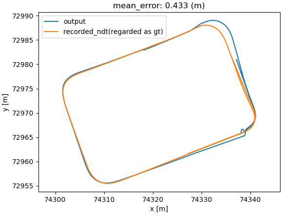

# AR Tag Based Localizer

**ArTagBasedLocalizer** is a vision-based localization node.


This node uses [the ArUco library](https://index.ros.org/p/aruco/) to detect AR-Tags from camera images and calculates and publishes the pose of the ego vehicle based on these detections.
The positions and orientations of the AR-Tags are assumed to be written in the Lanelet2 format.

## Inputs / Outputs

### `ar_tag_based_localizer` node

#### Input

| Name                   | Type                                            | Description                                                                                                                                                                                                                                                               |
| :--------------------- | :---------------------------------------------- | :------------------------------------------------------------------------------------------------------------------------------------------------------------------------------------------------------------------------------------------------------------------------ |
| `~/input/lanelet2_map` | `autoware_map_msgs::msg::LaneletMapBin`         | Data of lanelet2                                                                                                                                                                                                                                                          |
| `~/input/image`        | `sensor_msgs::msg::Image`                       | Camera Image                                                                                                                                                                                                                                                              |
| `~/input/camera_info`  | `sensor_msgs::msg::CameraInfo`                  | Camera Info                                                                                                                                                                                                                                                               |
| `~/input/ekf_pose`     | `geometry_msgs::msg::PoseWithCovarianceStamped` | EKF Pose without IMU correction. It is used to validate detected AR tags by filtering out False Positives. Only if the EKF Pose and the AR tag-detected Pose are within a certain temporal and spatial range, the AR tag-detected Pose is considered valid and published. |

#### Output

| Name                            | Type                                            | Description                                                                               |
| :------------------------------ | :---------------------------------------------- | :---------------------------------------------------------------------------------------- |
| `~/output/pose_with_covariance` | `geometry_msgs::msg::PoseWithCovarianceStamped` | Estimated Pose                                                                            |
| `~/debug/result`                | `sensor_msgs::msg::Image`                       | [debug topic] Image in which marker detection results are superimposed on the input image |
| `~/debug/marker`                | `visualization_msgs::msg::MarkerArray`          | [debug topic] Loaded landmarks to visualize in Rviz as thin boards                        |
| `/tf`                           | `geometry_msgs::msg::TransformStamped`          | [debug topic] TF from camera to detected tag                                              |
| `/diagnostics`                  | `diagnostic_msgs::msg::DiagnosticArray`         | Diagnostics outputs                                                                       |

## Parameters

{{ json_to_markdown("localization/autoware_landmark_based_localizer/autoware_ar_tag_based_localizer/schema/ar_tag_based_localizer.schema.json") }}

## How to launch

When launching Autoware, set `artag` for `pose_source`.

```bash
ros2 launch autoware_launch ... \
    pose_source:=artag \
    ...
```

### Rosbag

#### [Sample rosbag and map (AWSIM data)](https://drive.google.com/file/d/1ZPsfDvOXFrMxtx7fb1W5sOXdAK1e71hY/view)

This data is simulated data created by [AWSIM](https://tier4.github.io/AWSIM/).
Essentially, AR tag-based self-localization is not intended for such public road driving, but for driving in a smaller area, so the max driving speed is set at 15 km/h.

It is a known problem that the timing of when each AR tag begins to be detected can cause significant changes in estimation.


#### [Sample rosbag and map (Real world data)](https://drive.google.com/file/d/1VQCQ_qiEZpCMI3-z6SNs__zJ-4HJFQjx/view)

Please remap the topic names and play it.

```bash
ros2 bag play /path/to/ar_tag_based_localizer_sample_bag/ -r 0.5 -s sqlite3 \
     --remap /sensing/camera/front/image:=/sensing/camera/traffic_light/image_raw \
             /sensing/camera/front/image/info:=/sensing/camera/traffic_light/camera_info
```

This dataset contains issues such as missing IMU data, and overall the accuracy is low. Even when running AR tag-based self-localization, significant difference from the true trajectory can be observed.

The image below shows the trajectory when the sample is executed and plotted.



The pull request video below should also be helpful.

<https://github.com/autowarefoundation/autoware.universe/pull/4347#issuecomment-1663155248>

## Principle


