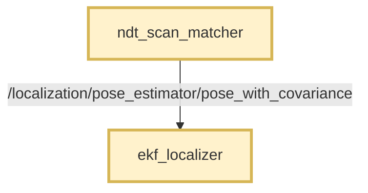
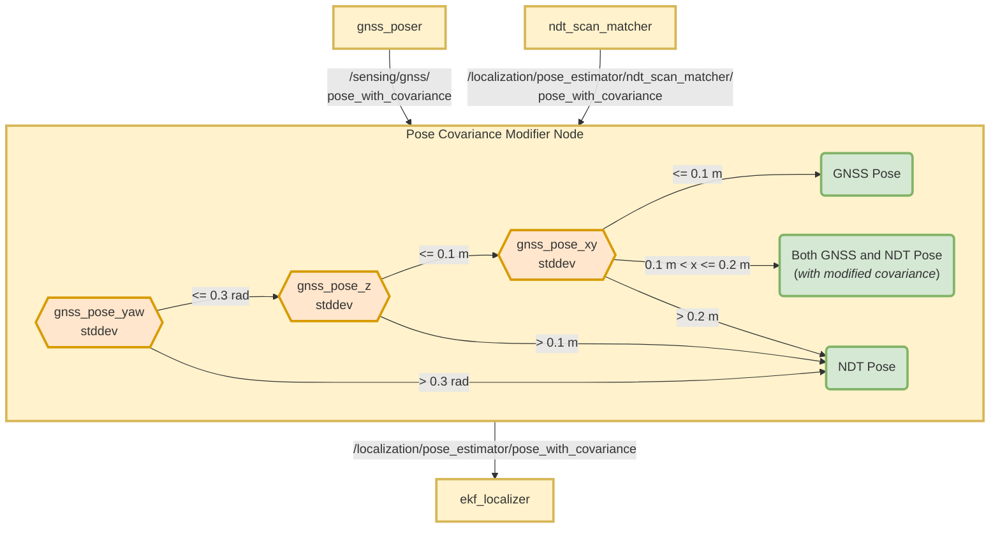
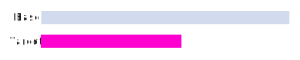

# Autoware Pose Covariance Modifier Node

## Purpose

This package makes it possible to use GNSS and NDT poses together in real time localization.

## Function

This package takes in GNSS (Global Navigation Satellite System)
and NDT (Normal Distribution Transform) poses with covariances.

It outputs a single pose with covariance:

- Directly the GNSS pose and its covariance.
- Directly the NDT pose and its covariance.
- Both GNSS and NDT poses with modified covariances.

> - This package doesn't modify the pose information it receives.
> - It only modifies NDT covariance values under certain conditions.

## Assumptions

- The NDT matcher provides a pose with a fixed covariance.
- The NDT matcher is unable to provide a dynamic, reliable covariance value.

## Requirements

- The GNSS/INS module must provide standard deviation values (its error / RMSE) for the position and orientation.
- It probably needs RTK support to provide accurate position and orientation information.
- You need to have a geo-referenced map.
- GNSS/INS module and the base_link frame must be calibrated well enough.
- In an environment where GNSS/INS and NDT systems work well, the `base_link` poses from both systems should be close to
  each other.

## Description

GNSS and NDT nodes provide the pose with covariance data utilized in an Extended Kalman Filter (EKF).

Accurate covariance values are crucial for the effectiveness of the EKF in estimating the state.

The GNSS system generates reliable standard deviation values, which can be transformed into covariance measures.

But we currently don't have a reliable way to determine the covariance values for the NDT poses.
And the NDT matching system in Autoware outputs poses with preset covariance values.

For this reason, this package is designed to manage the selection of the pose source,
based on the standard deviation values provided by the GNSS system.

It also tunes the covariance values of the NDT poses, based on the GNSS standard deviation values.

## Flowcharts

### Without this package

Only NDT pose is used in localization. GNSS pose is only used for initialization.

### With this package

Both NDT and GNSS poses are used in localization, depending on the standard deviation values coming from the GNSS
system.

Here is a flowchart depicting the process and the predefined thresholds:

## How to use this package

> **This package is disabled by default in Autoware, you need to manually enable it.**

To enable this package, you need to change the `use_autoware_pose_covariance_modifier` parameter to `true` within
the [pose_twist_estimator.launch.xml](../../launch/tier4_localization_launch/launch/pose_twist_estimator/pose_twist_estimator.launch.xml#L3).

### Without this condition (default)

- The output of the [ndt_scan_matcher](../../localization/ndt_scan_matcher) is directly sent
  to [ekf_localizer](../../localization/ekf_localizer).
  - It has a preset covariance value.
  - **topic name:** `/localization/pose_estimator/pose_with_covariance`
- The GNSS pose does not enter the ekf_localizer.
- This node does not launch.

### With this condition

- The output of the [ndt_scan_matcher](../../localization/ndt_scan_matcher) is renamed
  - **from:** `/localization/pose_estimator/pose_with_covariance`.
  - **to:** `/localization/pose_estimator/ndt_scan_matcher/pose_with_covariance`.
- The `ndt_scan_matcher` output enters the `autoware_pose_covariance_modifier`.
- The output of this package goes to [ekf_localizer](../../localization/ekf_localizer) with:
  - **topic name:** `/localization/pose_estimator/pose_with_covariance`.

## Node

### Subscribed topics

| Name                             | Type                                            | Description            |
| -------------------------------- | ----------------------------------------------- | ---------------------- |
| `input_gnss_pose_with_cov_topic` | `geometry_msgs::msg::PoseWithCovarianceStamped` | Input GNSS pose topic. |
| `input_ndt_pose_with_cov_topic`  | `geometry_msgs::msg::PoseWithCovarianceStamped` | Input NDT pose topic.  |

### Published topics

| Name                                | Type                                            | Description                                                                                                            |
| ----------------------------------- | ----------------------------------------------- | ---------------------------------------------------------------------------------------------------------------------- |
| `output_pose_with_covariance_topic` | `geometry_msgs::msg::PoseWithCovarianceStamped` | Output pose topic. This topic is used by the ekf_localizer package.                                                    |
| `selected_pose_type`                | `std_msgs::msg::String`                         | Declares which pose sources are used in the output of this package                                                     |
| `output/ndt_position_stddev`        | `std_msgs::msg::Float64`                        | Output pose ndt average standard deviation in position xy. It is published only when the enable_debug_topics is true.  |
| `output/gnss_position_stddev`       | `std_msgs::msg::Float64`                        | Output pose gnss average standard deviation in position xy. It is published only when the enable_debug_topics is true. |

### Parameters

The parameters are set
in [config/pose_covariance_modifier.param.yaml](config/pose_covariance_modifier.param.yaml) .

{{ json_to_markdown("
localization/autoware_pose_covariance_modifier/schema/pose_covariance_modifier.schema.json") }}

## FAQ

### How are varying frequency rates handled?

The GNSS and NDT pose topics may have different frequencies.
The GNSS pose topic may have a higher frequency than the NDT.

Let's assume that the inputs have the following frequencies:

| Source | Frequency |
| ------ | --------- |
| GNSS   | 200 Hz    |
| NDT    | 10 Hz     |

This package publishes the output poses as they come in, depending on the mode.

End result:

| Mode       | Output Freq |
| ---------- | ----------- |
| GNSS Only  | 200 Hz      |
| GNSS + NDT | 210 Hz      |
| NDT Only   | 10 Hz       |

### How and when are the NDT covariance values overwritten?

| Mode       | Outputs, Covariance                         |
| ---------- | ------------------------------------------- |
| GNSS Only  | GNSS, Unmodified                            |
| GNSS + NDT | **GNSS:** Unmodified, **NDT:** Interpolated |
| NDT Only   | NDT, Unmodified                             |

NDT covariance values overwritten only for the `GNSS + NDT` mode.

This enables a smooth transition between `GNSS Only` and `NDT Only` modes.

In this mode, both NDT and GNSS poses are published from this node.

#### NDT covariance calculation

As the `gnss_std_dev` increases within its bounds, `ndt_std_dev` should proportionally decrease within its own bounds.

To achieve this, we first linearly interpolate:

- Base value: `gnss_std_dev`
- Base range: [`threshold_gnss_stddev_xy_bound_lower`, `threshold_gnss_stddev_xy_bound_upper`]
- Target range: [`ndt_std_dev_bound_lower`, `ndt_std_dev_bound_upper`]
- Target value: `ndt_std_dev_target`

- Final value = `ndt_std_dev_bound_lower` + `ndt_std_dev_bound_upper` - `ndt_std_dev_target` (to get the inverse)

