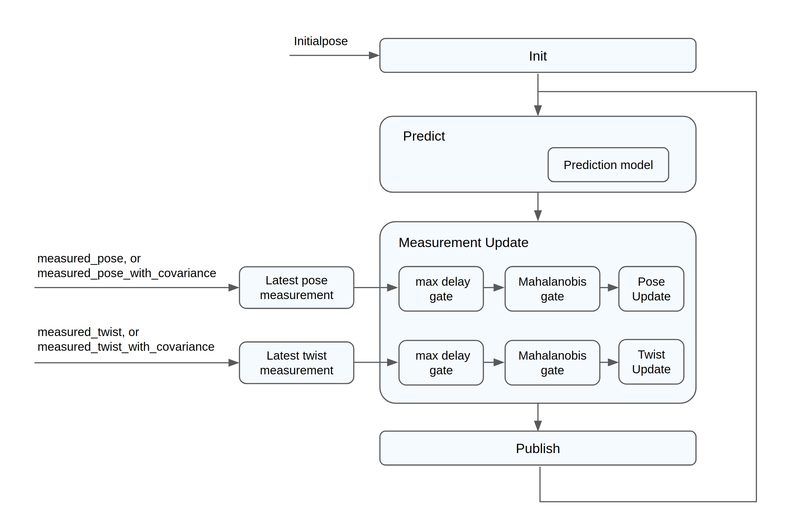
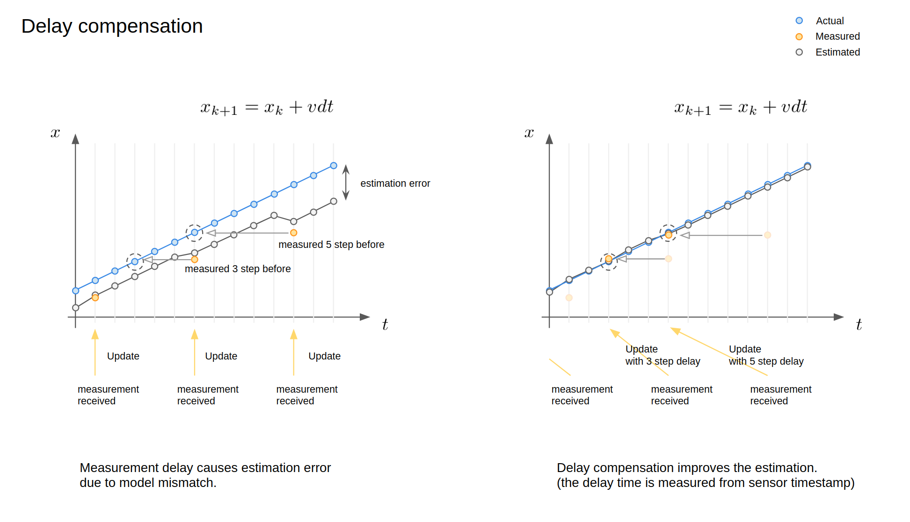
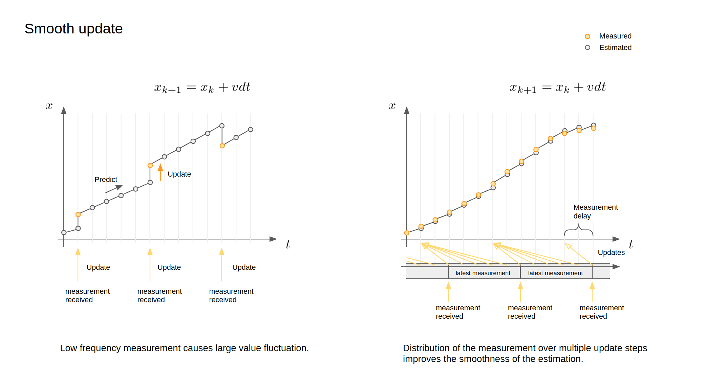
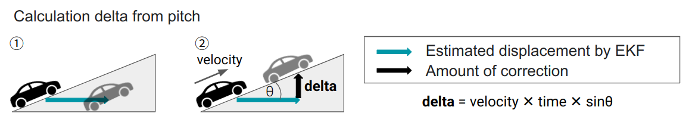
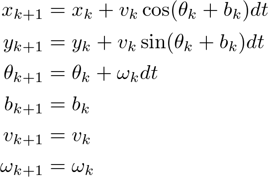
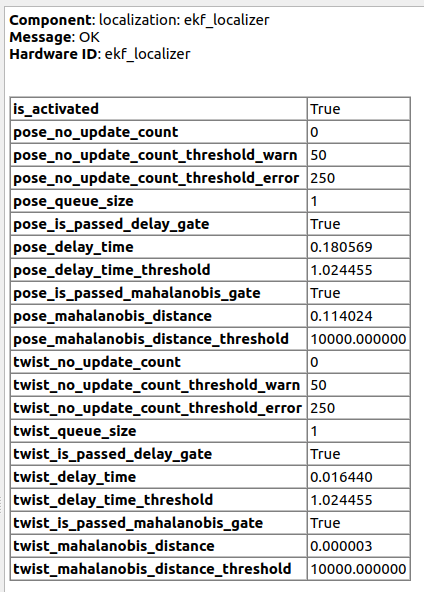

# Overview

The **Extend Kalman Filter Localizer** estimates robust and less noisy robot pose and twist by integrating the 2D vehicle dynamics model with input ego-pose and ego-twist messages. The algorithm is designed especially for fast-moving robots such as autonomous driving systems.

## Flowchart

The overall flowchart of the ekf_localizer is described below.

<p align="center">
  
</p>

## Features

This package includes the following features:

- **Time delay compensation** for input messages, which enables proper integration of input information with varying time delays. This is important especially for high-speed moving robots, such as autonomous driving vehicles. (see the following figure).
- **Automatic estimation of yaw bias** prevents modeling errors caused by sensor mounting angle errors, which can improve estimation accuracy.
- **Mahalanobis distance gate** enables probabilistic outlier detection to determine which inputs should be used or ignored.
- **Smooth update**, the Kalman Filter measurement update is typically performed when a measurement is obtained, but it can cause large changes in the estimated value, especially for low-frequency measurements. Since the algorithm can consider the measurement time, the measurement data can be divided into multiple pieces and integrated smoothly while maintaining consistency (see the following figure).
- **Calculation of vertical correction amount from pitch** mitigates localization instability on slopes. For example, when going uphill, it behaves as if it is buried in the ground (see the left side of the "Calculate delta from pitch" figure) because EKF only considers 3DoF(x,y,yaw). Therefore, EKF corrects the z-coordinate according to the formula (see the right side of the "Calculate delta from pitch" figure).

<p align="center">

</p>

<p align="center">
  
</p>

<p align="center">
  
</p>

## Launch

The `ekf_localizer` starts with the default parameters with the following command.

```sh
roslaunch ekf_localizer ekf_localizer.launch
```

The parameters and input topic names can be set in the `ekf_localizer.launch` file.

## Node

### Subscribed Topics

- measured_pose_with_covariance (geometry_msgs/PoseWithCovarianceStamped)

  Input pose source with the measurement covariance matrix.

- measured_twist_with_covariance (geometry_msgs/TwistWithCovarianceStamped)

  Input twist source with the measurement covariance matrix.

- initialpose (geometry_msgs/PoseWithCovarianceStamped)

  Initial pose for EKF. The estimated pose is initialized with zeros at the start. It is initialized with this message whenever published.

### Published Topics

- ekf_odom (nav_msgs/Odometry)

  Estimated odometry.

- ekf_pose (geometry_msgs/PoseStamped)

  Estimated pose.

- ekf_pose_with_covariance (geometry_msgs/PoseWithCovarianceStamped)

  Estimated pose with covariance.

- ekf_biased_pose (geometry_msgs/PoseStamped)

  Estimated pose including the yaw bias

- ekf_biased_pose_with_covariance (geometry_msgs/PoseWithCovarianceStamped)

  Estimated pose with covariance including the yaw bias

- ekf_twist (geometry_msgs/TwistStamped)

  Estimated twist.

- ekf_twist_with_covariance (geometry_msgs/TwistWithCovarianceStamped)

  The estimated twist with covariance.

- diagnostics (diagnostic_msgs/DiagnosticArray)

  The diagnostic information.

### Published TF

- base_link

  TF from "map" coordinate to estimated pose.

## Functions

### Predict

The current robot state is predicted from previously estimated data using a given prediction model. This calculation is called at a constant interval (`predict_frequency [Hz]`). The prediction equation is described at the end of this page.

### Measurement Update

Before the update, the Mahalanobis distance is calculated between the measured input and the predicted state, the measurement update is not performed for inputs where the Mahalanobis distance exceeds the given threshold.

The predicted state is updated with the latest measured inputs, measured_pose, and measured_twist. The updates are performed with the same frequency as prediction, usually at a high frequency, in order to enable smooth state estimation.

## Parameter description

The parameters are set in `launch/ekf_localizer.launch` .

### For Node

| Name                       | Type   | Description                                                                               | Default value |
| :------------------------- | :----- | :---------------------------------------------------------------------------------------- | :------------ |
| show_debug_info            | bool   | Flag to display debug info                                                                | false         |
| predict_frequency          | double | Frequency for filtering and publishing [Hz]                                               | 50.0          |
| tf_rate                    | double | Frequency for tf broadcasting [Hz]                                                        | 10.0          |
| extend_state_step          | int    | Max delay step which can be dealt with in EKF. Large number increases computational cost. | 50            |
| enable_yaw_bias_estimation | bool   | Flag to enable yaw bias estimation                                                        | true          |

### For pose measurement

| Name                          | Type   | Description                                                   | Default value |
| :---------------------------- | :----- | :------------------------------------------------------------ | :------------ |
| pose_additional_delay         | double | Additional delay time for pose measurement [s]                | 0.0           |
| pose_measure_uncertainty_time | double | Measured time uncertainty used for covariance calculation [s] | 0.01          |
| pose_smoothing_steps          | int    | A value for smoothing steps                                   | 5             |
| pose_gate_dist                | double | Limit of Mahalanobis distance used for outliers detection     | 10000.0       |

### For twist measurement

| Name                   | Type   | Description                                               | Default value |
| :--------------------- | :----- | :-------------------------------------------------------- | :------------ |
| twist_additional_delay | double | Additional delay time for twist [s]                       | 0.0           |
| twist_smoothing_steps  | int    | A value for smoothing steps                               | 2             |
| twist_gate_dist        | double | Limit of Mahalanobis distance used for outliers detection | 10000.0       |

### For process noise

| Name                   | Type   | Description                                                                                                      | Default value |
| :--------------------- | :----- | :--------------------------------------------------------------------------------------------------------------- | :------------ |
| proc_stddev_vx_c       | double | Standard deviation of process noise in time differentiation expression of linear velocity x, noise for d_vx = 0  | 2.0           |
| proc_stddev_wz_c       | double | Standard deviation of process noise in time differentiation expression of angular velocity z, noise for d_wz = 0 | 0.2           |
| proc_stddev_yaw_c      | double | Standard deviation of process noise in time differentiation expression of yaw, noise for d_yaw = omega           | 0.005         |
| proc_stddev_yaw_bias_c | double | Standard deviation of process noise in time differentiation expression of yaw_bias, noise for d_yaw_bias = 0     | 0.001         |

note: process noise for positions x & y are calculated automatically from nonlinear dynamics.

### For diagnostics

| Name                                  | Type   | Description                                                                                                                                | Default value |
| :------------------------------------ | :----- | :----------------------------------------------------------------------------------------------------------------------------------------- | :------------ |
| pose_no_update_count_threshold_warn   | size_t | The threshold at which a WARN state is triggered due to the Pose Topic update not happening continuously for a certain number of times.    | 50            |
| pose_no_update_count_threshold_error  | size_t | The threshold at which an ERROR state is triggered due to the Pose Topic update not happening continuously for a certain number of times.  | 250           |
| twist_no_update_count_threshold_warn  | size_t | The threshold at which a WARN state is triggered due to the Twist Topic update not happening continuously for a certain number of times.   | 50            |
| twist_no_update_count_threshold_error | size_t | The threshold at which an ERROR state is triggered due to the Twist Topic update not happening continuously for a certain number of times. | 250           |

### Misc

| Name                              | Type   | Description                                                                                        | Default value  |
| :-------------------------------- | :----- | :------------------------------------------------------------------------------------------------- | :------------- |
| threshold_observable_velocity_mps | double | Minimum value for velocity that will be used for EKF. Mainly used for dead zone in velocity sensor | 0.0 (disabled) |

## How to tune EKF parameters

### 0. Preliminaries

- Check header time in pose and twist message is set to sensor time appropriately, because time delay is calculated from this value. If it is difficult to set an appropriate time due to the timer synchronization problem, use `twist_additional_delay` and `pose_additional_delay` to correct the time.
- Check if the relation between measurement pose and twist is appropriate (whether the derivative of the pose has a similar value to twist). This discrepancy is caused mainly by unit error (such as confusing radian/degree) or bias noise, and it causes large estimation errors.

### 1. Tune sensor parameters

Set standard deviation for each sensor. The `pose_measure_uncertainty_time` is for the uncertainty of the header timestamp data.
You can also tune a number of steps for smoothing for each observed sensor data by tuning `*_smoothing_steps`.
Increasing the number will improve the smoothness of the estimation, but may have an adverse effect on the estimation performance.

- `pose_measure_uncertainty_time`
- `pose_smoothing_steps`
- `twist_smoothing_steps`

### 2. Tune process model parameters

- `proc_stddev_vx_c` : set to maximum linear acceleration
- `proc_stddev_wz_c` : set to maximum angular acceleration
- `proc_stddev_yaw_c` : This parameter describes the correlation between the yaw and yaw rate. A large value means the change in yaw does not correlate to the estimated yaw rate. If this is set to 0, it means the change in estimated yaw is equal to yaw rate. Usually, this should be set to 0.
- `proc_stddev_yaw_bias_c` : This parameter is the standard deviation for the rate of change in yaw bias. In most cases, yaw bias is constant, so it can be very small, but must be non-zero.

## Kalman Filter Model

### kinematics model in update function



where `b_k` is the yawbias.

### time delay model

The measurement time delay is handled by an augmented state [1] (See, Section 7.3 FIXED-LAG SMOOTHING).


Note that, although the dimension gets larger since the analytical expansion can be applied based on the specific structures of the augmented states, the computational complexity does not significantly change.

## Test Result with Autoware NDT

<p align="center">

</p>

## Diagnostics

<p align="center">

</p>

### The conditions that result in a WARN state

- The node is not in the activate state.
- The number of consecutive no measurement update via the Pose/Twist topic exceeds the `pose_no_update_count_threshold_warn`/`twist_no_update_count_threshold_warn`.
- The timestamp of the Pose/Twist topic is beyond the delay compensation range.
- The Pose/Twist topic is beyond the range of Mahalanobis distance for covariance estimation.

### The conditions that result in an ERROR state

- The number of consecutive no measurement update via the Pose/Twist topic exceeds the `pose_no_update_count_threshold_error`/`twist_no_update_count_threshold_error`.

## Known issues

- In the presence of multiple inputs with yaw estimation, yaw bias `b_k` in the current EKF state would not make any sense, since it is intended to capture the extrinsic parameter's calibration error of a sensor. Thus, future work includes introducing yaw bias for each sensor with yaw estimation.

## reference

[1] Anderson, B. D. O., & Moore, J. B. (1979). Optimal filtering. Englewood Cliffs, NJ: Prentice-Hall.
