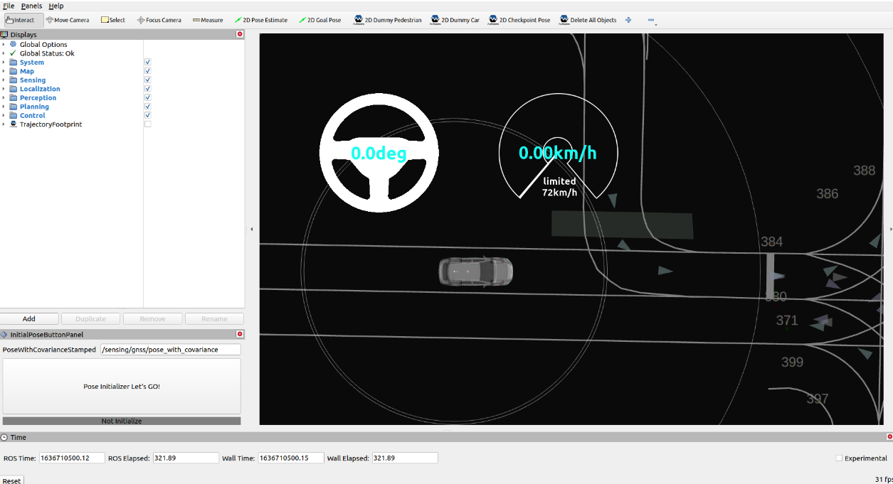

# initial_pose_button_panel

## Role

`initial_pose_button_panel` is the package to send a request to the localization module to calculate the current ego pose.

It starts calculating the current ego pose by pushing the button on Rviz, implemented as an Rviz plugin.
You can see the button on the right bottom of Rviz.

## Input / Output

### Input topics

| Name                                           | Type                                          | Description                                                    |
| ---------------------------------------------- | --------------------------------------------- | -------------------------------------------------------------- |
| `/sensing/gnss/pose_with_covariance` (default) | geometry_msgs::msg::PoseWithCovarianceStamped | initial pose with covariance to calculate the current ego pose |
