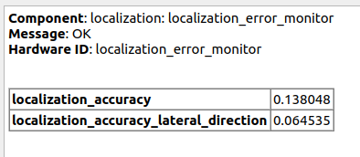

# localization_error_monitor

## Purpose

localization_error_monitor is a package for diagnosing localization errors by monitoring uncertainty of the localization results.
The package monitors the following two values:

- size of long radius of confidence ellipse
- size of confidence ellipse along lateral direction (body-frame)

## Inputs / Outputs

### Input

| Name                  | Type                                            | Description         |
| --------------------- | ----------------------------------------------- | ------------------- |
| `input/pose_with_cov` | `geometry_msgs::msg::PoseWithCovarianceStamped` | localization result |

### Output

| Name                   | Type                                    | Description         |
| ---------------------- | --------------------------------------- | ------------------- |
| `debug/ellipse_marker` | `visualization_msgs::msg::Marker`       | ellipse marker      |
| `diagnostics`          | `diagnostic_msgs::msg::DiagnosticArray` | diagnostics outputs |

## Parameters

{{ json_to_markdown("localization/localization_error_monitor/schema/localization_error_monitor.schema.json") }}
