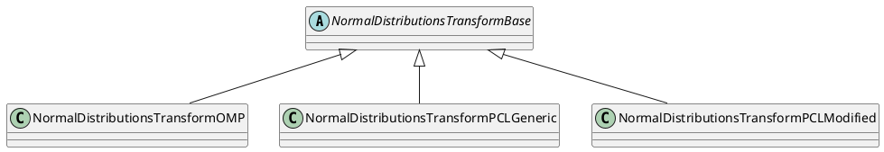

# ndt

This package aims to absorb the differences of several NDT implementations and provide a common interface.

```plantuml
@startuml
abstract class NormalDistributionsTransformBase
NormalDistributionsTransformBase <|-- NormalDistributionsTransformOMP
NormalDistributionsTransformBase <|-- NormalDistributionsTransformPCLGeneric
NormalDistributionsTransformBase <|-- NormalDistributionsTransformPCLModified
@enduml
```
