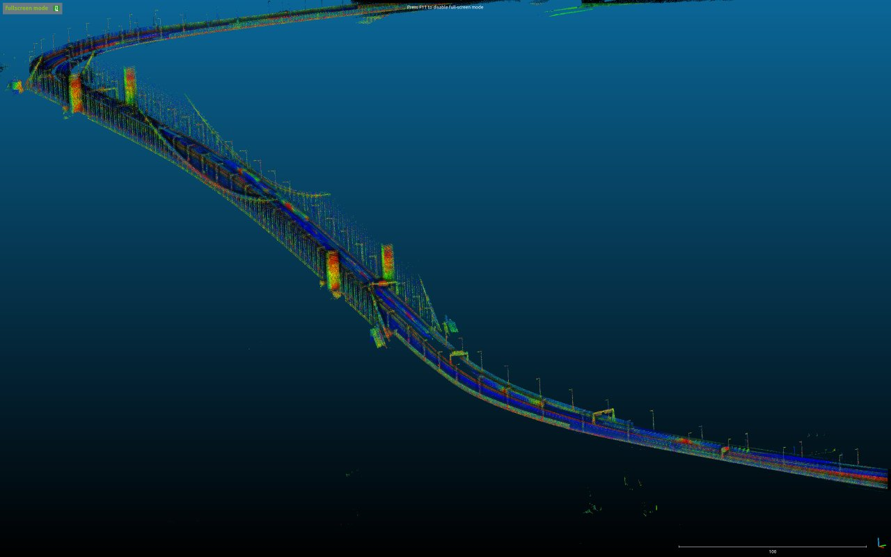
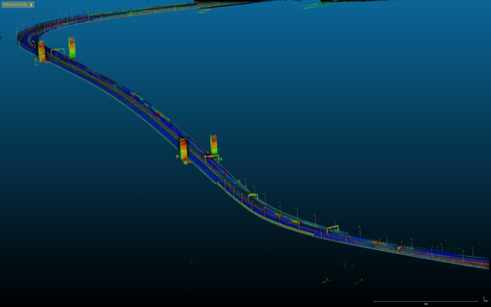
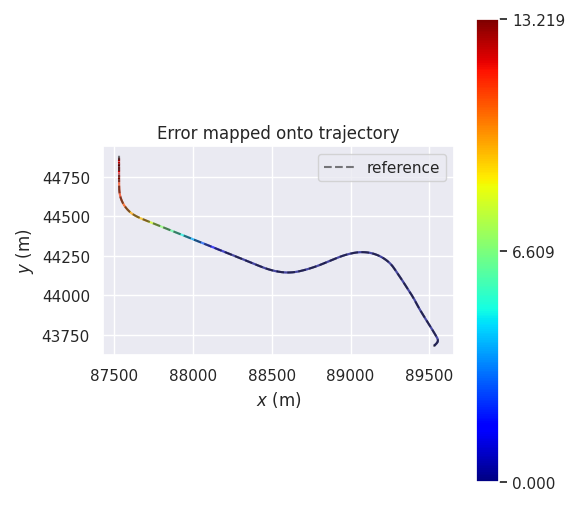
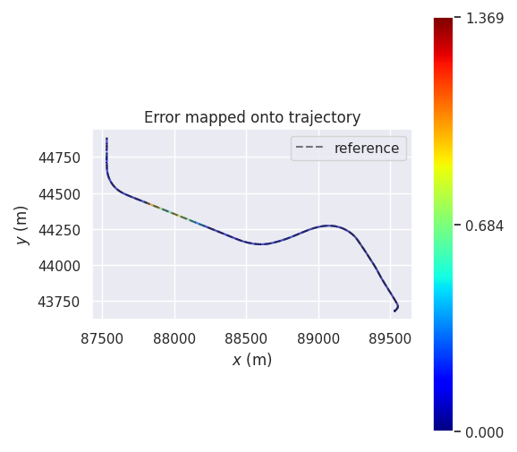
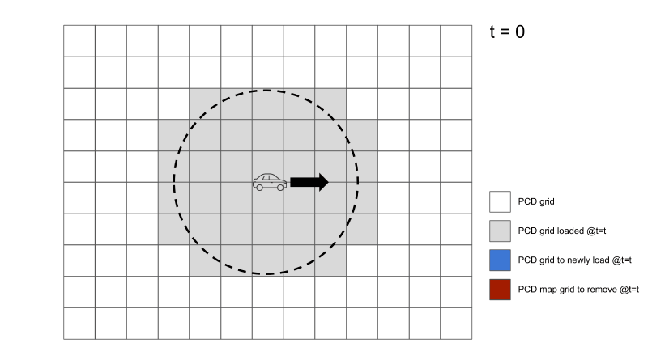

# ndt_scan_matcher

## Purpose

ndt_scan_matcher is a package for position estimation using the NDT scan matching method.

There are two main functions in this package:

- estimate position by scan matching
- estimate initial position via the ROS service using the Monte Carlo method

One optional function is regularization. Please see the regularization chapter in the back for details. It is disabled by default.

## Inputs / Outputs

### Input

| Name                                | Type                                            | Description                           |
| ----------------------------------- | ----------------------------------------------- | ------------------------------------- |
| `ekf_pose_with_covariance`          | `geometry_msgs::msg::PoseWithCovarianceStamped` | initial pose                          |
| `pointcloud_map`                    | `sensor_msgs::msg::PointCloud2`                 | map pointcloud                        |
| `points_raw`                        | `sensor_msgs::msg::PointCloud2`                 | sensor pointcloud                     |
| `sensing/gnss/pose_with_covariance` | `sensor_msgs::msg::PoseWithCovarianceStamped`   | base position for regularization term |

> `sensing/gnss/pose_with_covariance` is required only when regularization is enabled.

### Output

| Name                              | Type                                            | Description                                                                                                                              |
| --------------------------------- | ----------------------------------------------- | ---------------------------------------------------------------------------------------------------------------------------------------- |
| `ndt_pose`                        | `geometry_msgs::msg::PoseStamped`               | estimated pose                                                                                                                           |
| `ndt_pose_with_covariance`        | `geometry_msgs::msg::PoseWithCovarianceStamped` | estimated pose with covariance                                                                                                           |
| `/diagnostics`                    | `diagnostic_msgs::msg::DiagnosticArray`         | diagnostics                                                                                                                              |
| `points_aligned`                  | `sensor_msgs::msg::PointCloud2`                 | [debug topic] pointcloud aligned by scan matching                                                                                        |
| `points_aligned_no_ground`        | `sensor_msgs::msg::PointCloud2`                 | [debug topic] de-grounded pointcloud aligned by scan matching                                                                            |
| `initial_pose_with_covariance`    | `geometry_msgs::msg::PoseWithCovarianceStamped` | [debug topic] initial pose used in scan matching                                                                                         |
| `exe_time_ms`                     | `tier4_debug_msgs::msg::Float32Stamped`         | [debug topic] execution time for scan matching [ms]                                                                                      |
| `transform_probability`           | `tier4_debug_msgs::msg::Float32Stamped`         | [debug topic] score of scan matching                                                                                                     |
| `no_ground_transform_probability` | `tier4_debug_msgs::msg::Float32Stamped`         | [debug topic] score of scan matching based on de-grounded LiDAR scan                                                                     |
| `iteration_num`                   | `tier4_debug_msgs::msg::Int32Stamped`           | [debug topic] number of scan matching iterations                                                                                         |
| `initial_to_result_distance`      | `tier4_debug_msgs::msg::Float32Stamped`         | [debug topic] distance difference between the initial point and the convergence point [m]                                                |
| `initial_to_result_distance_old`  | `tier4_debug_msgs::msg::Float32Stamped`         | [debug topic] distance difference between the older of the two initial points used in linear interpolation and the convergence point [m] |
| `initial_to_result_distance_new`  | `tier4_debug_msgs::msg::Float32Stamped`         | [debug topic] distance difference between the newer of the two initial points used in linear interpolation and the convergence point [m] |
| `ndt_marker`                      | `visualization_msgs::msg::MarkerArray`          | [debug topic] markers for debugging                                                                                                      |
| `monte_carlo_initial_pose_marker` | `visualization_msgs::msg::MarkerArray`          | [debug topic] particles used in initial position estimation                                                                              |

### Service

| Name            | Type                                                         | Description                      |
| --------------- | ------------------------------------------------------------ | -------------------------------- |
| `ndt_align_srv` | `autoware_localization_srvs::srv::PoseWithCovarianceStamped` | service to estimate initial pose |

## Parameters

### Core Parameters

| Name                                    | Type   | Description                                                                                     |
| --------------------------------------- | ------ | ----------------------------------------------------------------------------------------------- |
| `base_frame`                            | string | Vehicle reference frame                                                                         |
| `input_sensor_points_queue_size`        | int    | Subscriber queue size                                                                           |
| `trans_epsilon`                         | double | The maximum difference between two consecutive transformations in order to consider convergence |
| `step_size`                             | double | The newton line search maximum step length                                                      |
| `resolution`                            | double | The ND voxel grid resolution [m]                                                                |
| `max_iterations`                        | int    | The number of iterations required to calculate alignment                                        |
| `converged_param_type`                  | int    | The type of indicators for scan matching score (0: TP, 1: NVTL)                                 |
| `converged_param_transform_probability` | double | Threshold for deciding whether to trust the estimation result                                   |
| `num_threads`                           | int    | Number of threads used for parallel computing                                                   |

(TP: Transform Probability, NVTL: Nearest Voxel Transform Probability)

## Regularization

### Abstract

This is a function that adds the regularization term to the NDT optimization problem as follows.

$$
\begin{align}
    \min_{\mathbf{R},\mathbf{t}}
    \mathrm{NDT}(\mathbf{R},\mathbf{t})
    +\mathrm{scale\ factor}\cdot \left|
        \mathbf{R}^\top
        (\mathbf{t_{base}-\mathbf{t}})
        \cdot
        \begin{pmatrix}
            1\\
            0\\
            0
        \end{pmatrix}
        \right|^2
\end{align}
$$

, where t_base is base position measured by GNSS or other means.
NDT(R,t) stands for the pure NDT cost function.
The regularization term shifts the optimal solution to the base position in the longitudinal direction of the vehicle.
Only errors along the **longitudinal direction** with respect to the base position are considered; errors along Z-axis and lateral-axis error are not considered.

Although the regularization term has rotation as a parameter, the gradient and hessian associated with it is not computed to stabilize the optimization.
Specifically, the gradients are computed as follows.

$$
\begin{align}
    &g_x=\nabla_x \mathrm{NDT}(\mathbf{R},\mathbf{t}) + 2 \mathrm{scale\ factor} \cos\theta_z\cdot e_{\mathrm{longitudinal}}
    \\
    &g_y=\nabla_y \mathrm{NDT}(\mathbf{R},\mathbf{t}) + 2 \mathrm{scale\ factor} \sin\theta_z\cdot e_{\mathrm{longitudinal}}
    \\
    &g_z=\nabla_z \mathrm{NDT}(\mathbf{R},\mathbf{t})
    \\
    &g_\mathbf{R}=\nabla_\mathbf{R} \mathrm{NDT}(\mathbf{R},\mathbf{t})
\end{align}
$$

Regularization is disabled by default.
If you wish to use it, please edit the following parameters to enable it.

#### Where is regularization available

This feature is effective on feature-less roads where GNSS is available, such as

- bridges
- highways
- farm roads

By remapping the base position topic to something other than GNSS, as described below, it can be valid outside of these.

#### Using other base position

Other than GNSS, you can give other global position topics obtained from magnetic markers, visual markers or etc. if they are available in your environment.
(Currently Autoware does not provide a node that gives such pose.)
To use your topic for regularization, you need to remap the `input_regularization_pose_topic` with your topic in `ndt_scan_matcher.launch.xml`.
By default, it is remapped with `/sensing/gnss/pose_with_covariance`.

#### Limitations

Since this function determines the base position by linear interpolation from the recently subscribed poses,
topics that are published at a low frequency relative to the driving speed cannot be used.
Inappropriate linear interpolation may result in bad optimization results.

When using GNSS for base location, the regularization can have negative effects in tunnels, indoors, and near skyscrapers.
This is because if the base position is far off from the true value, NDT scan matching may converge to inappropriate optimal position.

### Parameters

| Name                          | Type   | Description                                                            |
| ----------------------------- | ------ | ---------------------------------------------------------------------- |
| `regularization_enabled`      | bool   | Flag to add regularization term to NDT optimization (FALSE by default) |
| `regularization_scale_factor` | double | Coefficient of the regularization term.                                |

Regularization is disabled by default because GNSS is not always accurate enough to serve the appropriate base position in any scenes.

If the scale_factor is too large, the NDT will be drawn to the base position and scan matching may fail.
Conversely, if it is too small, the regularization benefit will be lost.

Note that setting scale_factor to 0 is equivalent to disabling regularization.

### Example

The following figures show tested maps.

- The left is a map with enough features that NDT can successfully localize.
- The right is a map with so few features that the NDT cannot localize well.

 

The following figures show the trajectories estimated on the feature-less map with standard NDT and regularization-enabled NDT, respectively.
The color of the trajectory indicates the error (meter) from the reference trajectory, which is computed with the feature-rich map.

- The left figure shows that the pure NDT causes a longitudinal error in the bridge and is not able to recover.
- The right figure shows that the regularization suppresses the longitudinal error.

 

## Dynamic map loading

Autoware supports dynamic map loading feature for `ndt_scan_matcher`. Using this feature, NDT dynamically requests for the surrounding pointcloud map to `pointcloud_map_loader`, and then receive and preprocess the map in an online fashion.

Using the feature, `ndt_scan_matcher` can theoretically handle any large size maps in terms of memory usage. (Note that it is still possible that there exists a limitation due to other factors, e.g. floating-point error)

### Additional interfaces

#### Additional inputs

| Name             | Type                      | Description                                                 |
| ---------------- | ------------------------- | ----------------------------------------------------------- |
| `input_ekf_odom` | `nav_msgs::msg::Odometry` | Vehicle localization results (used for map update decision) |

#### Additional outputs

| Name                          | Type                            | Description                                       |
| ----------------------------- | ------------------------------- | ------------------------------------------------- |
| `debug/loaded_pointcloud_map` | `sensor_msgs::msg::PointCloud2` | pointcloud maps used for localization (for debug) |

#### Additional client

| Name                | Type                                                   | Description        |
| ------------------- | ------------------------------------------------------ | ------------------ |
| `client_map_loader` | `autoware_map_msgs::srv::GetDifferentialPointCloudMap` | map loading client |

### Parameters

| Name                                  | Type   | Description                                                          |
| ------------------------------------- | ------ | -------------------------------------------------------------------- |
| `use_dynamic_map_loading`             | bool   | Flag to enable dynamic map loading feature for NDT (TRUE by default) |
| `dynamic_map_loading_update_distance` | double | Distance traveled to load new map(s)                                 |
| `dynamic_map_loading_map_radius`      | double | Map loading radius for every update                                  |
| `lidar_radius`                        | double | LiDAR radius used for localization (only used for diagnosis)         |

### Enabling the dynamic map loading feature

To use dynamic map loading feature for `ndt_scan_matcher`, you also need to appropriately configure some other settings outside of this node.
Follow the next two instructions.

1. enable dynamic map loading interface in `pointcloud_map_loader` (by setting `enable_differential_load` to true in the package)
2. split the PCD files into grids (recommended size: 20[m] x 20[m])

Note that the dynamic map loading may FAIL if the map is split into two or more large size map (e.g. 1000[m] x 1000[m]). Please provide either of

- one PCD map file
- multiple PCD map files divided into small size (~20[m])

Here is a split PCD map for `sample-map-rosbag` from Autoware tutorial: [`sample-map-rosbag_split.zip`](https://github.com/autowarefoundation/autoware.universe/files/10349104/sample-map-rosbag_split.zip)

|  PCD files  | `use_dynamic_map_loading` | `enable_differential_load` | How NDT loads map(s) |
| :---------: | :-----------------------: | :------------------------: | :------------------: |
| single file |           true            |            true            |  at once (standard)  |
| single file |           true            |           false            |  **does NOT work**   |
| single file |           false           |         true/false         |  at once (standard)  |
|  splitted   |           true            |            true            |     dynamically      |
|  splitted   |           true            |           false            |  **does NOT work**   |
|  splitted   |           false           |         true/false         |  at once (standard)  |

## Scan matching score based on de-grounded LiDAR scan

### Abstract

This is a function that using de-grounded LiDAR scan estimate scan matching score.This score can more accurately reflect the current localization performance.
[related issue](https://github.com/autowarefoundation/autoware.universe/issues/2044).

### Parameters

<!-- cspell: ignore degrounded -->

| Name                                  | Type   | Description                                                                           |
| ------------------------------------- | ------ | ------------------------------------------------------------------------------------- |
| `estimate_scores_for_degrounded_scan` | bool   | Flag for using scan matching score based on de-grounded LiDAR scan (FALSE by default) |
| `z_margin_for_ground_removal`         | double | Z-value margin for removal ground points                                              |
