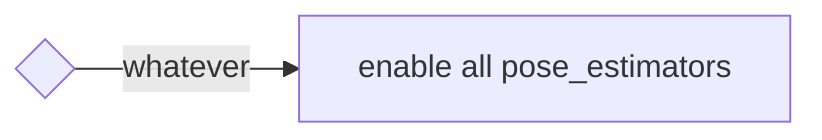

# pose_estimator_arbiter

Table of contents:

- [Abstract](#abstract)
- [Interface](#interfaces)
- [Architecture](#architecture)
- [How to launch](#how-to-launch)
- [Switching Rules](#switching-rules)
- [Pose Initialization](#pose-initialization)
- [Future Plans](#future-plans)

## Abstract

This package launches multiple pose estimators and provides the capability to stop or resume specific pose estimators based on the situation.
It provides provisional switching rules and will be adaptable to a wide variety of rules in the future.

Please refer to [this discussion](https://github.com/orgs/autowarefoundation/discussions/3878) about other ideas on implementation.

### Why do we need a stop/resume mechanism?

It is possible to launch multiple pose_estimators and fuse them using a Kalman filter by editing launch files.
However, this approach is not preferable due to computational costs.

Particularly, NDT and YabLoc are computationally intensive, and it's not recommended to run them simultaneously.
Also, even if both can be activated at the same time, the Kalman Filter may be affected by one of them giving bad output.

> [!NOTE]
> Currently, **there is ONLY A RULE implemented that always enables all pose_estimators.**
> If users want to toggle pose_estimator with their own rules, they need to add new rules. by referring to example_rule.
> The [example_rule](example_rule/README.md) has source code that can be used as a reference for implementing the rules.

### Supporting pose_estimators

- [ndt_scan_matcher](https://github.com/autowarefoundation/autoware.universe/tree/main/localization/ndt_scan_matcher)
- [eagleye](https://autowarefoundation.github.io/autoware-documentation/main/how-to-guides/integrating-autoware/launch-autoware/localization/eagleye/)
- [yabloc](https://github.com/autowarefoundation/autoware.universe/tree/main/localization/yabloc)
- [landmark_based_localizer](https://github.com/autowarefoundation/autoware.universe/tree/main/localization/landmark_based_localizer)

### Demonstration

The following video demonstrates the switching of four different pose estimators.

<div><video controls src="https://github.com/autowarefoundation/autoware.universe/assets/24854875/d4d48be4-748e-4ffc-bde2-d498911ed3a1" muted="false" width="800"></video></div>

Users can reproduce the demonstration using the following data and launch command:

[sample data (rosbag & map)](https://drive.google.com/file/d/1MxLo1Sw6PdvfkyOYf_9A5dZ9uli1vPvS/view)
The rosbag is simulated data created by [AWSIM](https://tier4.github.io/AWSIM/).
The map is an edited version of the [original map data](https://github.com/tier4/AWSIM/releases/download/v1.1.0/nishishinjuku_autoware_map.zip) published on the AWSIM documentation page to make it suitable for multiple pose_estimators.

```bash
ros2 launch autoware_launch logging_simulator.launch.xml \
  map_path:=<your-map-path> \
  vehicle_model:=sample_vehicle \
  sensor_model:=awsim_sensor_kit \
  pose_source:=ndt_yabloc_artag_eagleye
```

## Interfaces

<details>
<summary>Click to show details</summary>

### Parameters

There are no parameters.

### Services

| Name             | Type                            | Description                     |
| ---------------- | ------------------------------- | ------------------------------- |
| `/config_logger` | logging_demo::srv::ConfigLogger | service to modify logging level |

### Clients

| Name                  | Type                  | Description                       |
| --------------------- | --------------------- | --------------------------------- |
| `/yabloc_suspend_srv` | std_srv::srv::SetBool | service to stop or restart yabloc |

### Subscriptions

For pose estimator arbitration:

| Name                                  | Type                                          | Description    |
| ------------------------------------- | --------------------------------------------- | -------------- |
| `/input/artag/image`                  | sensor_msgs::msg::Image                       | ArTag input    |
| `/input/yabloc/image`                 | sensor_msgs::msg::Image                       | YabLoc input   |
| `/input/eagleye/pose_with_covariance` | geometry_msgs::msg::PoseWithCovarianceStamped | Eagleye output |
| `/input/ndt/pointcloud`               | sensor_msgs::msg::PointCloud2                 | NDT input      |

For switching rule:

| Name                          | Type                                                         | Description                       |
| ----------------------------- | ------------------------------------------------------------ | --------------------------------- |
| `/input/vector_map`           | autoware_auto_mapping_msgs::msg::HADMapBin                   | vector map                        |
| `/input/pose_with_covariance` | geometry_msgs::msg::PoseWithCovarianceStamped                | localization final output         |
| `/input/initialization_state` | autoware_adapi_v1_msgs::msg::LocalizationInitializationState | localization initialization state |

### Publications

| Name                                   | Type                                          | Description                                            |
| -------------------------------------- | --------------------------------------------- | ------------------------------------------------------ |
| `/output/artag/image`                  | sensor_msgs::msg::Image                       | relayed ArTag input                                    |
| `/output/yabloc/image`                 | sensor_msgs::msg::Image                       | relayed YabLoc input                                   |
| `/output/eagleye/pose_with_covariance` | geometry_msgs::msg::PoseWithCovarianceStamped | relayed Eagleye output                                 |
| `/output/ndt/pointcloud`               | sensor_msgs::msg::PointCloud2                 | relayed NDT input                                      |
| `/output/debug/marker_array`           | visualization_msgs::msg::MarkerArray          | [debug topic] everything for visualization             |
| `/output/debug/string`                 | visualization_msgs::msg::MarkerArray          | [debug topic] debug information such as current status |

</details>

## Trouble Shooting

If it does not seems to work, users can get more information in the following ways.

> [!TIP]
>
> ```bash
> ros2 service call /localization/pose_estimator_arbiter/config_logger logging_demo/srv/ConfigLogger \
>   '{logger_name: localization.pose_estimator_arbiter, level: debug}'
> ```

## Architecture

<details>
<summary>Click to show details</summary>

### Case of running a single pose estimator

When each pose_estimator is run alone, this package does nothing.
Following figure shows the node configuration when NDT, YabLoc Eagleye and AR-Tag are run independently.


### Case of running multiple pose estimators

When running multiple pose_estimators, pose_estimator_arbiter is executed.
It comprises a **switching rule** and **stoppers** corresponding to each pose_estimator.

- Stoppers control the pose_estimator activity by relaying inputs or outputs, or by requesting a suspend service.
- Switching rules determine which pose_estimator to use.

Which stoppers and switching rules are instantiated depends on the runtime arguments at startup.

Following figure shows the node configuration when all pose_estimator are run simultaneously.


- **NDT**

The NDT stopper relays topics in the front side of the point cloud pre-processor.

- **YabLoc**

The YabLoc stopper relays input image topics in the frontend of the image pre-processor.
YabLoc includes a particle filter process that operates on a timer, and even when image topics are not streamed, the particle prediction process continues to work.
To address this, the YabLoc stopper also has a service client for explicitly stopping and resuming YabLoc.

- **Eagleye**

The Eagleye stopper relays Eagleye's output pose topics in the backend of Eagleye's estimation process.
Eagleye performs time-series processing internally, and it can't afford to stop the input stream.
Furthermore, Eagleye's estimation process is lightweight enough to be run continuously without a significant load, so the relay is inserted in the backend.

- **ArTag**

The ArTag stopper relays image topics in the front side of the landmark localizer.

</details>

## How to launch

<details>
<summary>Click to show details</summary>

The user can launch the desired pose_estimators by giving the pose_estimator names as a concatenation of underscores for the runtime argument `pose_source`.

```bash
ros2 launch autoware_launch logging_simulator.launch.xml \
  map_path:=<your-map-path> \
  vehicle_model:=sample_vehicle \
  sensor_model:=awsim_sensor_kit \
  pose_source:=ndt_yabloc_artag_eagleye
```

Even if `pose_source` includes an unexpected string, it will be filtered appropriately.
Please see the table below for details.

| given runtime argument                      | parsed pose_estimator_arbiter's param (pose_sources) |
| ------------------------------------------- | ---------------------------------------------------- |
| `pose_source:=ndt`                          | `["ndt"]`                                            |
| `pose_source:=nan`                          | `[]`                                                 |
| `pose_source:=yabloc_ndt`                   | `["ndt","yabloc"]`                                   |
| `pose_source:=yabloc_ndt_ndt_ndt`           | `["ndt","yabloc"]`                                   |
| `pose_source:=ndt_yabloc_eagleye`           | `["ndt","yabloc","eagleye"]`                         |
| `pose_source:=ndt_yabloc_nan_eagleye_artag` | `["ndt","yabloc","eagleye","artag"]`                 |

</details>

## Switching Rules

<details>
<summary>Click to show details</summary>

Currently, **ONLY ONE RULE** (`enable_all_rule`) is implemented.
In the future, several rules will be implemented and users will be able to select rules.

> [!TIP]
> There are presets available to extend the rules. If you want to extend the rules, please see [example_rule](./example_rule/README.md).

### Enable All Rule

This is the default and simplest rule. This rule enables all pose_estimators regardless of their current state.



</details>

## Pose Initialization

When using multiple pose_estimators, it is necessary to appropriately adjust the parameters provided to the `pose_initializer`.

<details>
<summary>Click to show details</summary>

The following table is based on the runtime argument "pose_source" indicating which initial pose estimation methods are available and the parameters that should be provided to the pose_initialization node.
To avoid making the application too complicated, a priority is established so that NDT is always used when it is available.
(The pose_initializer will only perform NDT-based initial pose estimation when `ndt_enabled` and `yabloc_enabled` are both `true`).

This table's usage is described from three perspectives:

- **Autoware Users:** Autoware users do not need to consult this table.
  They simply provide the desired combinations of pose_estimators, and the appropriate parameters are automatically provided to the pose_initializer.
- **Autoware Developers:** Autoware developers can consult this table to know which parameters are assigned.
- **Who implements New Pose Estimator Switching:**
  Developers must extend this table and implement the assignment of appropriate parameters to the pose_initializer.

|         pose_source         | invoked initialization method | `ndt_enabled` | `yabloc_enabled` | `gnss_enabled` | `sub_gnss_pose_cov`                          |
| :-------------------------: | ----------------------------- | ------------- | ---------------- | -------------- | -------------------------------------------- |
|             ndt             | ndt                           | true          | false            | true           | /sensing/gnss/pose_with_covariance           |
|           yabloc            | yabloc                        | false         | true             | true           | /sensing/gnss/pose_with_covariance           |
|           eagleye           | vehicle needs run for a while | false         | false            | true           | /localization/pose_estimator/eagleye/...     |
|            artag            | 2D Pose Estimate (RViz)       | false         | false            | true           | /sensing/gnss/pose_with_covariance           |
|         ndt, yabloc         | ndt                           | ndt           | true             | true           | /sensing/gnss/pose_with_covariance           |
|        ndt, eagleye         | ndt                           | ndt           | false            | true           | /sensing/gnss/pose_with_covariance           |
|         ndt, artag          | ndt                           | ndt           | false            | true           | /sensing/gnss/pose_with_covariance           |
|       yabloc, eagleye       | yabloc                        | false         | true             | true           | /sensing/gnss/pose_with_covariance           |
|        yabloc, artag        | yabloc                        | false         | true             | true           | /sensing/gnss/pose_with_covariance           |
|       eagleye, artag        | vehicle needs run for a while | false         | false            | true           | /localization/pose_estimator/eagleye/pose... |
|    ndt, yabloc, eagleye     | ndt                           | ndt           | true             | true           | /sensing/gnss/pose_with_covariance           |
|     ndt, eagleye, artag     | ndt                           | ndt           | false            | true           | /sensing/gnss/pose_with_covariance           |
|   yabloc, eagleye, artag    | yabloc                        | ndt           | true             | true           | /sensing/gnss/pose_with_covariance           |
| ndt, yabloc, eagleye, artag | ndt                           | ndt           | true             | true           | /sensing/gnss/pose_with_covariance           |

</details>

## Future Plans

<details>
<summary>Click to show details</summary>

### gradually switching

In the future, this package will provide not only ON/OFF switching, but also a mechanism for low frequency operation, such as 50% NDT & 50% YabLoc.

### stopper for pose_estimators to be added in the future

The basic strategy is to realize ON/OFF switching by relaying the input or output topics of that pose_estimator.
If pose_estimator involves time-series processing with heavy computations, it's not possible to pause and resume with just topic relaying.

In such cases, there may not be generally applicable solutions, but the following methods may help:

1. Completely stop and **reinitialize** time-series processing, as seen in the case of YabLoc.
2. Subscribe to `localization/kinematic_state` and **keep updating states** to ensure that the estimation does not break (relying on the output of the active pose_estimator).
3. The multiple pose_estimator **does not support** that particular pose_estimator.

Please note that this issue is fundamental to realizing multiple pose_estimators, and it will arise regardless of the architecture proposed in this case.

</details>
