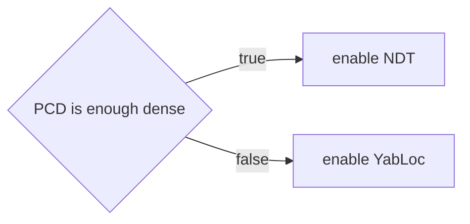
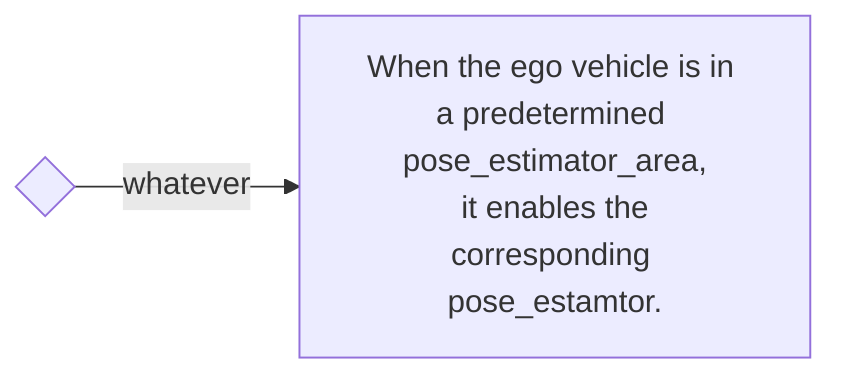

# example rule

The example rule provides a sample rule for controlling the arbiter. By combining the provided rules, it is possible to achieve demonstrations as follows. Users can extend the rules as needed by referencing this code, allowing them to control the arbiter as desired.

## Demonstration

The following video demonstrates the switching of four different pose estimators.

<div><video controls src="https://github-production-user-asset-6210df.s3.amazonaws.com/24854875/295755577-62b26fdd-dcf0-4b1c-a1a0-ecd633413196.mp4" muted="false" width="600"></video></div>

## Switching Rules

### Pcd Map Based Rule



### Vector Map Based Rule



### Rule helpers

Rule helpers are auxiliary tools for describing switching rules.

- [PCD occupancy](#pcd-occupancy)
- [Pose estimator area](#pose-estimator-area)

#### PCD occupancy


#### Pose estimator area

The pose_estimator_area is a planar area described by polygon in lanelet2.
The height of the area is meaningless; it judges if the projection of its self-position is contained within the polygon or not.


A sample pose_estimator_area is shown below. The values provided below are placeholders.
To be correctly read, the area should have the type "pose_estimator_specify" and the subtype should be one of ndt, yabloc, eagleye, or artag.

```xml
  <node id="1" lat="35.8xxxxx" lon="139.6xxxxx">
    <tag k="mgrs_code" v="54SUE000000"/>
    <tag k="local_x" v="10.0"/>
    <tag k="local_y" v="10.0"/>
    <tag k="ele" v="1.0"/>
  </node>
  <node id="2" lat="35.8xxxxx" lon="139.6xxxxx">
    <tag k="mgrs_code" v="54SUE000000"/>
    <tag k="local_x" v="10.0"/>
    <tag k="local_y" v="20.0"/>
    <tag k="ele" v="1.0"/>
  </node>
  <node id="3" lat="35.8xxxxx" lon="139.6xxxxx">
    <tag k="mgrs_code" v="54SUE000000"/>
    <tag k="local_x" v="20.0"/>
    <tag k="local_y" v="20.0"/>
    <tag k="ele" v="1.0"/>
  </node>
  <node id="4" lat="35.8xxxxx" lon="139.6xxxxx">
    <tag k="mgrs_code" v="54SUE000000"/>
    <tag k="local_x" v="10.0"/>
    <tag k="local_y" v="20.0"/>
    <tag k="ele" v="1.0"/>
  </node>

...

  <way id="5">
    <nd ref="1"/>
    <nd ref="2"/>
    <nd ref="3"/>
    <nd ref="4"/>
    <tag k="type" v="pose_estimator_specify"/>
    <tag k="subtype" v="eagleye"/>
    <tag k="area" v="yes"/>
  </way>

  <way id="6">
    <nd ref="7"/>
    <nd ref="8"/>
    <nd ref="9"/>
    <nd ref="10"/>
    <tag k="type" v="pose_estimator_specify"/>
    <tag k="subtype" v="yabloc"/>
    <tag k="area" v="yes"/>
  </way>

```
